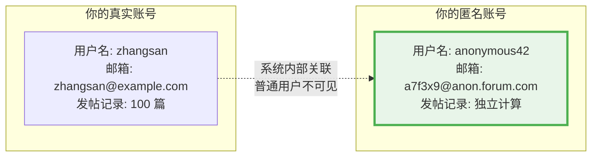
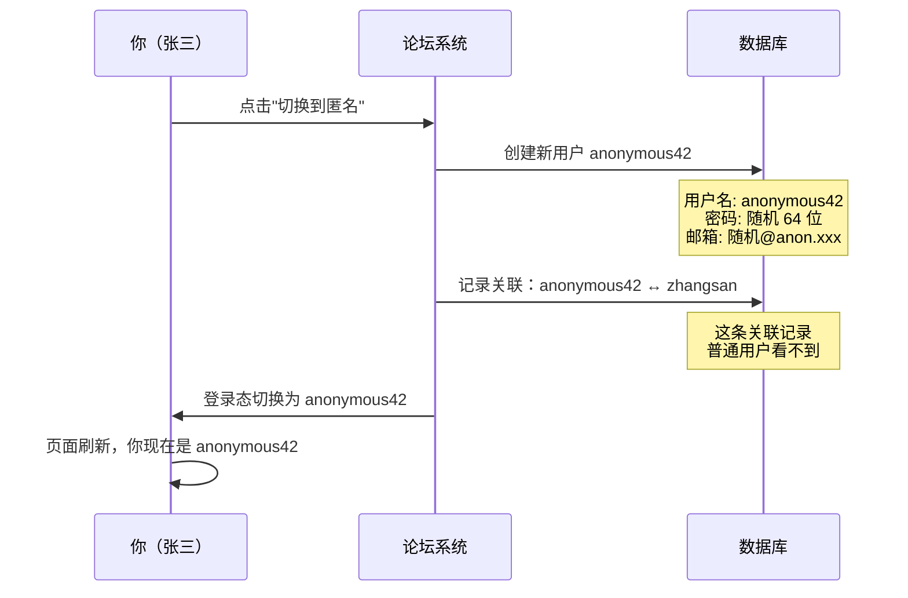
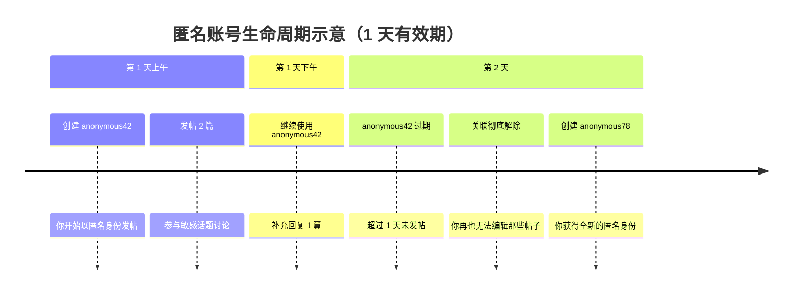

# 论坛匿名发帖机制详解：你的隐私，我们认真对待

## 写在前面

> **本文适合**：关心个人隐私、想了解匿名功能工作原理的论坛用户
>
> **阅读时间**：约 10 分钟
>
> **核心观点**：匿名不是"假装看不见"，而是从技术架构上切断身份关联

在网络社区中，"匿名发帖"是一个敏感而重要的话题。有人担心：所谓的匿名，是不是管理员一查就能看到真实身份？有人好奇：切换匿名后，我的历史发言会暴露我是谁吗？

这篇文章将用大白话告诉你，我们的匿名机制到底是怎么工作的，它能保护什么、不能保护什么，以及为什么我们有信心说：**这是一套经过严肃设计的隐私保护方案**。

---

## 1. 先说结论：匿名机制能做到什么？

| 你关心的问题 | 答案 |
|-------------|------|
| 其他用户能看到我的真实身份吗？ | ❌ **不能** |
| 版主能通过匿名帖子查到我是谁吗？ | ❌ **不能**（普通版主无此权限） |
| 管理员能在后台看到我的真实身份吗？ | ⚠️ **有限制**（见下文详细说明） |
| 我的匿名帖子会和真实账号的发言风格关联吗？ | ❌ **系统层面不会**（但请注意自己的措辞习惯） |
| 匿名账号会收到邮件通知吗？ | ❌ **不会**（已禁用所有邮件） |
| 我可以随时切换回真实身份吗？ | ✅ **可以**，一键切换 |

---

## 2. 核心设计：你不是"戴着面具"，而是拥有一个"分身"

很多平台的"匿名"功能，本质上只是把你的用户名显示成"匿名用户"——这种做法就像参加化装舞会时戴个面具，后台系统仍然清清楚楚地记录着"面具后面是张三"。

**我们的做法完全不同。**

当你点击"切换到匿名模式"时，系统会为你创建一个**全新的、独立的用户账户**——我们称之为"影子用户"（Shadow User）。这个影子用户：

- 有自己的用户名（如 `anonymous42`）
- 有自己的随机邮箱地址
- 有自己的发帖记录
- 与你的真实账户在数据库中是**两条完全独立的记录**



**关键点**：当你以匿名身份发帖时，数据库里记录的发帖人就是 `anonymous42`，而不是 `zhangsan`。这不是"换了个显示名"，而是真正的身份分离。

---

## 3. 技术细节：我们做了哪些保护措施

### 3.1 匿名账号的创建过程

当你第一次进入匿名模式时，系统会：

1. **生成随机密码**：一个你自己都不知道的 64 位随机密码
2. **生成随机邮箱**：格式类似 `a7f3c9d1e2@anon.forum.com`，这个邮箱不存在，纯粹是占位符
3. **禁用所有邮件通知**：匿名账号永远不会收到任何邮件，因为没有真实邮箱
4. **设定信任等级**：固定为 TL1（基础信任），不会因为你真实账号是 TL4 就给匿名账号更高权限



### 3.2 邮件完全隔离

很多人担心：匿名发帖后，如果有人回复，系统会不会发邮件到我的真实邮箱？

**答案是：绝对不会。**

匿名账号的邮件设置被强制关闭：
- 不发送回复通知
- 不发送摘要邮件
- 不发送任何系统邮件

系统在创建匿名账号时会执行：

```ruby
# 禁用所有邮件通知（简化示意）
shadow.user_option.update(
  email_messages_level: :never,  # 从不发送私信邮件
  email_digests: false,          # 不发送摘要
)
```

### 3.3 功能限制：匿名账号不能做什么

为了防止匿名身份被滥用，系统对匿名账号施加了严格限制：

| 功能 | 真实账号 | 匿名账号 | 为什么这么设计 |
|------|---------|---------|---------------|
| 发帖/回复 | ✅ | ✅ | 这是匿名的核心用途 |
| 点赞 | ✅ | ⚙️ 需管理员开启 | 防止通过点赞记录推断身份 |
| 举报 | ✅ | ❌ | 举报需要可追溯性 |
| 修改用户名 | ✅ | ❌ | 防止伪装其他用户 |
| 修改邮箱 | ✅ | ❌ | 邮箱本就是随机的 |
| 上传头像 | ✅ | ❌ | 防止通过头像暴露身份 |
| 使用聊天 | ✅ | ⚙️ 需管理员开启 | 私信场景需要额外考虑 |

### 3.4 匿名账号的"保质期"

你的匿名身份不是永久固定的。系统采用了**滚动更换**机制：

- **有效期**：**1 天**
- **过期条件**：匿名账号有过发帖记录，且最后一次发帖距今超过 1 天
- **过期后果**：下次切换匿名时，系统会为你创建一个**全新的**匿名账号

> ⚠️ **重要提醒**：匿名账号过期后，**关联关系将彻底解除**！
> 
> 这意味着：
> - 你将**无法再编辑**之前匿名发布的帖子
> - 你将**无法找回**之前的匿名身份
> - 系统中**不再有任何记录**能证明那些帖子是你发的
> 
> 这是有意为之的设计——不仅保护你的隐私，也让你真正"甩脱"之前的匿名历史。

**为什么这么设计？**

想象一下，如果你的匿名账号 `anonymous42` 使用了很长时间，发了大量帖子，有心人可能通过分析你的发言时间、话题偏好、措辞习惯，逐渐推断出你的真实身份。**1 天的短有效期**，可以最大程度打断这种关联分析，同时也确保过期后的内容与你彻底脱钩。



---

## 4. 隐私边界：管理员能看到什么？

这是大家最关心的问题，我们必须**实话实说**。

### 4.1 普通版主

- ❌ 无法看到匿名用户与真实用户的对应关系
- ❌ 无法通过后台查询"这个匿名帖子是谁发的"
- ✅ 可以对匿名帖子进行正常的审核操作（删帖、移动等）

### 4.2 论坛管理员

**数据库层面**：管理员如果直接访问数据库，理论上可以查询到关联关系。这是技术现实，我们不回避。

但系统做了以下设计来限制这种风险：

1. **常规管理界面不显示关联**：管理员在正常使用的后台管理界面中，看不到"这个匿名用户对应谁"
2. **无便捷查询入口**：没有一键查询功能，管理员需要直接操作数据库（需要技术能力和明确意图）
3. **操作留痕**：数据库的直接访问通常会有日志记录

### 4.3 关于网络认证层（IOA）

由于论坛采用公司统一的 IOA 认证体系进行身份验证，**所有访问流量会经过 IOA 网关**。这里有必要向大家说明：

**IOA 认证层会做什么**：
- ✅ 验证你是公司合法员工（通过 Cookie 检查来源）
- ✅ 记录基础的访问日志（这是网关的标准行为）

**IOA 认证层不会做什么**：
- ❌ **不会记录你的具体发帖内容**
- ❌ **不会记录你是否处于匿名模式**
- ❌ **不会关联你的匿名身份与真实身份**

**透明说明**：

理论上，通过 IOA 的网络日志，可以追溯到某个时间点访问论坛的真实用户身份。但请注意：

1. **我们不记录行为详情**：IOA 日志只有基础的访问记录，不会记录"张三在 15:30 以匿名身份发了一篇内容为xxx帖子"这样的信息
2. **查询极为繁琐**：即使要查，也需要跨系统关联分析，技术门槛很高且耗时
3. **非日常操作**：这不是论坛管理的常规手段，只在极端情况（如配合法律调查）下才可能涉及
4. **与论坛匿名机制独立**：IOA 是公司层面的网络安全基础设施，不是论坛的功能模块

> 💡 **简单理解**：IOA 就像公司大门的门禁系统，它知道你几点进了公司大楼，但不知道你在工位上具体做了什么。论坛的匿名机制保护的是"你在大楼里做的事"。

### 4.4 我们的承诺

> **匿名机制的设计初衷是保护用户隐私，我们不会主动查询或披露匿名用户的真实身份，除非面临法律强制要求。**

---

## 5. 使用指南：如何正确使用匿名功能

### 5.1 如何开启匿名模式

我们为匿名模式提供了**非常便捷的入口**——就在你右上角头像的左边：

1. 找到页面顶部导航栏，在你的**头像左侧**有一个匿名模式切换按钮
2. **点击一下**即可进入匿名模式
3. 页面刷新后，你的身份已切换为匿名账号


### 5.2 如何切换回真实身份

操作同样简单——**还是那个按钮**：

1. 在匿名模式下，点击头像左侧的同一个按钮
2. 点击即可退出匿名，恢复为真实账号
3. 一键进入，一键退出，非常直观

### 5.3 使用建议

| 场景 | 是否适合使用匿名 | 说明 |
|------|----------------|------|
| 讨论敏感话题（如职场困境、情感问题） | ✅ 推荐 | 匿名的核心价值 |
| 发表争议性观点 | ✅ 适合 | 保护自己免受人身攻击 |
| 举报违规内容 | ❌ 不适合 | 匿名账号不能举报，请用真实账号 |
| 日常技术讨论 | ⚪ 看情况 | 通常没必要，但你有选择的自由 |
| 恶意攻击他人 | ❌ 禁止 | 匿名不是免责金牌，违规内容仍会被处理 |

---

## 6. 常见问题解答

### Q1：我用匿名账号发的帖子，切换回真实账号后能编辑吗？

**不能。** 匿名账号和真实账号在系统中是两个独立用户，你需要切换回匿名身份才能编辑匿名帖子。

**特别注意**：如果你的匿名账号已经过期（超过 1 天未使用），你将**永远无法编辑**那些帖子，因为关联关系已经彻底解除。所以如果有需要修改的内容，请在匿名账号有效期内完成。

### Q2：别人能通过我的发言风格推断我是谁吗？

**系统无法防止这一点。** 如果你在匿名帖子中使用了标志性的口头禅、透露了特定的经历细节，熟悉你的人可能会猜到。匿名保护的是技术层面的身份关联，无法保护你的"行为指纹"。

**建议**：使用匿名功能时，刻意调整你的表达方式。

### Q3：我的匿名账号被封禁了，会影响真实账号吗？

**不会。** 两个账号是独立的，匿名账号被封禁不影响真实账号的正常使用。但如果管理员发现你通过匿名账号进行严重违规行为（如人身攻击、散布谣言），可能会对你的真实账号采取措施。


### Q5：我换设备登录后，匿名账号还在吗？

**在的。** 匿名账号存储在服务器上，与设备无关。但你需要先用真实账号登录，然后切换到匿名模式。你无法直接登录匿名账号（因为它的密码是随机的，你不知道）。

---

## 7. 技术透明度：关键实现细节

为了让技术用户对我们的实现有信心，这里列出一些关键的技术细节：

### 7.1 数据库设计

匿名用户与真实用户的关联存储在 `anonymous_users` 表中：

```sql
-- 简化的表结构
CREATE TABLE anonymous_users (
  user_id        INTEGER,  -- 匿名账号的 ID
  master_user_id INTEGER,  -- 真实账号的 ID
  active         BOOLEAN,  -- 是否当前活跃
  created_at     TIMESTAMP
);

-- 关键约束：一个真实用户同时只能有一个活跃的匿名账号
CREATE UNIQUE INDEX ON anonymous_users(master_user_id) WHERE active;
```

### 7.2 权限检查（Guardian 系统）

系统在每次操作时都会检查当前用户是否为匿名账号，并据此限制功能：

```ruby
# 示意代码
def can_edit_username?(user)
  return false if is_anonymous?  # 匿名用户不能改用户名
  # ...其他检查
end

def post_can_act?(post, action)
  if current_user.anonymous?
    # 匿名用户只能点赞（如果管理员允许），不能举报
    return site_settings.allow_likes_in_anonymous_mode? && action == :like
  end
  # ...
end
```

### 7.3 邮件过滤

在邮件发送队列中，系统会主动跳过匿名用户：

```ruby
# 发送邮件前的检查
if user.anonymous?
  skip_message(reason: :anonymous_user)  # 记录跳过原因，但不发送
  return
end
```

---

## 8. 与其他平台的对比

| 特性 | 本论坛 | 某知名问答平台 | 某社交媒体 |
|------|-------|--------------|-----------|
| 匿名实现方式 | 独立影子账户 | 仅隐藏显示名 | 仅隐藏显示名 |
| 后台是否可见真实身份 | 需直接查数据库 | 管理员可直接查看 | 管理员可直接查看 |
| 匿名邮件通知 | 完全禁用 | 可能发送到真实邮箱 | 可能发送到真实邮箱 |
| 匿名身份轮换 | 自动（1天） | 无 | 无 |
| 过期后关联关系 | 彻底解除 | 永久保留 | 永久保留 |
| 功能限制 | 严格（不能举报等） | 几乎无限制 | 几乎无限制 |

---

## 9. 总结：匿名的边界

匿名功能是一把双刃剑。我们设计这套系统的初衷是：

1. **保护善意用户的隐私**：让你能够在敏感话题上自由发言，而不必担心被人肉搜索或现实报复
2. **不为恶意行为提供庇护**：匿名不是法外之地，严重违规行为仍然会被处理

**技术能做到的**：
- ✅ 在论坛系统层面切断匿名身份与真实身份的直接关联
- ✅ 阻止普通用户和版主查询身份对应关系
- ✅ 防止通过邮件等渠道泄露真实身份
- ✅ 1 天后自动解除关联，让历史匿名内容与你彻底脱钩

**技术做不到的**：
- ❌ 防止你自己在发言中透露身份特征
- ❌ 绕过公司网络认证层（IOA）的基础访问日志
- ❌ 对抗法律层面的身份追溯要求

**关于网络认证层（IOA）的补充说明**：

作为公司内部论坛，我们使用统一的 IOA 认证。IOA 网关会有基础访问日志，但**不会记录你在论坛的具体行为**（如发帖内容、是否匿名等）。通过 IOA 日志反向追溯论坛行为在技术上可行但极为繁琐，不是日常管理手段。我们在此透明说明，是希望你了解完整的技术边界，而非制造恐慌——**对于绝大多数正常使用场景，匿名机制的保护是充分有效的**。

---

我们相信，在合理的隐私期待和必要的社区治理之间，这套机制找到了一个平衡点。

如果你对匿名功能有任何疑问或建议，欢迎在社区反馈区提出（当然，你可以用匿名模式 😉）。


