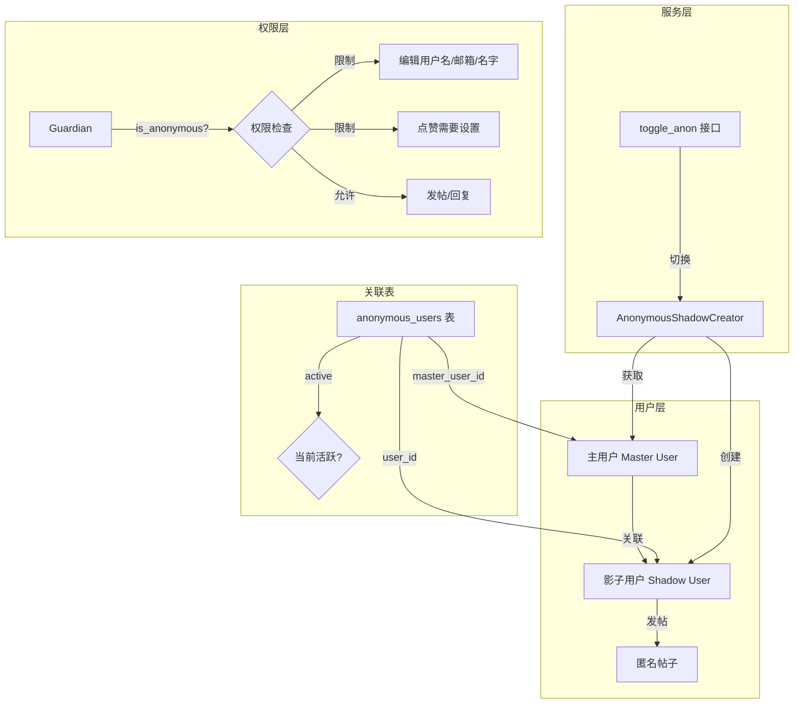
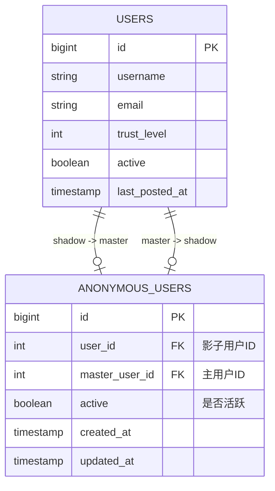
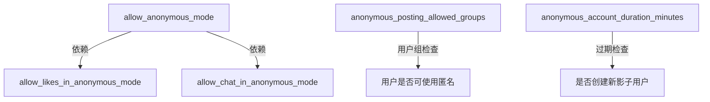
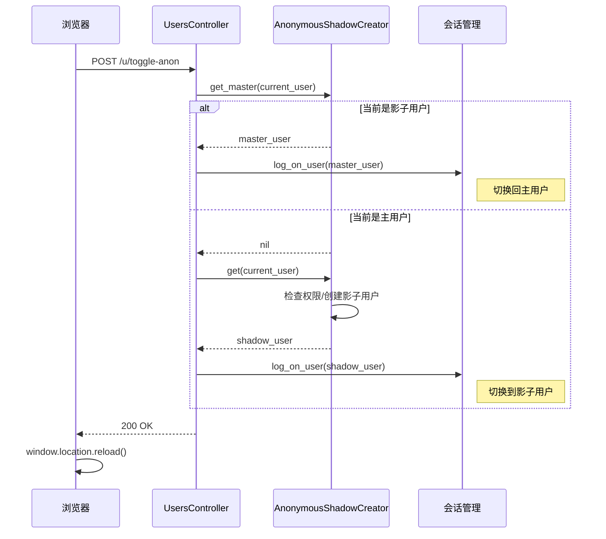
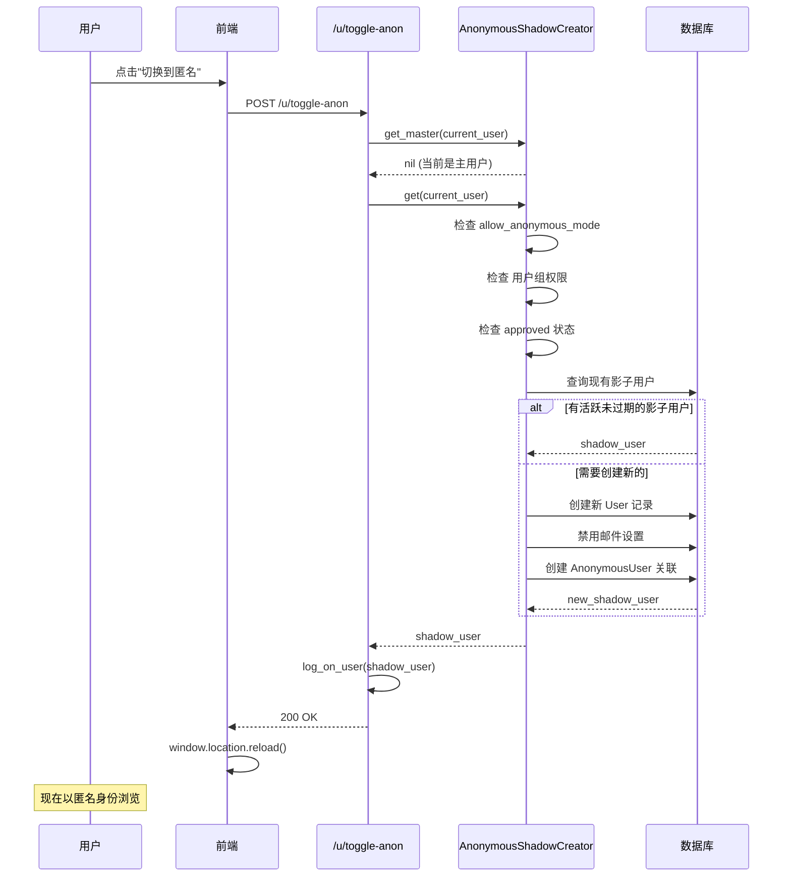
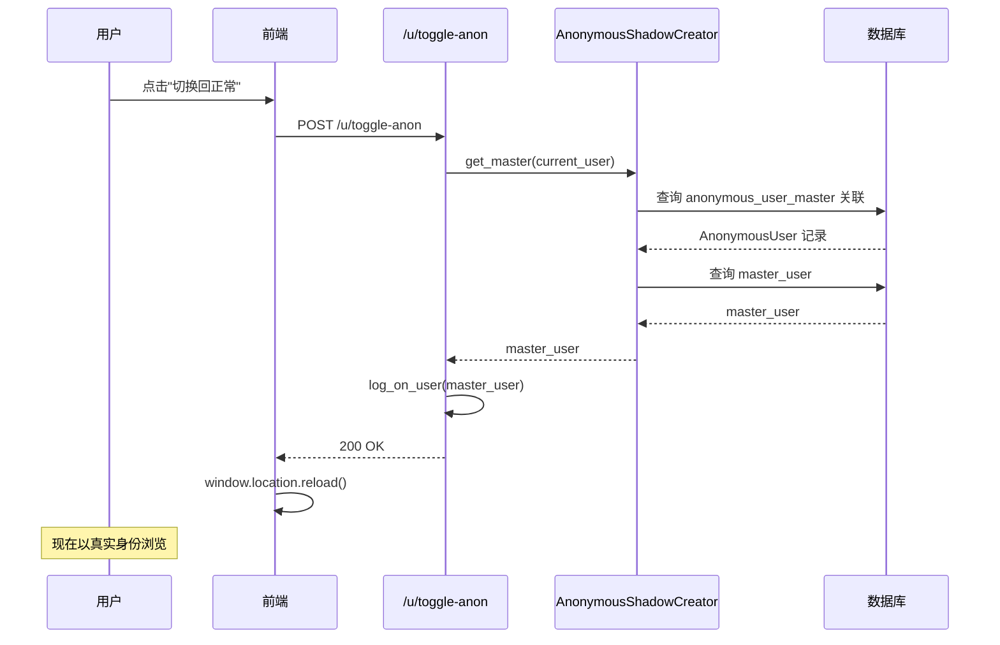
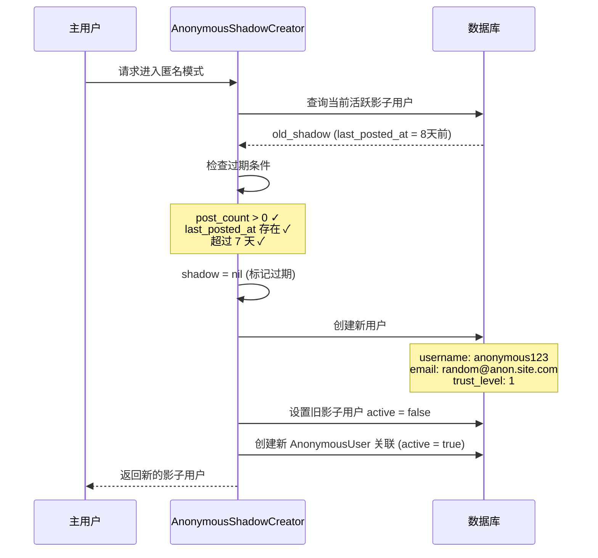

# Discourse 匿名用户机制完全指南

> **目标读者**: 需要深入理解并改造 Discourse 匿名发帖机制的研发人员
>
> **文档范围**: 匿名用户的核心架构、数据库设计、业务流程、权限控制、插件扩展
>
> **最后更新**: 2026-02-03

---

## 📑 目录

- [1. 概念辨析：两种"匿名"](#1-概念辨析两种匿名)
- [2. 核心架构](#2-核心架构)
- [3. 数据库设计](#3-数据库设计)
- [4. 核心服务：AnonymousShadowCreator](#4-核心服务anonymousshadowcreator)
- [5. 站点设置](#5-站点设置)
- [6. 权限控制（Guardian）](#6-权限控制guardian)
- [7. 控制器与路由](#7-控制器与路由)
- [8. 前端实现](#8-前端实现)
- [9. 邮件与通知处理](#9-邮件与通知处理)
- [10. 插件扩展：Chat 聊天支持](#10-插件扩展chat-聊天支持)
- [11. 完整业务流程](#11-完整业务流程)
- [12. 改造建议与扩展点](#12-改造建议与扩展点)
- [13. 相关文件索引](#13-相关文件索引)

---

## 1. 概念辨析：两种"匿名"

Discourse 中存在**两种完全不同的"匿名"概念**，理解这一点至关重要：

### 1.1 未登录访客 (Guardian::AnonymousUser)

**定义**: 指没有登录的网站访客

**实现位置**: `lib/guardian.rb`

```ruby
class Guardian
  class AnonymousUser
    def blank?; true; end
    def admin?; false; end
    def staff?; false; end
    def moderator?; false; end
    def anonymous?; true; end   # ← 这里的 anonymous? 表示"未认证"
    def approved?; false; end
    def has_trust_level?(level); false; end
    # ...
  end
  
  def anonymous?
    !authenticated?  # 是否未登录
  end
end
```

**特点**:
- 用于权限检查时的默认用户对象
- 不是真正的用户记录
- `guardian.anonymous?` 返回 `true` 表示用户未登录

### 1.2 匿名发帖模式 (Shadow User / 影子用户)

**定义**: 已登录用户可以切换到一个"影子账户"进行匿名发帖

**实现位置**: `app/models/anonymous_user.rb`, `app/services/anonymous_shadow_creator.rb`

```ruby
# User 模型中
def anonymous?
  SiteSetting.allow_anonymous_mode && 
  trust_level >= 1 && 
  !!anonymous_user_master  # 存在主用户关联
end
```

**特点**:
- 是真实的用户记录（存在于 `users` 表）
- 通过 `anonymous_users` 表与主用户关联
- `user.anonymous?` 返回 `true` 表示这是一个匿名发帖账户

### 1.3 关键区别

| 特性 | 未登录访客 | 匿名发帖模式 |
|------|-----------|-------------|
| 检查方法 | `guardian.anonymous?` | `user.anonymous?` 或 `guardian.is_anonymous?` |
| 是否有用户记录 | 否 | 是 |
| 能否发帖 | 否 | 是 |
| 存储位置 | 内存中的虚拟对象 | `users` + `anonymous_users` 表 |
| 用途 | 权限检查默认值 | 保护用户真实身份 |

---

## 2. 核心架构

### 2.1 架构图



### 2.2 核心设计理念

1. **主用户-影子用户模式**: 每个主用户可以有一个活跃的影子用户
2. **时间限制**: 影子用户有有效期，过期后自动创建新的影子账户
3. **功能限制**: 影子用户功能受限（不能改用户名/邮箱、默认不能点赞）
4. **无痕切换**: 用户可以在主身份和匿名身份之间自由切换

---

## 3. 数据库设计

### 3.1 anonymous_users 表

**记录数量级**: 与活跃匿名用户数相当（通常万级）

```sql
CREATE TABLE anonymous_users (
  id             BIGINT PRIMARY KEY,
  user_id        INTEGER NOT NULL,      -- 影子用户ID（指向 users.id）
  master_user_id INTEGER NOT NULL,      -- 主用户ID（指向 users.id）
  active         BOOLEAN NOT NULL,      -- 是否当前活跃
  created_at     TIMESTAMP NOT NULL,
  updated_at     TIMESTAMP NOT NULL
);

-- 索引设计
CREATE UNIQUE INDEX index_anonymous_users_on_user_id 
  ON anonymous_users(user_id);
  
CREATE UNIQUE INDEX index_anonymous_users_on_master_user_id 
  ON anonymous_users(master_user_id) 
  WHERE active;  -- 部分索引：只索引活跃记录
```

**关键设计点**:

| 设计决策 | 说明 |
|---------|------|
| `user_id` 唯一索引 | 一个影子用户只能属于一个主用户 |
| `master_user_id` 部分唯一索引 | 一个主用户同时只能有一个活跃的影子用户 |
| `active` 字段 | 支持历史记录保留，同时保证只有一个活跃 |

### 3.2 User 模型中的关联

```ruby
# app/models/user.rb

# 从影子用户查找主用户
has_one :anonymous_user_master,
        class_name: "AnonymousUser",
        dependent: :destroy,
        strict_loading: false

# 从主用户查找影子用户（仅活跃的）
has_one :anonymous_user_shadow,
        ->(record) { where(active: true) },
        foreign_key: :master_user_id,
        class_name: "AnonymousUser",
        dependent: :destroy

# 便捷访问方法
has_one :master_user, through: :anonymous_user_master
has_one :shadow_user, through: :anonymous_user_shadow, source: :user
```

### 3.3 数据关系图



---

## 4. 核心服务：AnonymousShadowCreator

**文件位置**: `app/services/anonymous_shadow_creator.rb`

### 4.1 完整源码分析

```ruby
class AnonymousShadowCreator
  attr_reader :user

  # 静态方法：获取主用户（从影子用户切换回来）
  def self.get_master(user)
    new(user).get_master
  end

  # 静态方法：获取或创建影子用户
  def self.get(user)
    new(user).get
  end

  def initialize(user)
    @user = user
  end

  # 获取当前用户的主用户（如果当前是影子用户）
  def get_master
    return unless user
    return unless SiteSetting.allow_anonymous_mode
    user.master_user  # 通过关联获取
  end

  # 获取或创建影子用户
  def get
    return unless user
    return unless SiteSetting.allow_anonymous_mode
    
    # 检查用户组权限
    return if !user.in_any_groups?(SiteSetting.anonymous_posting_allowed_groups_map)
    
    # 如果需要审核用户但未审核通过，不允许匿名
    return if SiteSetting.must_approve_users? && !user.approved?

    shadow = user.shadow_user

    # 检查影子用户是否过期
    # 条件：存在影子用户 + 有发帖记录 + 最后发帖时间超过设置的有效期
    if shadow && (shadow.post_count + shadow.topic_count) > 0 && 
       shadow.last_posted_at &&
       shadow.last_posted_at < SiteSetting.anonymous_account_duration_minutes.minutes.ago
      shadow = nil  # 标记为过期，需要创建新的
    end

    shadow || create_shadow!
  end

  private

  # 创建新的影子用户
  def create_shadow!
    username = resolve_username

    User.transaction do
      shadow = User.create!(
        password: SecureRandom.hex,              # 随机密码（不可登录）
        email: "#{SecureRandom.hex}@anon.#{Discourse.current_hostname}",  # 随机邮箱
        skip_email_validation: true,             # 跳过邮箱验证
        name: username,                          # 名字与用户名相同
        username: username,                      # 使用本地化的"anonymous"
        active: true,                            # 立即激活
        trust_level: 1,                          # 固定 TL1
        manual_locked_trust_level: 1,            # 锁定信任等级
        approved: true,                          # 自动审核通过
        approved_at: 1.day.ago,
        created_at: 1.day.ago,                   # 绕过新用户限制
      )

      # 禁用所有邮件通知
      shadow.user_option.update_columns(
        email_messages_level: UserOption.email_level_types[:never],
        email_digests: false,
      )

      # 确认邮箱令牌
      shadow.email_tokens.update_all(confirmed: true)
      shadow.activate

      # 停用旧的影子用户（如果有）
      AnonymousUser.where(master_user_id: user.id, active: true).update_all(active: false)
      
      # 创建新的关联记录
      AnonymousUser.create!(user_id: shadow.id, master_user_id: user.id, active: true)

      shadow.reload
      user.reload

      shadow
    end
  end

  # 解析用户名：优先使用本地化翻译
  def resolve_username
    username = I18n.t("anonymous").downcase
    # 如果翻译结果不是有效用户名，回退到 "anonymous"
    username = "anonymous" if UserNameSuggester.sanitize_username(username).blank?
    UserNameSuggester.suggest(username)  # 处理重复（添加数字后缀）
  end
end
```

### 4.2 关键业务逻辑

#### 影子用户过期机制

```ruby
# 过期条件判断
if shadow && 
   (shadow.post_count + shadow.topic_count) > 0 &&  # 有发帖记录
   shadow.last_posted_at &&                          # 有最后发帖时间
   shadow.last_posted_at < SiteSetting.anonymous_account_duration_minutes.minutes.ago
  shadow = nil  # 过期
end
```

**过期逻辑**:
1. 影子用户必须有发帖记录才会过期
2. 最后发帖时间超过配置的有效期（默认7天）
3. 过期后，下次切换会创建新的影子用户
4. 旧的影子用户记录保留（`active = false`）

#### 用户名生成策略

```ruby
def resolve_username
  # 1. 尝试使用本地化翻译
  username = I18n.t("anonymous").downcase  # 如 "匿名" (中文) 或 "anonymous" (英文)
  
  # 2. 验证是否为有效用户名（处理特殊字符）
  username = "anonymous" if UserNameSuggester.sanitize_username(username).blank?
  
  # 3. 处理重复（添加数字后缀）
  UserNameSuggester.suggest(username)  # 如 anonymous1, anonymous2...
end
```

---

## 5. 站点设置

**文件位置**: `config/site_settings.yml`

### 5.1 核心设置项

```yaml
# 是否启用匿名发帖模式
allow_anonymous_mode:
  default: false
  client: true              # 客户端可见
  area: "users"

# 匿名模式下是否允许点赞
allow_likes_in_anonymous_mode:
  default: false
  client: true

# 允许使用匿名模式的用户组
anonymous_posting_allowed_groups:
  default: "1|2|11"         # admins, moderators, trust_level_1
  type: group_list
  allow_any: false
  refresh: true
  validator: "AtLeastOneGroupValidator"
  area: "group_permissions"

# 匿名账户有效期（分钟）
anonymous_account_duration_minutes:
  default: 10080            # 7天 = 7 * 24 * 60
  max: 99000
  area: "users"
```

### 5.2 设置项详解

| 设置项 | 默认值 | 说明 |
|--------|--------|------|
| `allow_anonymous_mode` | false | 总开关，必须启用才能使用匿名功能 |
| `allow_likes_in_anonymous_mode` | false | 匿名用户是否可以点赞 |
| `anonymous_posting_allowed_groups` | 管理员+版主+TL1 | 哪些用户组可以使用匿名模式 |
| `anonymous_account_duration_minutes` | 10080 (7天) | 匿名账户过期时间 |

### 5.3 设置依赖关系



---

## 6. 权限控制（Guardian）

### 6.1 核心检查方法

**文件位置**: `lib/guardian.rb`

```ruby
class Guardian
  # 检查当前用户是否是匿名发帖用户
  def is_anonymous?
    @user.anonymous?
  end
  
  # 检查是否未登录（与上面不同！）
  def anonymous?
    !authenticated?
  end
end
```

### 6.2 用户信息编辑限制

**文件位置**: `lib/guardian/user_guardian.rb`

```ruby
module UserGuardian
  # 匿名用户不能修改用户名
  def can_edit_username?(user)
    return false if SiteSetting.auth_overrides_username?
    return true if is_staff?
    return false if SiteSetting.username_change_period <= 0
    return false if is_anonymous?  # ← 匿名用户限制
    is_me?(user) && user.created_at > SiteSetting.username_change_period.days.ago
  end

  # 匿名用户不能修改邮箱
  def can_edit_email?(user)
    return false if SiteSetting.auth_overrides_email?
    return false unless SiteSetting.email_editable?
    return true if is_staff?
    return false if is_anonymous?  # ← 匿名用户限制
    can_edit?(user)
  end

  # 匿名用户不能修改名字
  def can_edit_name?(user)
    return false if SiteSetting.auth_overrides_name?
    return true if is_admin?
    return false unless SiteSetting.enable_names?
    return true if is_moderator?
    return false if is_anonymous?  # ← 匿名用户限制
    can_edit?(user)
  end
end
```

### 6.3 帖子操作限制

**文件位置**: `lib/guardian/post_guardian.rb`

```ruby
module PostGuardian
  # 帖子操作检查（点赞、举报等）
  def post_can_act?(post, action_key, opts: {}, can_see_post: nil)
    return false if !(can_see_post.nil? && can_see_post?(post)) && !can_see_post

    result = if authenticated? && post
      # 匿名用户只能在启用设置时点赞，其他操作一律禁止
      if @user.anonymous?
        return SiteSetting.allow_likes_in_anonymous_mode? && (action_key == :like)
      end
      # ... 其他逻辑
    end

    !!result
  end

  # 删除帖子操作（如撤销点赞）
  def can_delete_post_action?(post_action)
    return false unless is_my_own?(post_action) && !post_action.is_private_message?

    ok_to_delete = post_action.created_at > SiteSetting.post_undo_action_window_mins.minutes.ago &&
                   !post_action.post&.topic&.archived?

    # 匿名用户只能撤销点赞
    if authenticated? && is_anonymous?
      return ok_to_delete && 
             SiteSetting.allow_likes_in_anonymous_mode? && 
             post_action.is_like? &&
             is_my_own?(post_action)
    end

    ok_to_delete
  end

  # 匿名用户不能看删除的帖子
  def can_see_deleted_post?(post)
    return false if !post.trashed?
    return false if @user.anonymous?  # ← 匿名用户限制
    return true if is_staff?
    post.deleted_by_id == @user.id && @user.has_trust_level?(TrustLevel[4])
  end
end
```

### 6.4 分类权限检查

**文件位置**: `lib/guardian/category_guardian.rb`

```ruby
module CategoryGuardian
  # 匿名用户不能在分类中发帖（通过 Guardian，而非影子用户）
  def can_post_in_category?(category)
    return false unless category
    return false if is_anonymous?  # ← 这里是未登录访客检查
    return true if is_admin?
    Category.post_create_allowed(self).exists?(id: category.id)
  end
end
```

### 6.5 权限矩阵总结

| 操作 | 普通用户 | 匿名发帖用户 (Shadow) | 未登录访客 |
|------|---------|----------------------|-----------|
| 发帖/回复 | ✅ | ✅ | ❌ |
| 点赞 | ✅ | ⚙️ 需设置 | ❌ |
| 举报 | ✅ | ❌ | ❌ |
| 编辑用户名 | ✅ | ❌ | ❌ |
| 编辑邮箱 | ✅ | ❌ | ❌ |
| 编辑名字 | ✅ | ❌ | ❌ |
| 查看删除帖子 | ⚙️ TL4 | ❌ | ❌ |
| 使用聊天 | ✅ | ⚙️ 需设置 | ❌ |

---

## 7. 控制器与路由

### 7.1 路由定义

**文件位置**: `config/routes.rb`

```ruby
post "#{root_path}/toggle-anon" => "users#toggle_anon"
```

### 7.2 控制器实现

**文件位置**: `app/controllers/users_controller.rb`

```ruby
class UsersController < ApplicationController
  # toggle_anon 不需要 XHR 检查（允许普通 POST）
  skip_before_action :check_xhr, only: %i[toggle_anon ...]

  def toggle_anon
    # 优先尝试切换回主用户（如果当前是影子用户）
    user = AnonymousShadowCreator.get_master(current_user) || 
           AnonymousShadowCreator.get(current_user)

    if user
      log_on_user(user)  # 切换登录身份
      render json: success_json
    else
      render json: failed_json, status: :forbidden
    end
  end
end
```

### 7.3 切换逻辑流程



---

## 8. 前端实现

### 8.1 Serializer 序列化

**文件位置**: `app/serializers/current_user_serializer.rb`

```ruby
class CurrentUserSerializer < BasicUserSerializer
  attributes :can_post_anonymously, :is_anonymous

  # 是否可以使用匿名发帖功能
  def can_post_anonymously
    SiteSetting.allow_anonymous_mode &&
      (is_anonymous || object.in_any_groups?(SiteSetting.anonymous_posting_allowed_groups_map))
  end

  # 当前是否处于匿名状态
  def is_anonymous
    object.anonymous?
  end

  # 匿名用户不能上传头像
  def can_upload_avatar
    !is_anonymous && object.in_any_groups?(SiteSetting.uploaded_avatars_allowed_groups_map)
  end
end
```

### 8.2 用户菜单组件

**文件位置**: `frontend/discourse/app/components/user-menu/profile-tab-content.gjs`

```javascript
import Component from "@glimmer/component";
import { action } from "@ember/object";
import { service } from "@ember/service";
import { ajax } from "discourse/lib/ajax";
import { userPath } from "discourse/lib/url";

export default class UserMenuProfileTabContent extends Component {
  @service currentUser;
  @service siteSettings;

  // 是否显示匿名切换按钮
  get showToggleAnonymousButton() {
    return (
      this.currentUser.can_post_anonymously || this.currentUser.is_anonymous
    );
  }

  // 切换匿名模式
  @action
  async toggleAnonymous() {
    await ajax(userPath("toggle-anon"), { type: "POST" });
    window.location.reload();  // 刷新页面以应用新身份
  }

  // 模板中使用
  // {{#if this.showToggleAnonymousButton}}
  //   <DButton 
  //     @action={{this.toggleAnonymous}}
  //     @icon={{if this.currentUser.is_anonymous "user" "user-secret"}}
  //     @label={{if this.currentUser.is_anonymous 
  //              "user.switch_from_anon" 
  //              "user.switch_to_anon"}}
  //   />
  // {{/if}}
}
```

### 8.3 匿名用户侧边栏

**文件位置**: `frontend/discourse/app/components/sidebar/anonymous/`

```
sidebar/anonymous/
├── sections.gjs          # 主组件
├── categories-section.gjs # 分类区块
├── tags-section.gjs       # 标签区块
└── custom-sections.gjs    # 自定义区块
```

这些组件用于未登录访客的侧边栏显示（注意：这是针对未登录访客，不是匿名发帖用户）。

---

## 9. 邮件与通知处理

### 9.1 邮件跳过逻辑

**文件位置**: `app/jobs/regular/user_email.rb`

```ruby
class Jobs::UserEmail < ::Jobs::Base
  def execute(args)
    # ...
    
    # 匿名用户不发送邮件
    if user.anonymous?
      return skip_message(SkippedEmailLog.reason_types[:user_email_anonymous_user])
    end
    
    # ...
  end
end
```

### 9.2 跳过原因记录

**文件位置**: `app/models/skipped_email_log.rb`

```ruby
class SkippedEmailLog < ActiveRecord::Base
  def self.reason_types
    @types ||= {
      # ...
      user_email_anonymous_user: 7,  # 用户是匿名用户
      # ...
    }
  end
end
```

### 9.3 影子用户邮件设置

创建影子用户时自动禁用所有邮件：

```ruby
# app/services/anonymous_shadow_creator.rb
shadow.user_option.update_columns(
  email_messages_level: UserOption.email_level_types[:never],  # 从不发送
  email_digests: false,  # 禁用摘要邮件
)
```

---

## 10. 插件扩展：Chat 聊天支持

### 10.1 Chat 设置

**文件位置**: `plugins/chat/config/settings.yml`

```yaml
allow_chat_in_anonymous_mode:
  default: false
  validator: "Chat::AllowChatInAnonymousModeValidator"
  depends_on:
    - "allow_anonymous_mode"  # 依赖匿名模式开启
```

### 10.2 Guardian 扩展

**文件位置**: `plugins/chat/lib/chat/guardian_extensions.rb`

```ruby
module Chat
  module GuardianExtensions
    # 检查是否可以使用聊天
    def can_chat?
      return false if anonymous?  # 未登录访客不能聊天
      return true if @user.bot?

      if @user.anonymous?  # 匿名发帖用户
        # 需要设置开启 + 主用户有聊天权限
        SiteSetting.allow_chat_in_anonymous_mode &&
          AnonymousShadowCreator.get_master(@user)&.guardian&.can_chat?
      else
        @user.in_any_groups?(Chat.allowed_group_ids)
      end
    end

    # 检查是否可以在频道发帖
    def can_post_in_chatable?(chatable)
      # ...
      if is_anonymous?
        SiteSetting.allow_chat_in_anonymous_mode &&
          AnonymousShadowCreator.get_master(@user)&.guardian&.can_post_in_category?(chatable)
      else
        can_post_in_category?(chatable)
      end
    end
  end
end
```

### 10.3 设置验证器

**文件位置**: `plugins/chat/app/validators/chat/allow_chat_in_anonymous_mode_validator.rb`

```ruby
module Chat
  class AllowChatInAnonymousModeValidator
    def valid_value?(val)
      return true if val == "f"  # 关闭总是允许
      return true if SiteSetting.allow_anonymous_mode  # 开启需要依赖
      false
    end

    def error_message
      I18n.t("site_settings.errors.allow_chat_in_anonymous_mode_invalid")
    end
  end
end
```

---

## 11. 完整业务流程

### 11.1 进入匿名模式流程



### 11.2 退出匿名模式流程



### 11.3 影子用户过期创建新用户流程



---

## 12. 改造建议与扩展点

### 12.1 可能的改造方向

| 改造方向 | 当前状态 | 改造建议 |
|---------|---------|---------|
| **多影子用户** | 只能有一个活跃 | 支持多个匿名身份（如不同场景） |
| **自定义用户名** | 固定为 "anonymous" | 允许用户选择匿名用户名 |
| **头像定制** | 使用默认头像 | 支持匿名专属头像设置 |
| **信任等级** | 固定 TL1 | 可配置或继承主用户等级 |
| **过期策略** | 按最后发帖时间 | 支持按活跃度、发帖量等多种策略 |
| **权限粒度** | 全局设置 | 支持按分类/话题设置匿名权限 |

### 12.2 关键扩展点

#### 12.2.1 创建影子用户时的扩展

```ruby
# 在 AnonymousShadowCreator#create_shadow! 中添加事件触发
DiscourseEvent.trigger(:anonymous_user_created, shadow, user)

# 插件可以监听
DiscourseEvent.on(:anonymous_user_created) do |shadow, master|
  # 自定义逻辑
end
```

#### 12.2.2 权限检查扩展

```ruby
# 在 Guardian 中添加自定义检查
add_to_class(:guardian, :can_use_anonymous_in_category?) do |category|
  return false unless is_anonymous?
  # 自定义逻辑
end
```

#### 12.2.3 用户切换扩展

```ruby
# 在 toggle_anon 控制器中添加回调
class UsersController
  def toggle_anon
    # 原有逻辑
    
    # 触发切换事件
    DiscourseEvent.trigger(:user_toggled_anonymous, 
                           current_user, 
                           user, 
                           entering_anon: user.anonymous?)
  end
end
```

### 12.3 数据库扩展建议

如果需要扩展匿名功能，可以考虑：

```sql
-- 扩展 anonymous_users 表
ALTER TABLE anonymous_users ADD COLUMN 
  settings JSONB DEFAULT '{}';  -- 存储自定义设置

ALTER TABLE anonymous_users ADD COLUMN 
  alias VARCHAR(60);  -- 自定义别名

ALTER TABLE anonymous_users ADD COLUMN 
  avatar_upload_id INTEGER;  -- 自定义头像

-- 添加索引
CREATE INDEX idx_anonymous_users_settings 
  ON anonymous_users USING gin(settings);
```

---

## 13. 相关文件索引

### 13.1 核心文件

| 文件路径 | 用途 |
|---------|------|
| `app/models/anonymous_user.rb` | AnonymousUser 模型定义 |
| `app/models/user.rb` | User 模型中的匿名关联 |
| `app/services/anonymous_shadow_creator.rb` | 创建和管理匿名用户服务 |
| `lib/guardian.rb` | Guardian 核心类和 AnonymousUser 虚拟类 |
| `lib/guardian/user_guardian.rb` | 用户权限检查 |
| `lib/guardian/post_guardian.rb` | 帖子权限检查 |

### 13.2 配置文件

| 文件路径 | 用途 |
|---------|------|
| `config/site_settings.yml` | 匿名模式相关设置 |
| `config/routes.rb` | toggle-anon 路由定义 |
| `config/locales/server.en.yml` | 英文翻译（anonymous 用户名） |

### 13.3 控制器和序列化器

| 文件路径 | 用途 |
|---------|------|
| `app/controllers/users_controller.rb` | toggle_anon 方法 |
| `app/serializers/current_user_serializer.rb` | 序列化匿名状态到前端 |

### 13.4 前端文件

| 文件路径 | 用途 |
|---------|------|
| `frontend/discourse/app/components/user-menu/profile-tab-content.gjs` | 匿名切换按钮 |
| `frontend/discourse/app/components/sidebar/anonymous/` | 未登录用户侧边栏 |
| `frontend/discourse/app/components/anonymous-topic-footer-buttons.gjs` | 话题底部按钮 |

### 13.5 邮件和通知

| 文件路径 | 用途 |
|---------|------|
| `app/jobs/regular/user_email.rb` | 邮件发送跳过逻辑 |
| `app/models/skipped_email_log.rb` | 跳过邮件原因枚举 |

### 13.6 插件扩展

| 文件路径 | 用途 |
|---------|------|
| `plugins/chat/lib/chat/guardian_extensions.rb` | Chat 匿名支持 |
| `plugins/chat/config/settings.yml` | Chat 匿名设置 |
| `plugins/chat/app/validators/chat/allow_chat_in_anonymous_mode_validator.rb` | Chat 设置验证 |

### 13.7 数据库迁移

| 文件路径 | 用途 |
|---------|------|
| `db/migrate/20190529002752_add_unique_constraint_to_shadow_accounts.rb` | 创建 anonymous_users 表 |
| `db/migrate/20231024034031_migrate_tl_to_group_settings_anonymous_posting_min_tl.rb` | 迁移到用户组设置 |
| `db/migrate/20240912210450_delete_anonymous_users_from_directory_items.rb` | 目录列表清理 |
| `db/migrate/20250314102616_rename_allow_anonymous_posting_to_allow_anonymous_mode.rb` | 设置重命名 |

### 13.8 测试文件

| 文件路径 | 用途 |
|---------|------|
| `spec/services/anonymous_shadow_creator_spec.rb` | 服务测试 |
| `spec/requests/users_controller_spec.rb` | toggle_anon 接口测试 |
| `plugins/chat/spec/lib/chat/guardian_extensions_spec.rb` | Chat 匿名权限测试 |

---

## 附录：快速查询命令

```ruby
# Rails Console 中的常用查询

# 查找所有匿名用户
AnonymousUser.includes(:user, :master_user).all

# 查找某用户的影子用户
user = User.find_by(username: "example")
user.shadow_user

# 查找某影子用户的主用户
shadow = User.find_by(username: "anonymous1")
shadow.master_user

# 检查用户是否是匿名用户
user.anonymous?

# 手动创建匿名用户
shadow = AnonymousShadowCreator.get(user)

# 查看匿名用户统计
AnonymousUser.where(active: true).count
```

---

**文档维护**: 如有疑问或发现错误，请提交 Issue 或 PR。
