# Discourse 数据库设计完全指南

> 基于实际运行的 PostgreSQL 数据库结构 + Redis 缓存设计
> 
> **使用说明**: 本文档采用模块化结构，先总览后细化。你可以通过 AI 指令深入任何模块，例如：
> - "展开 [2.1 用户系统] 的详细表结构"
> - "详细说明 [3.2 帖子生命周期] 相关的表设计"
> - "深入分析 [6. 插件扩展] 的数据库设计理念"

---

## 📊 数据库概览

### 核心统计
- **总表数**: 约 330+ 张表
- **核心业务表**: 50+ 张
- **插件扩展表**: 100+ 张（带前缀：`chat_`, `ai_`, `discourse_*`）
- **辅助系统表**: 180+ 张
- **数据库**: PostgreSQL 13+
- **缓存**: Redis 7+

### 设计理念

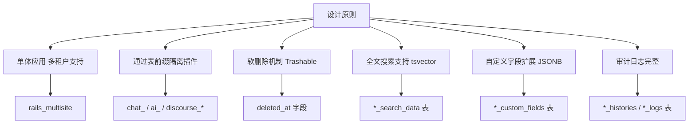

**核心设计特点**:
1. ✅ **无强制外键约束** - 应用层保证完整性，提升性能
2. ✅ **计数器缓存** - `posts_count`, `views` 等冗余字段，减少 COUNT 查询
3. ✅ **搜索表分离** - `*_search_data` 表存储 tsvector，加速全文搜索
4. ✅ **自定义字段表** - `*_custom_fields` 存储扩展属性（JSONB）
5. ✅ **软删除** - 关键表使用 `deleted_at` 而非物理删除
6. ✅ **多态关联** - `bookmarkable_type/id`, `target_type/id` 等
7. ✅ **时间分区** - `user_visits` 等大表按日期分区

---

## 📑 目录

### 核心业务模块
- [1. 用户系统 (Users)](#1-用户系统-users) - 10+ 表
- [2. 内容系统 (Topics & Posts)](#2-内容系统-topics--posts) - 15+ 表
- [3. 分类与标签 (Categories & Tags)](#3-分类与标签-categories--tags) - 8+ 表
- [4. 互动功能 (Actions & Reactions)](#4-互动功能-actions--reactions) - 12+ 表
- [5. 通知系统 (Notifications)](#5-通知系统-notifications) - 4+ 表
- [6. 权限与组 (Groups & Permissions)](#6-权限与组-groups--permissions) - 10+ 表

### 功能模块
- [7. 搜索系统 (Search)](#7-搜索系统-search) - 6+ 表
- [8. 上传系统 (Uploads)](#8-上传系统-uploads) - 5+ 表
- [9. 邮件系统 (Email)](#9-邮件系统-email) - 6+ 表
- [10. 审核系统 (Review)](#10-审核系统-review) - 8+ 表
- [11. 徽章系统 (Badges)](#11-徽章系统-badges) - 4+ 表
- [12. 主题系统 (Themes)](#12-主题系统-themes) - 10+ 表

### 扩展与插件
- [13. 聊天系统 (Chat Plugin)](#13-聊天系统-chat-plugin) - 15+ 表
- [14. AI 功能 (AI Plugin)](#14-ai-功能-ai-plugin) - 20+ 表
- [15. 投票功能 (Voting Plugins)](#15-投票功能-voting-plugins) - 10+ 表
- [16. 其他插件表](#16-其他插件表) - 50+ 表

### 系统与基础设施
- [17. 任务调度 (Sidekiq)](#17-任务调度-sidekiq) - 3+ 表
- [18. 统计分析 (Analytics)](#18-统计分析-analytics) - 8+ 表
- [19. 缓存与会话 (Redis)](#19-缓存与会话-redis)
- [20. 系统配置 (Settings)](#20-系统配置-settings) - 5+ 表

---

## 1. 用户系统 (Users)

### 1.1 核心表概览

| 表名 | 记录数量级 | 核心字段 | 业务用途 |
|------|----------|---------|---------|
| **users** | 百万级 | username, email, trust_level | 用户主表 |
| **user_emails** | 百万级 | email, primary, confirmed | 邮箱管理（支持多邮箱）|
| **user_profiles** | 百万级 | bio, website, location | 用户资料 |
| **user_stats** | 百万级 | posts_count, likes_given | 统计数据 |
| **user_options** | 百万级 | email_digests, mailing_list_mode | 用户偏好设置 |
| **user_avatars** | 百万级 | custom_upload_id, gravatar_upload_id | 头像管理 |
| **user_auth_tokens** | 千万级 | auth_token, seen | 登录会话 token |
| **user_auth_token_logs** | 亿级 | action, created_at | 登录日志（审计）|
| **user_api_keys** | 十万级 | key, scopes | API 密钥 |
| **user_custom_fields** | 百万级 | name, value (text) | 扩展字段 |
| **user_histories** | 千万级 | action, details | 用户操作历史 |
| **user_visits** | 亿级 | visited_at, posts_read | 访问记录（按日统计）|

### 1.2 表关系图

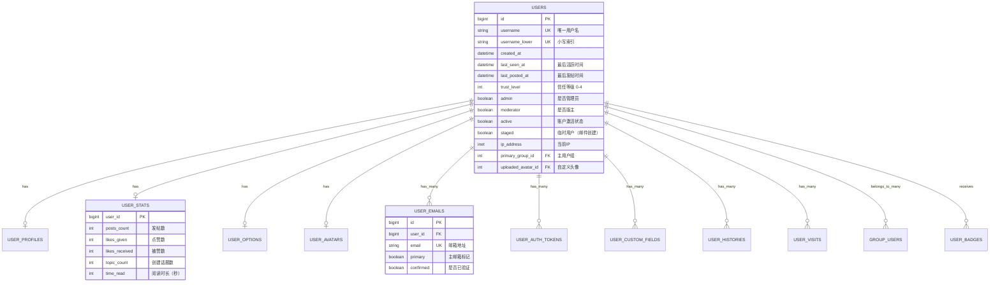

### 1.3 业务逻辑说明

#### 信任等级系统 (Trust Level)
```ruby
# lib/trust_level.rb
TrustLevel[0] = 新用户 (New User)       - 受限制
TrustLevel[1] = 基础用户 (Basic User)   - 基本权限
TrustLevel[2] = 成员 (Member)           - 更多权限
TrustLevel[3] = 常客 (Regular)          - 高级权限
TrustLevel[4] = 领袖 (Leader)           - 接近版主权限
```

**自动晋升条件** (可配置):
- TL1: 阅读 5 个话题，30 篇帖子，10 分钟阅读时长
- TL2: 15 天内访问 15 天，阅读 20% 的帖子，收到 1 个赞
- TL3: 50 天内访问 50 天，阅读 25% 的帖子，给出 30 个赞，收到 20 个赞

#### 多邮箱支持
- 一个用户可以有多个邮箱（`user_emails` 表）
- 只有一个主邮箱（`primary = true`）
- 邮箱变更需要验证（`email_change_requests` 表）

#### 会话管理
- `user_auth_tokens`: 存储登录 token（支持多设备）
- `user_auth_token_logs`: 审计日志，记录所有登录/登出行为
- Redis 存储短期会话数据

---

## 2. 内容系统 (Topics & Posts)

### 2.1 核心表概览

| 表名 | 记录数量级 | 核心字段 | 业务用途 |
|------|----------|---------|---------|
| **topics** | 百万级 | title, category_id, user_id | 话题主表 |
| **posts** | 千万级 | raw, cooked, topic_id, post_number | 帖子内容 |
| **post_revisions** | 千万级 | modifications, number | 编辑历史 |
| **post_replies** | 千万级 | post_id, reply_post_id | 回复关系 |
| **post_actions** | 千万级 | post_action_type_id (like/flag) | 用户互动 |
| **post_timings** | 亿级 | msecs, post_id, user_id | 阅读统计 |
| **topic_users** | 千万级 | notification_level, last_read_post_number | 用户跟踪 |
| **topic_allowed_users** | 百万级 | topic_id, user_id | 私信权限 |
| **topic_allowed_groups** | 十万级 | topic_id, group_id | 私信权限（组）|
| **topic_links** | 千万级 | url, clicks | 外部链接 |
| **topic_embeds** | 十万级 | embed_url, topic_id | 外部嵌入 |
| **topic_views** | 亿级 | topic_id, viewed_at, ip_address | 浏览记录 |
| **topic_search_data** | 百万级 | search_data (tsvector) | 全文搜索 |
| **post_search_data** | 千万级 | search_data (tsvector) | 全文搜索 |

### 2.2 表关系图

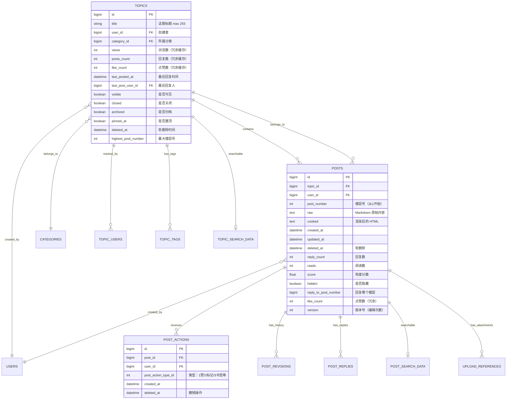

### 2.3 业务逻辑说明

#### 帖子编号系统
- **topic_id + post_number** 组成唯一标识
- `post_number = 1` 是主帖（OP）
- `post_number >= 2` 是回复
- URL 格式: `/t/topic-slug/{topic_id}/{post_number}`

#### 内容渲染流程
```ruby
# 保存流程
1. User 输入 Markdown (raw)
2. PrettyText.cook(raw) -> HTML (cooked)
3. 提取链接 -> topic_links
4. 生成搜索数据 -> post_search_data (tsvector)
5. 异步处理：图片优化、Onebox、通知等
```

#### 软删除机制
- 用户删除: `deleted_at` 设置，`deleted_by_id` 记录操作者
- 保留 24 小时可恢复
- 24 小时后物理删除（后台任务）

#### 计数器缓存
```sql
-- 避免频繁 COUNT 查询
topics.posts_count        -- 回复数（不含主帖）
topics.views              -- 浏览数
posts.reply_count         -- 被回复次数
posts.like_count          -- 点赞数
```

---

## 3. 分类与标签 (Categories & Tags)

### 3.1 核心表概览

| 表名 | 记录数量级 | 核心字段 | 业务用途 |
|------|----------|---------|---------|
| **categories** | 千级 | name, slug, parent_category_id | 分类主表（支持多级）|
| **category_groups** | 万级 | permission_type | 分类权限（基于组）|
| **category_users** | 十万级 | notification_level | 用户关注分类 |
| **category_custom_fields** | 万级 | name, value | 扩展字段 |
| **category_search_data** | 千级 | search_data (tsvector) | 分类搜索 |
| **tags** | 万级 | name, topic_count | 标签主表 |
| **tag_groups** | 千级 | name, permissions | 标签组 |
| **topic_tags** | 千万级 | topic_id, tag_id | 话题-标签关联 |
| **category_tags** | 万级 | category_id, tag_id | 分类允许的标签 |
| **tag_users** | 十万级 | notification_level | 用户关注标签 |

### 3.2 表关系图

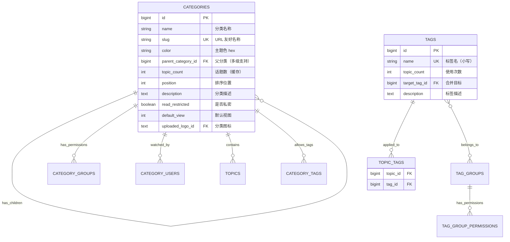

### 3.3 业务逻辑说明

#### 分类层级结构
- 支持最多 2 级分类（父分类 + 子分类）
- `parent_category_id IS NULL` 表示顶级分类
- 权限继承：子分类可以继承父分类权限

#### 权限模型
```ruby
# category_groups.permission_type
0 = 完全访问 (Full)
1 = 创建/回复/查看 (Create/Reply/See)
2 = 仅回复/查看 (Reply/See)
3 = 仅查看 (See)
```

#### 标签系统
- 可以限制某个分类只能使用特定标签（`category_tags`）
- 标签组可以设置互斥规则（一个话题只能选一个）
- 支持标签合并（`target_tag_id` 指向合并目标）

---

## 4. 互动功能 (Actions & Reactions)

### 4.1 核心表概览

| 表名 | 记录数量级 | 核心字段 | 业务用途 |
|------|----------|---------|---------|
| **post_actions** | 千万级 | post_action_type_id | 点赞/标记/书签 |
| **post_action_types** | 10+ 条 | name_key | 操作类型定义 |
| **bookmarks** | 百万级 | bookmarkable_type/id | 书签（多态）|
| **user_actions** | 亿级 | action_type, target_* | 用户行为流 |
| **given_daily_likes** | 百万级 | user_id, date, likes_given | 每日点赞限额 |
| **topic_links** | 千万级 | url, clicks | 外链追踪 |
| **topic_link_clicks** | 千万级 | topic_link_id, user_id | 点击记录 |
| **quoted_posts** | 千万级 | post_id, quoted_post_id | 引用关系 |
| **discourse_reactions_*** | 插件表 | emoji | 表情回复（插件）|

### 4.2 表关系图

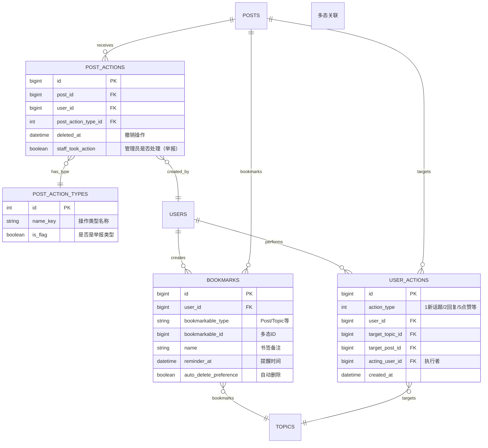

### 4.3 业务逻辑说明

#### Post Action Types（操作类型）
```ruby
1  = Like (点赞)
2  = Bookmark (书签 - 已废弃，迁移到 bookmarks 表)
3  = Flag - Off Topic (举报：偏题)
4  = Flag - Inappropriate (举报：不当内容)
5  = Flag - Spam (举报：垃圾信息)
6  = Flag - Notify User (举报：通知用户)
7  = Flag - Notify Moderators (举报：通知版主)
8  = Flag - Something Else (举报：其他)
```

#### User Action Types（用户行为）
```ruby
1  = 创建新话题 (New Topic)
2  = 回复帖子 (Reply)
4  = 回复给自己 (Response)
5  = 点赞帖子 (Like)
6  = 被点赞 (Was Liked)
7  = 创建书签 (Bookmark)
9  = 创建私信 (New Private Message)
11 = 回复私信 (Reply Private Message)
12 = 被提及 (Mention)
13 = 引用 (Quote)
...
```

#### 点赞限制机制
- 每日点赞数限制（基于信任等级）
- `given_daily_likes` 表记录每日点赞数
- TL0: 50次/天，TL1+: 无限制（可配置）

---

## 5. 通知系统 (Notifications)

### 5.1 核心表概览

| 表名 | 记录数量级 | 核心字段 | 业务用途 |
|------|----------|---------|---------|
| **notifications** | 亿级 | notification_type, user_id, read | 通知主表 |
| **shelved_notifications** | 百万级 | notification_id | 延迟通知（免打扰）|
| **user_notification_schedules** | 十万级 | enabled, day, time | 通知计划 |
| **do_not_disturb_timings** | 十万级 | starts_at, ends_at | 免打扰时段 |

### 5.2 通知类型完整列表

```ruby
# app/models/notification.rb
TYPES = {
  mentioned: 1,                    # 被 @提及
  replied: 2,                      # 帖子被回复
  quoted: 3,                       # 被引用
  edited: 4,                       # 帖子被编辑
  liked: 5,                        # 被点赞
  private_message: 6,              # 收到私信
  invited_to_private_message: 7,   # 被邀请到私信
  invitee_accepted: 8,             # 邀请被接受
  posted: 9,                       # 关注的话题有新回复
  moved_post: 10,                  # 帖子被移动
  linked: 11,                      # 被其他帖子链接
  granted_badge: 12,               # 获得徽章
  invited_to_topic: 13,            # 被邀请到话题
  custom: 14,                      # 自定义通知
  group_mentioned: 15,             # 组被提及
  group_message_summary: 16,       # 组消息摘要
  watching_first_post: 17,         # 关注的分类有新话题
  topic_reminder: 18,              # 话题提醒
  liked_consolidated: 19,          # 点赞汇总
  post_approved: 20,               # 帖子被批准
  code_review_commit_approved: 21, # 代码审核通过
  membership_request_accepted: 22, # 组加入请求通过
  membership_request_consolidated: 23, # 组请求汇总
  bookmark_reminder: 24,           # 书签提醒
  reaction: 25,                    # 表情回复
  votes_released: 26,              # 投票发布
  event_reminder: 27,              # 日程提醒
  event_invitation: 28,            # 日程邀请
  chat_mention: 29,                # 聊天提及
  chat_message: 30,                # 聊天消息
  chat_invitation: 31,             # 聊天邀请
  chat_group_mention: 32,          # 聊天组提及
  chat_quoted: 33,                 # 聊天引用
  assigned: 34,                    # 被分配任务
  new_features: 35,                # 新功能提示
  watching_category_or_tag: 36,    # 关注的分类/标签
  admin_problems: 37,              # 管理员问题
}
```

### 5.3 通知机制说明

#### 通知优先级
- `high_priority = true`: 立即推送（私信、@提及）
- `high_priority = false`: 可以合并批量推送

#### 免打扰模式
1. **全局免打扰**: `do_not_disturb_timings` 表设置时段
2. **消息搁置**: 通知暂存到 `shelved_notifications`，免打扰结束后发送
3. **通知计划**: 用户可设置每天什么时间接收通知邮件

#### 通知聚合
- 点赞通知每小时聚合一次（`liked_consolidated`）
- 避免通知轰炸

---

## 6. 权限与组 (Groups & Permissions)

### 6.1 核心表概览

| 表名 | 记录数量级 | 核心字段 | 业务用途 |
|------|----------|---------|---------|
| **groups** | 千级 | name, visibility_level | 用户组主表 |
| **group_users** | 百万级 | group_id, user_id, owner | 组成员关系 |
| **category_groups** | 万级 | permission_type | 分类权限 |
| **group_histories** | 十万级 | action, acting_user_id | 组操作历史 |
| **group_requests** | 十万级 | status | 加入申请 |
| **group_mentions** | 百万级 | post_id, group_id | 组提及 |
| **associated_groups** | 万级 | provider_name, provider_id | SSO 组关联 |

### 6.2 权限设计架构

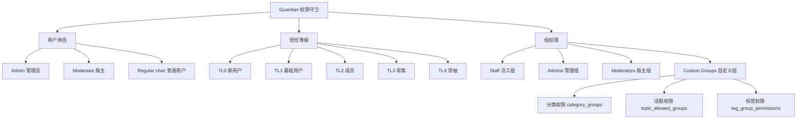

### 6.3 系统内置组

```ruby
# 不可删除的系统组
Group::AUTO_GROUPS = {
  everyone: 0,          # 所有用户
  admins: 1,           # 管理员
  moderators: 2,       # 版主
  staff: 3,            # 员工（管理员+版主）
  trust_level_0: 10,   # TL0 用户
  trust_level_1: 11,   # TL1 用户
  trust_level_2: 12,   # TL2 用户
  trust_level_3: 13,   # TL3 用户
  trust_level_4: 14,   # TL4 用户
}
```

### 6.4 权限检查流程

```ruby
# lib/guardian.rb 核心逻辑
class Guardian
  def can_see?(object)
    case object
    when Topic
      # 1. 话题是否已删除？
      # 2. 话题是否可见？
      # 3. 用户是否有分类访问权限？
      # 4. 如果是私信，用户是否在 topic_allowed_users？
    when Post
      # 1. 帖子是否已删除？
      # 2. 用户能否看到所属话题？
      # 3. 帖子是否被隐藏（需要版主权限）？
    when Category
      # 1. 分类是否 read_restricted？
      # 2. 用户所属的组是否有 category_groups 权限？
    end
  end
end
```

---

## 7. 搜索系统 (Search)

### 7.1 核心表概览

| 表名 | 记录数量级 | 核心字段 | 业务用途 |
|------|----------|---------|---------|
| **topic_search_data** | 百万级 | search_data (tsvector) | 话题全文搜索 |
| **post_search_data** | 千万级 | search_data (tsvector), raw_data | 帖子全文搜索 |
| **category_search_data** | 千级 | search_data (tsvector) | 分类搜索 |
| **tag_search_data** | 万级 | search_data (tsvector) | 标签搜索 |
| **user_search_data** | 百万级 | search_data (tsvector) | 用户搜索 |
| **search_logs** | 千万级 | term, search_type, user_id | 搜索日志分析 |

### 7.2 PostgreSQL 全文搜索设计

```sql
-- post_search_data 表结构示例
CREATE TABLE post_search_data (
  post_id bigint PRIMARY KEY,
  search_data tsvector,  -- 分词后的搜索向量
  raw_data text,         -- 原始文本（用于高亮）
  locale text,           -- 语言
  version int DEFAULT 0  -- 索引版本
);

-- GIN 索引加速搜索
CREATE INDEX idx_search_post ON post_search_data 
  USING GIN (search_data);

-- 搜索查询示例
SELECT post_id 
FROM post_search_data 
WHERE search_data @@ to_tsquery('english', 'discourse & forum')
ORDER BY ts_rank(search_data, to_tsquery('english', 'discourse & forum')) DESC;
```

### 7.3 搜索权重策略

```ruby
# lib/search.rb
WEIGHTS = {
  A: 1.0,  # 标题 (最高权重)
  B: 0.2,  # 分类名称
  C: 0.8,  # 帖子内容
  D: 0.5,  # 标签
}

# 构建搜索向量
setweight(to_tsvector('english', title), 'A') ||
setweight(to_tsvector('english', cooked), 'C')
```

### 7.4 搜索类型

1. **全文搜索**: PostgreSQL tsvector + tsquery
2. **用户搜索**: username, name 模糊匹配
3. **分类搜索**: name, description 匹配
4. **标签搜索**: 精确匹配 + 同义词
5. **高级搜索**: 
   - 按分类过滤 `category:support`
   - 按用户过滤 `@username`
   - 按时间过滤 `after:2024-01-01`
   - 按状态过滤 `status:solved`

---

## 8. 上传系统 (Uploads)

### 8.1 核心表概览

| 表名 | 记录数量级 | 核心字段 | 业务用途 |
|------|----------|---------|---------|
| **uploads** | 千万级 | url, sha1, filesize | 文件主表 |
| **upload_references** | 千万级 | target_type/id (多态) | 引用关系（GC 用）|
| **optimized_images** | 千万级 | upload_id, width, height | 图片缩略图 |
| **optimized_videos** | 十万级 | upload_id | 视频优化 |
| **external_upload_stubs** | 十万级 | key, status | 外部上传临时记录 |
| **user_uploads** | 千万级 | user_id, upload_id | 用户上传历史 |

### 8.2 上传流程设计

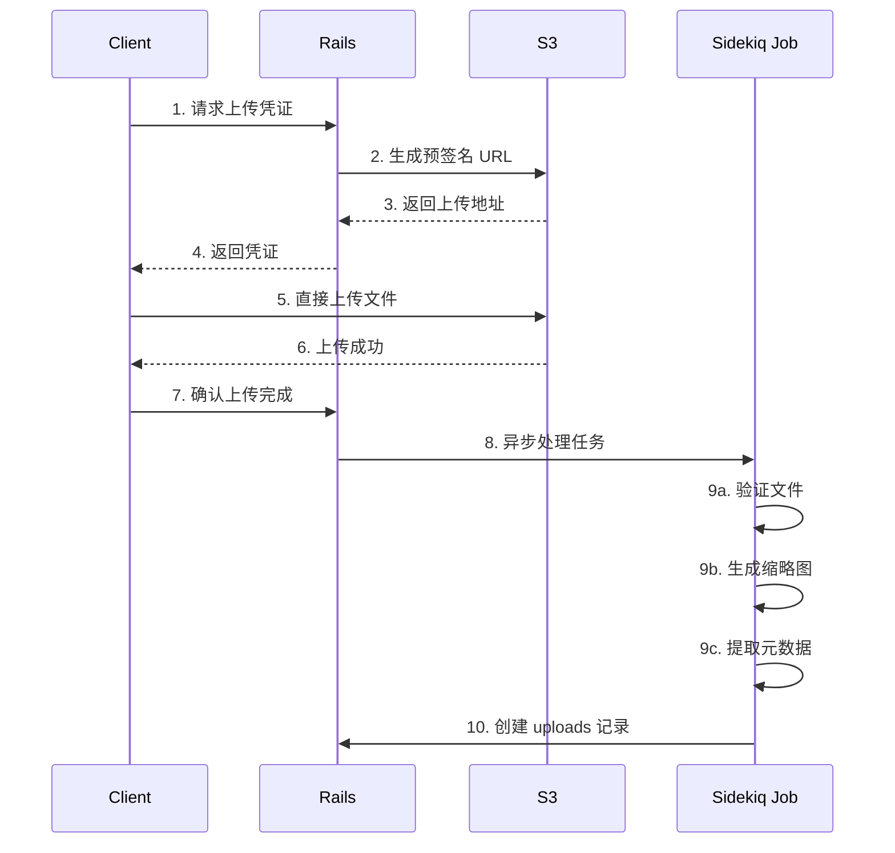

### 8.3 文件存储策略

#### 本地存储
```ruby
# public/uploads/default/
# ├── original/
# │   └── 1X/  # 按 ID 分片
# │       └── abc123.jpg
# └── optimized/
#     └── 1X/
#         └── abc123_2_100x100.jpg
```

#### S3 存储
```ruby
# s3://bucket-name/
# ├── original/
# │   └── 1X/abc123def456.jpg
# └── optimized/
#     └── 1X/abc123def456_2_100x100.jpg
```

### 8.4 图片优化策略

| 优化类型 | 尺寸 | 用途 |
|---------|------|------|
| **thumbnail** | 最大 500x500 | 帖子列表缩略图 |
| **medium** | 最大 1500x1500 | 帖子内查看 |
| **large** | 最大 2000x2000 | 高清预览 |
| **avatar** | 20/25/32/45/60/90/120/240 | 用户头像多尺寸 |

### 8.5 垃圾回收机制

```ruby
# upload_references 表追踪引用
# 定期任务检查孤立文件（无引用的 uploads）
# 保留 30 天后删除（可配置）

Jobs.enqueue(:cleanup_uploads)
# 1. 查找 created_at < 30天 且无 upload_references 的记录
# 2. 从 S3/本地删除文件
# 3. 删除 uploads 记录
```

---

## 9. 邮件系统 (Email)

### 9.1 核心表概览

| 表名 | 记录数量级 | 核心字段 | 业务用途 |
|------|----------|---------|---------|
| **email_logs** | 亿级 | email_type, to_address, user_id | 发送日志 |
| **skipped_email_logs** | 千万级 | reason_type | 跳过原因 |
| **email_tokens** | 百万级 | token, expired, confirmed | 邮件验证 token |
| **email_change_requests** | 十万级 | old_email, new_email, change_state | 邮箱变更请求 |
| **incoming_emails** | 千万级 | message_id, raw | 收到的邮件（邮件回复）|
| **user_emails** | 百万级 | email, primary, confirmed | 用户邮箱 |

### 9.2 邮件类型

```ruby
EMAIL_TYPES = {
  signup: '注册确认',
  signup_after_approval: '审核通过通知',
  forgot_password: '忘记密码',
  email_login: '邮件登录',
  admin_confirmation_new: '管理员确认',
  notify_old_email: '旧邮箱通知',
  notify_old_email_add: '添加邮箱通知',
  post: '帖子通知',
  digest: '摘要邮件',
  invite: '邀请邮件',
  mailing_list: '邮件列表模式',
  group_smtp: '组邮件',
}
```

### 9.3 邮件回复处理


#### Reply Key 机制
```ruby
# post_reply_keys 表存储一次性 key
# 格式: {uuid}@{site_name}
# 例如: abc123def456@forum.example.com
# 回复时解析 key，关联到 post_id 和 user_id
```

---

## 10. 审核系统 (Review)

### 10.1 核心表概览

| 表名 | 记录数量级 | 核心字段 | 业务用途 |
|------|----------|---------|---------|
| **reviewables** | 百万级 | type, status, score | 待审核项主表 |
| **reviewable_scores** | 千万级 | reviewable_id, user_id, score | 举报评分 |
| **reviewable_histories** | 千万级 | reviewable_action_id | 审核历史 |
| **reviewable_claimed_topics** | 十万级 | topic_id, user_id | 话题认领（版主）|
| **flags** | 千万级 | post_id, flag_type | 举报记录 |

### 10.2 审核类型

```ruby
# Reviewable 子类
ReviewableQueuedPost    # 新用户帖子需审核
ReviewableFlaggedPost   # 被举报的帖子
ReviewableUser          # 新注册用户需审核
ReviewablePost          # AI 标记的可疑帖子
```

### 10.3 审核状态机

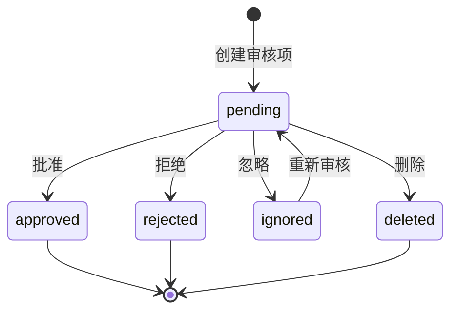

### 10.4 评分机制

```ruby
# reviewable_scores 累加规则
TL0 用户举报: +0.0 分（不累加）
TL1 用户举报: +1.0 分
TL2 用户举报: +2.0 分
TL3+ 用户举报: +5.0 分
版主举报: +10.0 分

# 达到阈值自动隐藏（可配置）
post.hide! if reviewable.score >= SiteSetting.hide_post_sensitivity
```

---

## 11. 徽章系统 (Badges)

### 11.1 核心表概览

| 表名 | 记录数量级 | 核心字段 | 业务用途 |
|------|----------|---------|---------|
| **badges** | 百级 | name, badge_type_id, query | 徽章定义 |
| **badge_types** | 5 条 | name (Gold/Silver/Bronze) | 徽章等级 |
| **badge_groupings** | 十级 | name, position | 徽章分组 |
| **user_badges** | 百万级 | badge_id, user_id, granted_at | 用户获得的徽章 |

### 11.2 徽章类型

| 类型 | ID | 说明 |
|------|----|----|
| Gold | 1 | 金色徽章（最稀有）|
| Silver | 2 | 银色徽章 |
| Bronze | 3 | 铜色徽章 |
| Badge | 4 | 普通徽章 |

### 11.3 系统内置徽章

```ruby
# 自动授予的徽章
Badge::Welcome           # 完成教程
Badge::FirstLink         # 第一次添加链接
Badge::FirstQuote        # 第一次引用
Badge::FirstLike         # 第一次点赞
Badge::FirstFlag         # 第一次举报
Badge::NicePost         # 帖子获得 10 个赞
Badge::GoodPost         # 帖子获得 25 个赞
Badge::GreatPost        # 帖子获得 50 个赞
Badge::PopularLink      # 分享的链接被点击 50 次
Badge::HotLink          # 分享的链接被点击 300 次
Badge::FamousLink       # 分享的链接被点击 1000 次
Badge::Editor           # 编辑帖子 1 次
Badge::Autobiographer   # 完善个人资料
```

---

## 12. 主题系统 (Themes)

### 12.1 核心表概览

| 表名 | 记录数量级 | 核心字段 | 业务用途 |
|------|----------|---------|---------|
| **themes** | 百级 | name, user_id, remote_theme_id | 主题主表 |
| **theme_fields** | 万级 | theme_id, name, value | 主题代码文件 |
| **theme_settings** | 千级 | theme_id, name, value | 主题配置 |
| **remote_themes** | 百级 | remote_url, branch | Git 远程主题 |
| **child_themes** | 千级 | parent_theme_id, child_theme_id | 组件继承 |
| **color_schemes** | 百级 | name, user_selectable | 配色方案 |
| **color_scheme_colors** | 千级 | color_scheme_id, name, hex | 颜色定义 |

### 12.2 主题结构

```ruby
# theme_fields.name 字段类型
TYPES = {
  # SCSS
  'scss' => { common, desktop, mobile, embedded },
  
  # JavaScript
  'javascript' => { common, desktop, mobile, head_tag },
  
  # HTML
  'html' => { header, after_header, footer, head_tag, body_tag },
  
  # Handlebars 模板
  'hbs' => { connector, custom_template },
  
  # Settings
  'yaml' => { settings, locales },
}
```

### 12.3 主题编译流程

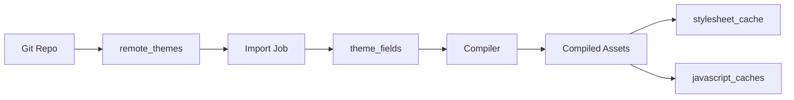

---

## 13. 聊天系统 (Chat Plugin)

### 13.1 核心表概览（带 `chat_` 前缀）

| 表名 | 记录数量级 | 核心字段 | 业务用途 |
|------|----------|---------|---------|
| **chat_channels** | 千级 | name, chatable_type/id | 聊天频道（公开/私聊）|
| **chat_messages** | 亿级 | chat_channel_id, user_id, message | 消息主表 |
| **chat_message_revisions** | 千万级 | old_message, new_message | 编辑历史 |
| **chat_mentions** | 千万级 | user_id, chat_message_id | @提及 |
| **chat_threads** | 百万级 | channel_id, original_message_id | 消息线程 |
| **user_chat_channel_memberships** | 百万级 | last_read_message_id | 用户频道关系 |
| **chat_message_reactions** | 千万级 | emoji, chat_message_id | 表情回复 |

### 13.2 聊天架构

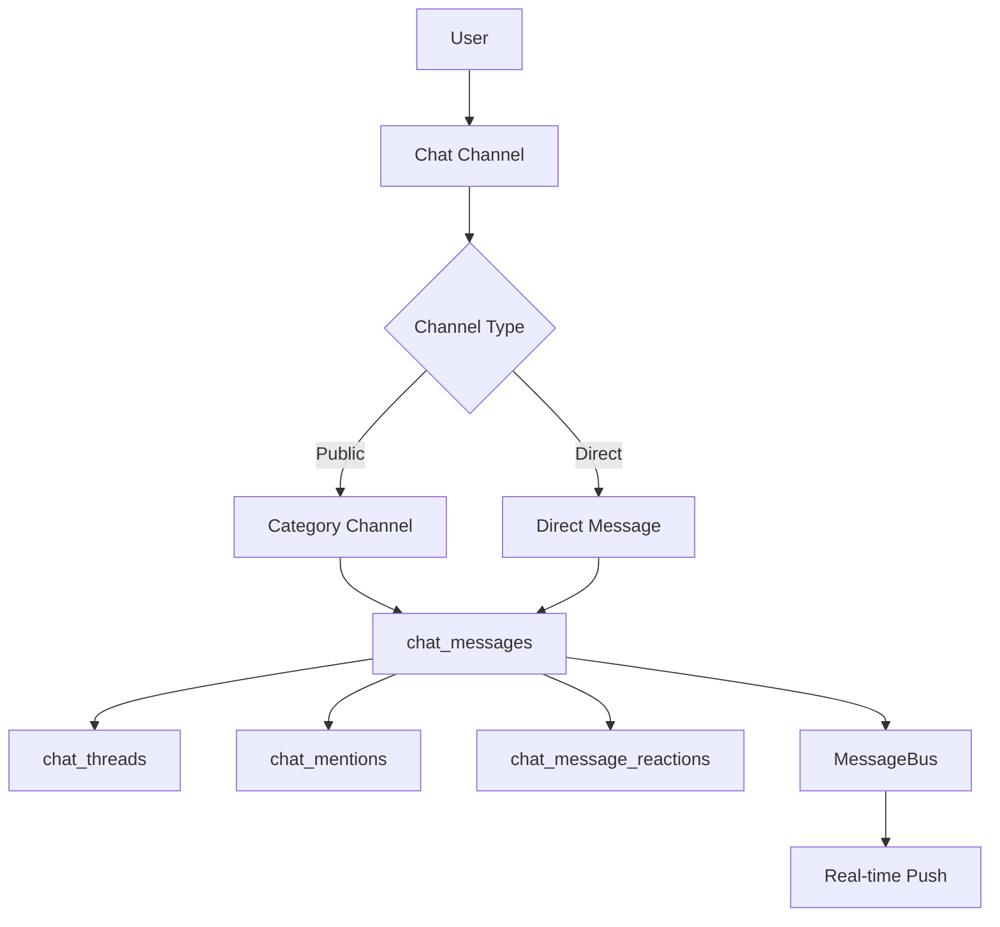

---

## 14. AI 功能 (AI Plugin)

### 14.1 核心表概览（带 `ai_` 前缀）

| 表名 | 记录数量级 | 核心字段 | 业务用途 |
|------|----------|---------|---------|
| **ai_personas** | 百级 | name, description, system_prompt | AI 角色定义 |
| **ai_tools** | 百级 | name, script | AI 工具/函数 |
| **ai_summaries** | 百万级 | target_id, content | AI 摘要 |
| **llm_models** | 十级 | provider, name, api_endpoint | LLM 模型配置 |
| **ai_api_audit_logs** | 千万级 | request_tokens, response_tokens | API 调用日志 |
| **ai_posts_embeddings** | 千万级 | post_id, embeddings | 帖子向量嵌入 |
| **ai_topics_embeddings** | 百万级 | topic_id, embeddings | 话题向量嵌入 |
| **rag_document_fragments** | 百万级 | fragment, embeddings | RAG 文档片段 |
| **shared_ai_conversations** | 十万级 | context, llm_model_id | 共享对话 |

### 14.2 AI 功能架构

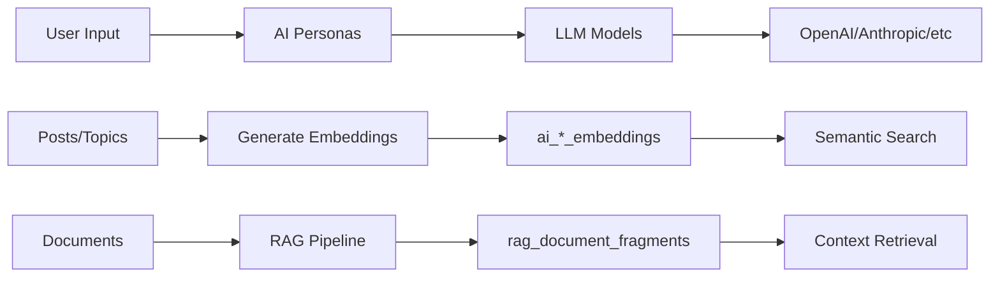

---

## 15. 投票功能 (Voting Plugins)

### 15.1 核心表概览

| 表名 | 记录数量级 | 核心字段 | 业务用途 |
|------|----------|---------|---------|
| **polls** | 百万级 | post_id, name, type | 投票主表 |
| **poll_options** | 千万级 | poll_id, html | 投票选项 |
| **poll_votes** | 千万级 | poll_id, poll_option_id, user_id | 用户投票 |
| **post_voting_votes** | 千万级 | votable_type/id, direction | 帖子赞/踩 |
| **topic_voting_votes** | 百万级 | topic_id, user_id | 话题投票 |

---

## 16. 其他插件表

### 16.1 插件表分类

| 前缀 | 功能 | 表数量 |
|------|------|--------|
| **discourse_post_event_*** | 日程活动 | 3 表 |
| **discourse_solved_*** | 已解决标记 | 1 表 |
| **discourse_calendar_*** | 日历 | 2 表 |
| **discourse_automation_*** | 自动化规则 | 7 表 |
| **discourse_subscriptions_*** | 订阅付费 | 3 表 |
| **discourse_reactions_*** | 表情回复 | 2 表 |
| **gamification_*** | 游戏化 | 3 表 |
| **ad_plugin_*** | 广告系统 | 4 表 |
| **github_*** | GitHub 集成 | 2 表 |

---

## 17. 任务调度 (Sidekiq)

### 17.1 核心表概览

| 表名 | 记录数量级 | 核心字段 | 业务用途 |
|------|----------|---------|---------|
| **scheduler_stats** | 万级 | name, duration_ms | 定时任务统计 |
| **javascript_caches** | 千级 | theme_field_id, content | JS 编译缓存 |
| **stylesheet_cache** | 千级 | target, digest | CSS 编译缓存 |

### 17.2 常见后台任务

```ruby
# 定时任务（每分钟/小时/天执行）
Jobs::CleanupUploads          # 清理孤立上传文件
Jobs::PeriodicalUpdates       # 更新热门话题分数
Jobs::UpdateTopTopics         # 更新 Top 榜单
Jobs::EnqueueDigestEmails     # 发送摘要邮件
Jobs::CleanUpStalingUsers     # 清理临时用户
Jobs::GrantBadges             # 授予徽章
Jobs::UpdateUsername          # 更新用户名引用
Jobs::CreateMissingAvatars    # 生成缺失头像
Jobs::PullHotlinkedImages     # 下载外链图片
```

---

## 18. 统计分析 (Analytics)

### 18.1 核心表概览

| 表名 | 记录数量级 | 核心字段 | 业务用途 |
|------|----------|---------|---------|
| **user_visits** | 亿级 | user_id, visited_at, posts_read | 每日访问统计 |
| **topic_views** | 亿级 | topic_id, viewed_at, user_id | 话题浏览 |
| **topic_view_stats** | 千万级 | viewed_at, anonymous_views | 按小时统计 |
| **application_requests** | 千万级 | req_type, count | API 请求统计 |
| **incoming_links** | 千万级 | url, referer, topic_id | 外部引流 |
| **incoming_referers** | 百万级 | path, referer, incoming_domain_id | 来源统计 |
| **directory_items** | 百万级 | period_type, likes_received, posts_read | 用户排行榜 |
| **top_topics** | 千万级 | topic_id, period, score | 热门话题榜 |

### 18.2 统计维度

```ruby
# directory_items / top_topics 的 period_type
PERIODS = {
  daily: 1,       # 日榜
  weekly: 2,      # 周榜
  monthly: 3,     # 月榜
  quarterly: 4,   # 季榜
  yearly: 5,      # 年榜
  all: 6,         # 总榜
}
```

---

## 19. 缓存与会话 (Redis)

### 19.1 Redis 使用场景

| Key 前缀 | 用途 | 数据类型 | 过期时间 |
|---------|------|---------|---------|
| `_DISCOURSE_CACHE:*` | 通用缓存 | String | 可变 |
| `_DISCOURSE_RATE_LIMIT:*` | 频率限制 | String | 1分钟-1天 |
| `message_bus:*` | 实时消息总线 | List | 7天 |
| `mutex:*` | 分布式锁 | String | 60秒 |
| `anon-cache:*` | 匿名用户页面缓存 | String | 10分钟 |
| `user-last-seen:*` | 用户最后活跃时间 | String | 永久 |
| `topic-views:*` | 话题浏览计数 | String | 1小时 |
| `hot-topics` | 热门话题集合 | Sorted Set | 实时 |
| `digest:*` | 摘要邮件队列 | List | 7天 |

### 19.2 MessageBus 架构

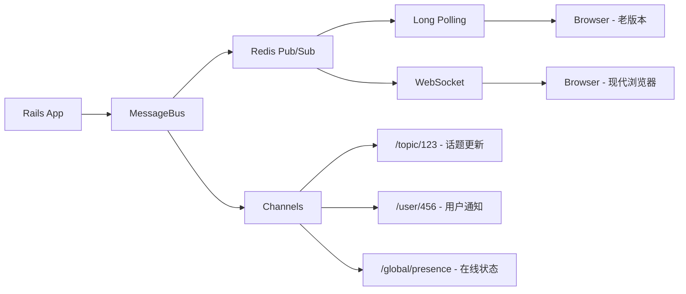

### 19.3 缓存策略

```ruby
# 1. 页面片段缓存（Fragment Cache）
cache "user-card-#{user.id}-#{user.updated_at}" do
  render_user_card(user)
end

# 2. 低级缓存（Low-Level Cache）
Discourse.cache.fetch("site-settings", expires_in: 30.minutes) do
  SiteSetting.all_settings
end

# 3. 对象缓存
@user ||= User.find_by(id: user_id)

# 4. 查询结果缓存
Topic.where(category_id: 1).cache_key
```

---

## 20. 系统配置 (Settings)

### 20.1 核心表概览

| 表名 | 记录数量级 | 核心字段 | 业务用途 |
|------|----------|---------|---------|
| **site_settings** | 千级 | name, value, data_type | 站点配置 |
| **site_setting_groups** | 十级 | name, position | 配置分组 |
| **plugin_store_rows** | 万级 | plugin_name, key, value | 插件数据存储 |
| **translation_overrides** | 万级 | locale, translation_key, value | 文本覆盖 |
| **custom_emojis** | 千级 | name, upload_id | 自定义表情 |

### 20.2 核心配置项

```yaml
# 重要的 site_settings
title: "站点标题"
site_description: "站点描述"
contact_email: "联系邮箱"
contact_url: "联系 URL"

# 用户相关
min_trust_to_create_topic: 0          # 创建话题最低信任等级
min_trust_to_edit_post: 0             # 编辑帖子最低信任等级
max_mentions_per_post: 10             # 每帖最多 @提及数
delete_user_max_post_age: 60          # 用户自删账户最大帖子年龄（天）

# 内容相关
min_post_length: 20                    # 最短帖子长度
max_post_length: 32000                 # 最长帖子长度
title_min_entropy: 10                  # 标题最小熵值（防灌水）
body_min_entropy: 50                   # 内容最小熵值

# 上传相关
max_attachment_size_kb: 4096           # 最大附件大小
max_image_size_kb: 4096                # 最大图片大小
authorized_extensions: jpg|jpeg|png|gif # 允许的扩展名

# 邮件相关
email_time_window_mins: 10             # 邮件窗口期（合并通知）
disable_emails: no                     # 禁用邮件

# 安全相关
enable_cors: false                     # CORS 支持
cors_origins: ""                       # CORS 域名白名单
enable_sso: false                      # SSO 单点登录
sso_url: ""                           # SSO 登录 URL
```

---

## 📚 数据库设计理念总结

### 设计亮点

1. **无外键约束** ✅
   - 应用层保证数据完整性
   - 避免锁竞争，提升并发性能
   - 灵活支持分库分表

2. **计数器缓存** ✅
   ```ruby
   # 避免每次查询都 COUNT
   topic.posts_count       # 冗余存储回复数
   user_stat.posts_count   # 冗余存储用户发帖数
   category.topic_count    # 冗余存储分类话题数
   ```

3. **搜索表分离** ✅
   - `*_search_data` 独立表存储 tsvector
   - GIN 索引加速全文搜索
   - 不影响主表性能

4. **自定义字段扩展** ✅
   - `*_custom_fields` 表（key-value）
   - 插件无需修改核心表结构
   - 支持 JSONB 类型

5. **软删除机制** ✅
   ```ruby
   # deleted_at 字段标记删除
   # deleted_by_id 记录操作者
   # 保留数据可恢复
   ```

6. **多态关联** ✅
   ```ruby
   # bookmarkable_type + bookmarkable_id
   # 可以书签 Post / Topic / 任意对象
   ```

7. **审计日志完整** ✅
   - `*_histories` 表记录操作历史
   - `*_logs` 表记录详细日志
   - 可追溯所有变更

### 性能优化手段

1. **索引策略**
   - 复合索引：`(user_id, created_at)`
   - 唯一索引：`username_lower`
   - GIN 索引：全文搜索
   - 部分索引：`WHERE deleted_at IS NULL`

2. **分区表**
   - `user_visits` 按日期分区
   - `topic_views` 按月分区
   - 提升大表查询性能

3. **物化视图**（未使用，可扩展）
   - 可用于复杂统计查询
   - 定期刷新

4. **读写分离**
   - 主库写入
   - 从库读取（搜索、统计）

### 扩展性设计

1. **多租户支持** (`rails_multisite`)
   - 表名无租户字段
   - 连接级别隔离
   - 共享代码，独立数据

2. **插件隔离**
   - 表名前缀隔离（`chat_`, `ai_`）
   - 不污染核心表
   - 可独立迁移/回滚

3. **水平扩展**
   - 无外键约束，便于分片
   - 用户维度分片
   - 分类维度分片

---

## 🎯 后续深入方向

### 示例指令

```bash
# 展开核心模块
"详细展开 [1. 用户系统]，包括完整表结构、索引、业务逻辑"
"深入分析 [2. 内容系统] 的帖子生命周期和缓存策略"
"解释 [6. 权限与组] 的 Guardian 实现原理"

# 分析特定场景
"分析创建话题的完整数据库操作流程"
"说明帖子编辑后如何更新所有相关表"
"解释搜索功能如何使用 PostgreSQL 全文搜索"

# 性能优化
"分析热门话题列表查询的性能优化方案"
"解释 Redis 在用户会话管理中的作用"
"说明如何优化大表的查询性能"

# 插件系统
"深入分析 [13. 聊天系统] 的实时消息架构"
"解释 [14. AI 功能] 的向量嵌入存储设计"
"说明插件如何扩展核心表结构"
```

### 推荐学习顺序

1. ✅ **第一步**: 熟悉 1-6 节核心业务模块
2. ✅ **第二步**: 理解 7-12 节功能模块
3. ✅ **第三步**: 研究 13-16 节插件扩展
4. ✅ **第四步**: 掌握 17-20 节系统基础设施

---

## 📊 表数量统计

| 模块 | 表数量 | 说明 |
|------|--------|------|
| 用户系统 | 12+ | 核心用户数据 |
| 内容系统 | 15+ | 话题和帖子 |
| 分类标签 | 10+ | 组织结构 |
| 互动功能 | 12+ | 点赞书签等 |
| 通知系统 | 4+ | 消息推送 |
| 权限组 | 10+ | 权限管理 |
| 搜索系统 | 6+ | 全文搜索 |
| 上传系统 | 6+ | 文件管理 |
| 邮件系统 | 6+ | 邮件收发 |
| 审核系统 | 5+ | 内容审核 |
| 徽章系统 | 4+ | 成就系统 |
| 主题系统 | 10+ | 外观定制 |
| **核心小计** | **100+** | **基础功能** |
| 聊天插件 | 15+ | Chat 功能 |
| AI 插件 | 20+ | AI 功能 |
| 投票插件 | 8+ | 投票功能 |
| 其他插件 | 50+ | 各类扩展 |
| **插件小计** | **93+** | **扩展功能** |
| 系统基础设施 | 30+ | 调度/统计/配置 |
| **总计** | **330+** | **完整系统** |
