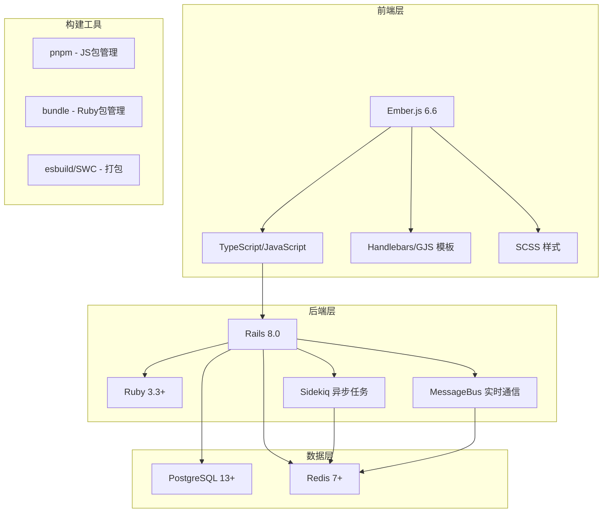
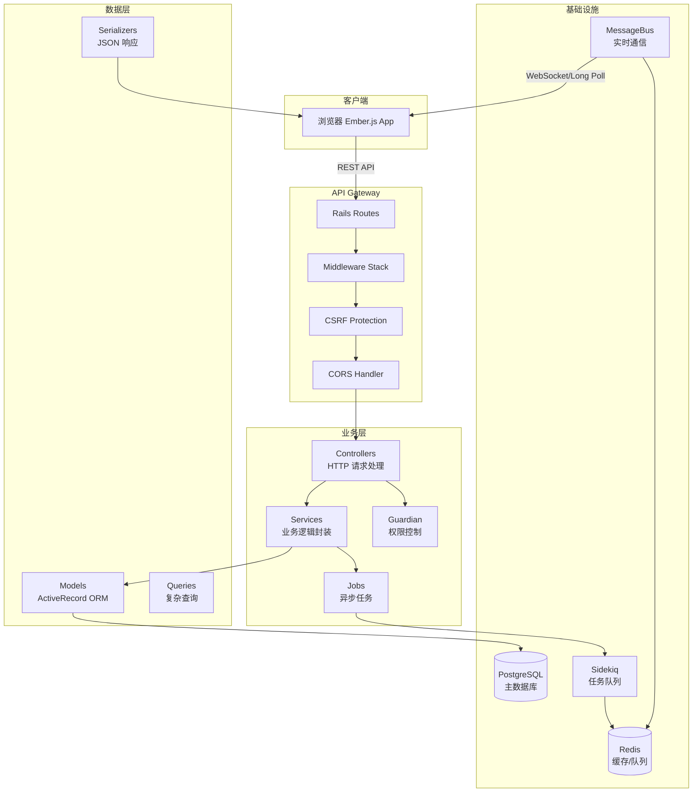
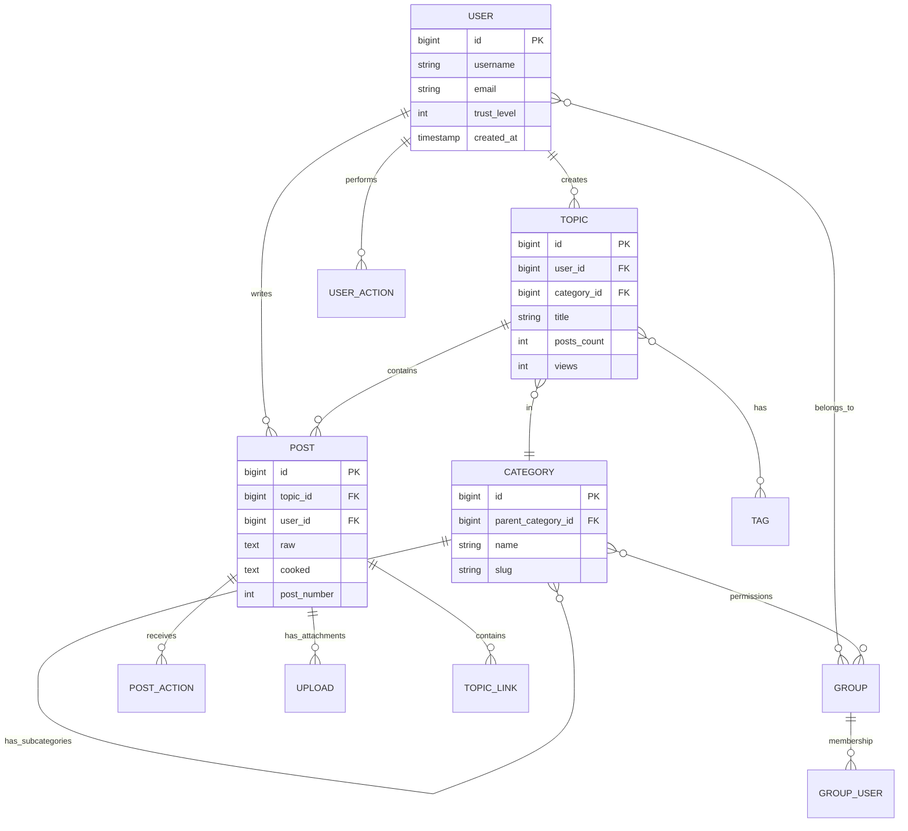
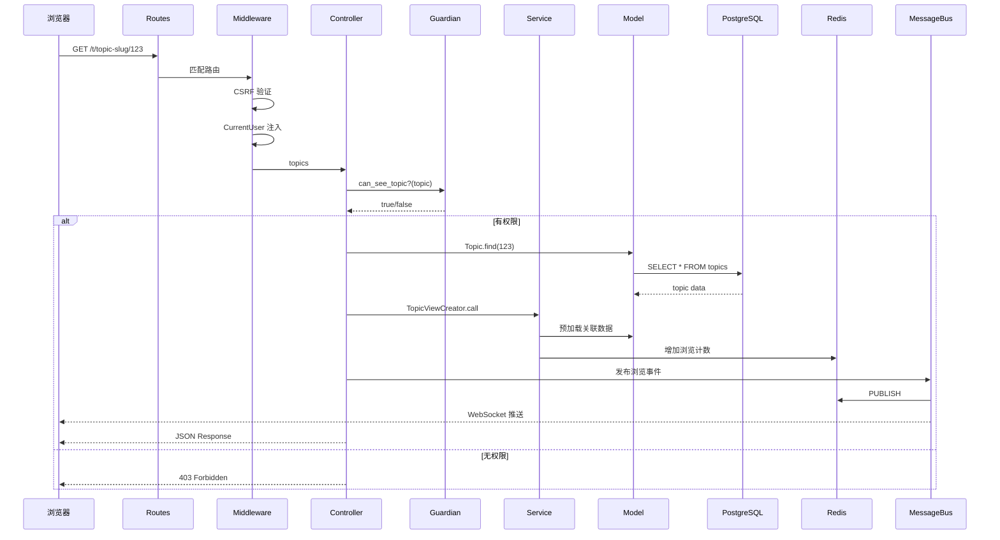
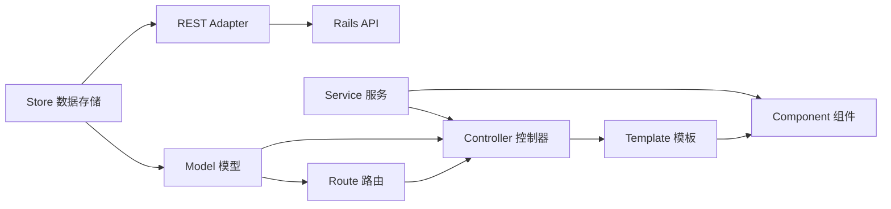
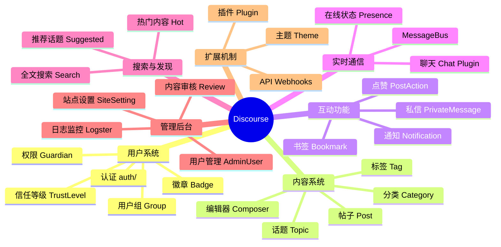
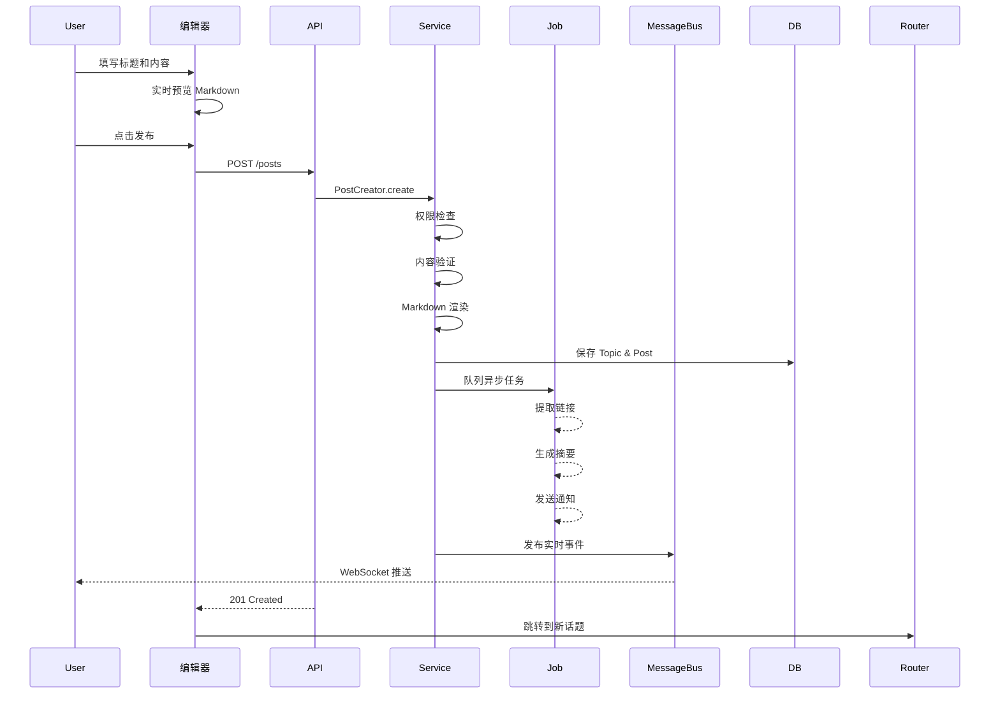
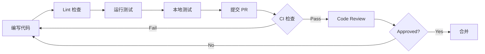

# Discourse 架构概览

> 面向熟悉 Go/Java 和 MVC 架构的研发人员快速上手指南

---

## 📋 目录

- [1. 项目概述](#1-项目概述)
- [2. 技术栈](#2-技术栈)
- [3. 项目结构](#3-项目结构)
- [4. 核心架构](#4-核心架构)
- [5. 数据模型](#5-数据模型)
- [6. 请求处理流程](#6-请求处理流程)
- [7. 前端架构](#7-前端架构)
- [8. 核心功能模块](#8-核心功能模块)
- [9. 扩展机制](#9-扩展机制)
- [10. 开发工具链](#10-开发工具链)
- [11. 与你熟悉的技术对比](#11-与你熟悉的技术对比)

---

## 1. 项目概述

**Discourse** 是一个 100% 开源的现代化社区论坛平台，采用前后端分离架构：
- **后端**: Ruby on Rails (RESTful API)
- **前端**: Ember.js (SPA 单页应用)
- **数据库**: PostgreSQL + Redis
- **实时通信**: MessageBus (基于 Redis)

### 核心特性
- 💬 话题讨论（Topic & Post）
- ⚡️ 实时聊天
- 🎨 主题定制系统
- 🔌 插件扩展机制
- 👥 用户权限管理（Guardian 模式）
- 🔍 全文搜索

---

## 2. 技术栈



### 核心依赖

**后端 (Gemfile)**:
- `rails ~> 8.0` - Web 框架
- `redis` + `redis-namespace` - 缓存和队列
- `sidekiq` - 异步任务处理（类似 Go 的 goroutine + channel）
- `message_bus` - 实时消息推送
- `rails_multisite` - 多租户支持
- `aws-sdk-s3` - 对象存储
- `nokogiri` + `loofah` - HTML 处理

**前端 (package.json)**:
- `ember-source 6.6` - 前端框架
- `typescript ^5.9` - 类型系统
- `esbuild` - 快速打包
- `playwright` - E2E 测试

---

## 3. 项目结构

```
discourse/
├── app/                          # Rails 应用核心（类似 Spring Boot 的主目录）
│   ├── controllers/              # 控制器（135个）- 处理 HTTP 请求
│   ├── models/                   # 模型（349个）- ORM 实体
│   ├── serializers/              # JSON 序列化器（228个）- 类似 DTO
│   ├── services/                 # 业务逻辑层（135个）- 推荐模式
│   ├── jobs/                     # 异步任务（218个）- Sidekiq jobs
│   ├── mailers/                  # 邮件发送
│   ├── views/                    # 服务端模板（很少使用）
│   └── assets/                   # 样式资源
│
├── frontend/                     # 前端应用（Ember.js）
│   ├── discourse/                # 主应用
│   │   ├── app/                  # Ember 应用代码
│   │   │   ├── components/       # UI 组件（.gjs 文件）
│   │   │   ├── controllers/      # 前端控制器
│   │   │   ├── routes/           # 路由定义
│   │   │   ├── models/           # 前端数据模型
│   │   │   ├── services/         # 前端服务（注入）
│   │   │   └── form-kit/         # 表单系统
│   │   └── public/               # 静态资源
│   ├── discourse-types/          # TypeScript 类型定义
│   ├── discourse-markdown-it/    # Markdown 渲染
│   └── discourse-i18n/           # 国际化
│
├── lib/                          # 核心业务逻辑库（738文件）
│   ├── guardian.rb               # 权限控制核心（类似 Spring Security）
│   ├── post_creator.rb           # 帖子创建
│   ├── topic_creator.rb          # 话题创建
│   ├── email.rb                  # 邮件处理
│   ├── search.rb                 # 搜索引擎
│   └── ...（大量核心功能）
│
├── config/                       # 配置文件
│   ├── routes.rb                 # 路由定义（>2000行）
│   ├── site_settings.yml         # 站点配置
│   ├── database.yml              # 数据库配置
│   └── locales/                  # 多语言文件
│
├── db/                           # 数据库
│   ├── migrate/                  # 迁移文件（1669个）
│   └── fixtures/                 # 种子数据
│
├── spec/                         # 测试（2171个测试文件）
│   ├── system/                   # 系统测试（E2E）
│   ├── requests/                 # API 测试
│   ├── models/                   # 模型测试
│   └── services/                 # 服务测试
│
├── plugins/                      # 插件目录
│   ├── chat/                     # 聊天插件
│   ├── discourse-ai/             # AI 功能
│   └── ...（320,000+ 文件）
│
├── themes/                       # 主题系统
│
├── bin/                          # 开发脚本
│   ├── rails                     # Rails CLI
│   ├── rake                      # 任务运行器
│   ├── rspec                     # 测试运行器
│   ├── lint                      # 代码检查
│   └── ember-cli                 # Ember 工具
│
└── migrations/                   # 跨版本迁移脚本
```

---

## 4. 核心架构

### 4.1 分层架构



### 4.2 MVC 模式对比

| Rails 术语 | Java/Go 等价物 | 说明 |
|-----------|--------------|------|
| **Controller** | `@RestController` (Spring) | 处理 HTTP 请求 |
| **Model** | Entity / Domain Model | 数据模型 + ORM |
| **Service** | Service / UseCase | 业务逻辑封装 |
| **Serializer** | DTO / Presenter | 数据传输对象 |
| **Guardian** | Security/Authorization | 权限校验 |
| **Job** | AsyncTask / Consumer | 异步任务 |
| **Lib** | Utility / Helper | 工具类库 |

---

## 5. 数据模型

### 5.1 核心实体关系



### 5.2 关键模型文件

| 模型 | 位置 | 职责 |
|------|------|------|
| `User` | `app/models/user.rb` | 用户账户、权限、信任等级 |
| `Topic` | `app/models/topic.rb` | 话题/帖子主题 |
| `Post` | `app/models/post.rb` | 具体的回复内容 |
| `Category` | `app/models/category.rb` | 分类/版块 |
| `Group` | `app/models/group.rb` | 用户组/权限组 |
| `Tag` | `app/models/tag.rb` | 标签系统 |
| `Upload` | `app/models/upload.rb` | 文件上传 |
| `Notification` | `app/models/notification.rb` | 通知系统 |

### 5.3 ActiveRecord 特性

```ruby
# 类似于 Java JPA / Hibernate
class Post < ActiveRecord::Base
  # 关联关系（类似 @ManyToOne）
  belongs_to :user
  belongs_to :topic
  
  # 一对多（类似 @OneToMany）
  has_many :post_actions
  has_many :uploads, through: :upload_references
  
  # 验证（类似 Bean Validation）
  validates :raw, presence: true, length: { minimum: 1 }
  
  # 回调（类似 @PrePersist）
  before_save :cook_post
  after_create :publish_to_message_bus
  
  # 作用域（类似 JPA Query Methods）
  scope :visible, -> { where(hidden: false) }
  scope :recent, -> { order(created_at: :desc) }
  
  # 自定义方法
  def cooked
    PrettyText.cook(raw)
  end
end
```

---

## 6. 请求处理流程

### 6.1 典型请求链路



### 6.2 代码示例

#### 控制器（类似 Spring Controller）

```ruby
# app/controllers/topics_controller.rb
class TopicsController < ApplicationController
  # 权限检查（类似 @PreAuthorize）
  before_action :ensure_logged_in, except: [:show]
  
  def show
    # 获取资源
    topic = Topic.find(params[:id])
    
    # 权限校验（Guardian 模式）
    guardian.ensure_can_see!(topic)
    
    # 业务逻辑（推荐使用 Service）
    topic_view = TopicViewCreator.call(
      topic: topic,
      user: current_user
    )
    
    # 返回 JSON（通过 Serializer）
    render json: TopicViewSerializer.new(
      topic_view,
      scope: guardian
    )
  end
  
  def create
    # 使用 Service 模式处理业务逻辑
    result = TopicCreator.create(
      current_user,
      topic_params
    )
    
    if result.success?
      render json: success_json.merge(
        topic: serialize_data(result.topic, TopicSerializer)
      )
    else
      render_json_error(result.errors)
    end
  end
end
```

#### Service 模式（推荐）

```ruby
# app/services/topic_creator.rb
class TopicCreator < ServiceBase
  # Service 对象封装业务逻辑
  # 类似于 Go 的 UseCase 或 Java 的 Service
  
  def self.create(user, params)
    new(user, params).create
  end
  
  def create
    # 验证权限
    guardian.ensure_can_create_topic!
    
    # 业务逻辑
    topic = Topic.new(filtered_params)
    topic.user = user
    
    # 事务处理（类似 @Transactional）
    Topic.transaction do
      topic.save!
      create_first_post(topic)
      publish_event(topic)
    end
    
    Success(topic: topic)
  rescue => e
    Failure(error: e.message)
  end
end
```

#### Guardian 权限控制

```ruby
# lib/guardian.rb
class Guardian
  # 类似 Spring Security 的权限检查
  def can_see_topic?(topic)
    return false if topic.nil?
    return false if topic.deleted?
    return true if is_admin?
    return true if topic.public?
    
    # 检查用户是否在允许的组内
    topic.allowed_groups & user.groups
  end
  
  def can_create_topic?
    return false unless authenticated?
    return true if is_staff?
    
    # 检查信任等级
    user.trust_level >= SiteSetting.min_trust_level_to_create_topic
  end
end
```

---

## 7. 前端架构

### 7.1 Ember.js 结构



### 7.2 关键概念对比

| Ember 概念 | React 等价 | Vue 等价 | 说明 |
|-----------|-----------|---------|------|
| **Route** | React Router | Vue Router | 路由和数据加载 |
| **Controller** | - | - | 路由状态管理（较少使用）|
| **Component (.gjs)** | JSX Component | SFC | UI 组件 |
| **Service** | Context/Hook | Provide/Inject | 单例服务 |
| **Model** | - | - | 数据模型 |
| **Store** | Redux Store | Vuex | 状态管理 |
| **Glimmer** | Virtual DOM | Virtual DOM | 渲染引擎 |

### 7.3 组件示例 (GJS)

```javascript
// frontend/discourse/app/components/topic-list-item.gjs
import Component from "@glimmer/component";
import { service } from "@ember/service";
import { action } from "@ember/object";

export default class TopicListItem extends Component {
  @service router;
  @service currentUser;
  
  get canEdit() {
    return this.currentUser?.staff || 
           this.args.topic.user_id === this.currentUser?.id;
  }
  
  @action
  navigateToTopic() {
    this.router.transitionTo('topic', this.args.topic.id);
  }
  
  <template>
    <div class="topic-list-item" {{on "click" this.navigateToTopic}}>
      <h3>{{@topic.title}}</h3>
      <div class="topic-meta">
        <span>{{@topic.posts_count}} 回复</span>
        <span>{{@topic.views}} 浏览</span>
      </div>
      
      {{#if this.canEdit}}
        <button>编辑</button>
      {{/if}}
    </div>
  </template>
}
```

### 7.4 前端路由

```javascript
// frontend/discourse/app/routes/topic.js
import DiscourseRoute from "discourse/routes/discourse";

export default class TopicRoute extends DiscourseRoute {
  // 数据加载（类似 React useEffect + fetch）
  model(params) {
    return this.store.find("topic", params.id);
  }
  
  // 设置控制器
  setupController(controller, model) {
    super.setupController(controller, model);
    controller.set("topic", model);
  }
  
  // 标题设置
  titleToken() {
    const topic = this.modelFor("topic");
    return topic?.title;
  }
}
```

---

## 8. 核心功能模块

### 8.1 模块总览



### 8.2 关键业务流程

#### 创建话题流程



### 8.3 权限系统 (Guardian)

```ruby
# 核心权限检查逻辑
class Guardian
  def initialize(user)
    @user = user
  end
  
  # 分层权限检查
  def can_see?(obj)
    case obj
    when Topic
      can_see_topic?(obj)
    when Post
      can_see_post?(obj)
    when Category
      can_see_category?(obj)
    end
  end
  
  def can_edit?(obj)
    return false unless authenticated?
    return true if is_admin?
    
    case obj
    when Post
      is_my_own?(obj) || is_staff?
    when Topic
      obj.user == @user || is_moderator?
    end
  end
  
  private
  
  def is_admin?
    @user&.admin?
  end
  
  def is_staff?
    @user&.staff?
  end
end
```

---

## 9. 扩展机制

### 9.1 插件系统

```
plugins/
├── chat/                    # 官方聊天插件
│   ├── plugin.rb            # 插件入口
│   ├── app/
│   │   ├── controllers/     # 扩展控制器
│   │   ├── models/          # 扩展模型
│   │   └── serializers/     # 序列化器
│   ├── assets/
│   │   └── javascripts/     # 前端代码
│   ├── config/
│   │   ├── routes.rb        # 扩展路由
│   │   └── settings.yml     # 插件配置
│   └── spec/                # 测试
│
└── discourse-ai/            # AI 功能插件
    ├── plugin.rb
    └── ...
```

#### 插件定义示例

```ruby
# plugins/example/plugin.rb
# name: example-plugin
# about: 示例插件
# version: 1.0
# authors: Your Name

enabled_site_setting :example_enabled

# 注册路由
Discourse::Application.routes.append do
  get '/example' => 'example#index'
end

# 扩展模型
add_to_class(:user, :example_field) do
  custom_fields["example_field"]
end

# 添加权限检查
add_to_class(:guardian, :can_use_example?) do
  user&.trust_level >= 1
end

# 添加序列化字段
add_to_serializer(:user, :example_field) do
  object.example_field
end

# 注册 JavaScript
register_asset "javascripts/discourse/templates/example.hbs"
register_asset "stylesheets/example.scss"

# 监听事件
on(:post_created) do |post, opts, user|
  # 处理帖子创建事件
end
```

### 9.2 主题系统

```
themes/
└── my-theme/
    ├── about.json           # 主题元信息
    ├── settings.yml         # 可配置项
    ├── common/
    │   ├── common.scss      # 通用样式
    │   └── header.html      # 注入 HTML
    ├── desktop/
    │   └── desktop.scss     # 桌面样式
    ├── mobile/
    │   └── mobile.scss      # 移动样式
    └── javascripts/
        └── theme.js         # 主题 JS
```

---

## 10. 开发工具链

### 10.1 常用命令

```bash
# Ruby/Rails 相关
bundle install              # 安装依赖（类似 go mod download）
bin/rails server            # 启动开发服务器
bin/rails console           # 交互式控制台（类似 go tool pprof）
bin/rake db:migrate         # 运行数据库迁移
bin/rails generate migration AddFieldToModel  # 生成迁移

# 前端相关
pnpm install               # 安装 JS 依赖
pnpm dev                   # 启动前后端开发服务器
pnpm ember serve           # 单独启动前端

# 测试
bin/rspec spec/models/user_spec.rb        # 运行单元测试
bin/rspec spec/requests/topics_spec.rb    # 运行 API 测试
bin/qunit path/to/test.js                 # 运行前端测试

# 代码质量
bin/lint path/to/file      # 运行 Linter
bin/lint --fix --recent    # 自动修复最近更改
```

### 10.2 开发流程



### 10.3 调试技巧

```ruby
# Rails Console 调试
bin/rails console

# 查找用户
user = User.find_by(username: 'admin')

# 执行业务逻辑
TopicCreator.create(user, title: 'Test', raw: 'Content')

# 查看 SQL 查询
ActiveRecord::Base.logger = Logger.new(STDOUT)
Topic.where(category_id: 1).to_a

# 测试权限
guardian = Guardian.new(user)
guardian.can_see?(topic)
```

---

## 11. 与你熟悉的技术对比

### 11.1 Rails vs Spring Boot

| 特性 | Rails (Ruby) | Spring Boot (Java) |
|------|-------------|-------------------|
| **配置** | Convention over Configuration | 注解驱动 |
| **ORM** | ActiveRecord（简洁但魔法多）| JPA/Hibernate（显式配置）|
| **路由** | `config/routes.rb` | `@RequestMapping` |
| **依赖注入** | 不显式（自动加载）| `@Autowired` |
| **异步任务** | Sidekiq | `@Async` / RabbitMQ |
| **测试** | RSpec（BDD 风格）| JUnit + Mockito |
| **迁移** | `rails generate migration` | Flyway / Liquibase |

### 11.2 Ember.js vs React/Vue

| 特性 | Ember.js | React | Vue |
|------|---------|-------|-----|
| **学习曲线** | 陡峭（约定多）| 中等 | 平缓 |
| **路由** | 内置强大 | 需要 React Router | Vue Router |
| **状态管理** | 内置 Service | Redux/Context | Vuex/Pinia |
| **组件格式** | .gjs (Template + JS) | JSX | SFC (.vue) |
| **数据流** | DDAU (Data Down, Actions Up) | 单向数据流 | 双向绑定可选 |

### 11.3 关键概念映射

#### Go 开发者视角

| Discourse 概念 | Go 等价概念 | 说明 |
|---------------|------------|------|
| **Model** | struct + gorm | 数据模型 |
| **Service** | UseCase / Service | 业务逻辑 |
| **Job** | goroutine + channel | 异步任务 |
| **Guardian** | Middleware + RBAC | 权限控制 |
| **Serializer** | JSON tag / Encoder | 序列化 |
| **MessageBus** | Redis Pub/Sub | 消息总线 |
| **ActiveRecord** | ORM (gorm) | 数据库抽象 |

#### Java 开发者视角

| Discourse 概念 | Java/Spring 等价 | 说明 |
|---------------|-----------------|------|
| **Controller** | `@RestController` | HTTP 控制器 |
| **Model** | `@Entity` | JPA 实体 |
| **Service** | `@Service` | 业务层 |
| **Job** | `@Async` / MessageListener | 异步任务 |
| **Guardian** | Spring Security | 权限框架 |
| **Serializer** | Jackson / DTO | JSON 序列化 |
| **Migration** | Flyway | 数据库版本控制 |

---

## 12. 核心文件
1. **项目结构** 
   - 阅读本文档
   - 浏览 `AGENTS.md` 开发规范
   - 理解目录结构

2. **后端核心** 
   - `config/routes.rb` - 路由定义
   - `app/controllers/topics_controller.rb` - 典型控制器
   - `app/models/topic.rb` - 核心模型
   - `lib/guardian.rb` - 权限系统
   - `app/services/` - Service 模式

3. **前端架构** 
   - `frontend/discourse/app/routes/` - 路由
   - `frontend/discourse/app/components/` - 组件
   - 学习 GJS 语法

4. **数据库** 
   - `db/migrate/` - 迁移文件
   - 理解表结构关系

5. **测试体系**
   - `spec/models/` - 模型测试
   - `spec/requests/` - API 测试
   - `spec/system/` - 系统测试

---

## 13. 重要资源链接

### 官方文档
- [Discourse Meta](https://meta.discourse.org/) - 官方社区和文档
- [开发者指南](https://meta.discourse.org/c/documentation/developer-guides/56)
- [API 文档](https://docs.discourse.org/)
- [插件开发](https://meta.discourse.org/t/beginners-guide-to-creating-discourse-plugins/30515)

### 源码导航
- GitHub: https://github.com/discourse/discourse
- 在线浏览: https://github.com/discourse/discourse/tree/main

### 社区资源
- [Discourse 中文社区](https://meta.discoursecn.org/)
- [Awesome Discourse](https://github.com/discourse/awesome-discourse)

---

## 附录: 常见问题

**Q: Discourse 是单体应用还是微服务？**  
A: 单体应用，但通过插件实现模块化。MessageBus 提供实时通信能力。

**Q: 如何理解 Rails 的"魔法"？**  
A: Rails 依赖约定和元编程，如自动加载、命名约定、ActiveRecord 关联等。熟悉后会很高效。

**Q: Ember.js 过时了吗？**  
A: Ember 在大型企业应用中仍有使用，Discourse 长期投入维护。核心概念与现代框架相通。

**Q: 如何调试性能问题？**  
A: 使用 Rails 的 `rack-mini-profiler`、PostgreSQL 的 `EXPLAIN`、Redis 的 `MONITOR`。

**Q: 可以用其他前端框架替换 Ember 吗？**  
A: 理论可行但工作量巨大。Discourse 深度集成 Ember，不建议替换。

---

## 总结

Discourse 是一个**成熟的、架构清晰的 Rails + Ember.js 应用**：

✅ **后端**: 标准 Rails MVC，Service 模式，Guardian 权限  
✅ **前端**: Ember.js SPA，组件化开发  
✅ **数据**: PostgreSQL + Redis，ActiveRecord ORM  
✅ **扩展**: 强大的插件和主题系统  
✅ **工程化**: 完善的测试、Lint、CI/CD  

对于熟悉 Go/Java 的开发者：
- Rails ≈ Spring Boot（更简洁但更"魔法"）
- ActiveRecord ≈ Hibernate/GORM
- Sidekiq ≈ 异步任务队列
- Guardian ≈ Spring Security

**下一步行动**:
1. 搭建本地开发环境（参考 `docs/INSTALL.md`）
2. 运行一次完整的测试套件
3. 阅读 3-5 个核心文件的源码
4. 尝试创建一个简单的插件

Good luck! 🚀
