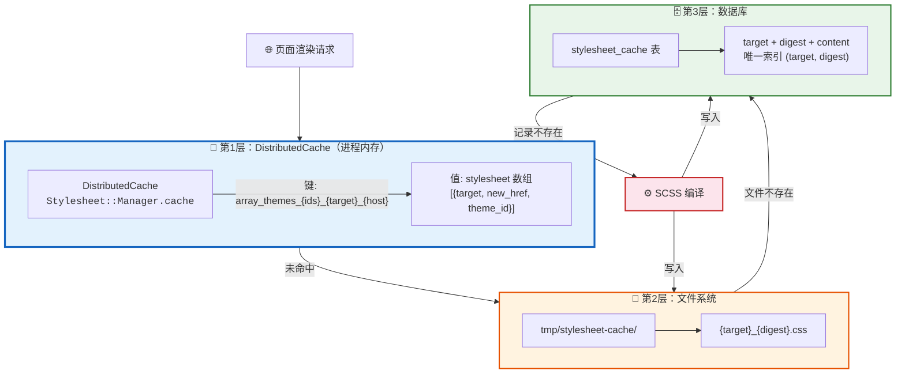
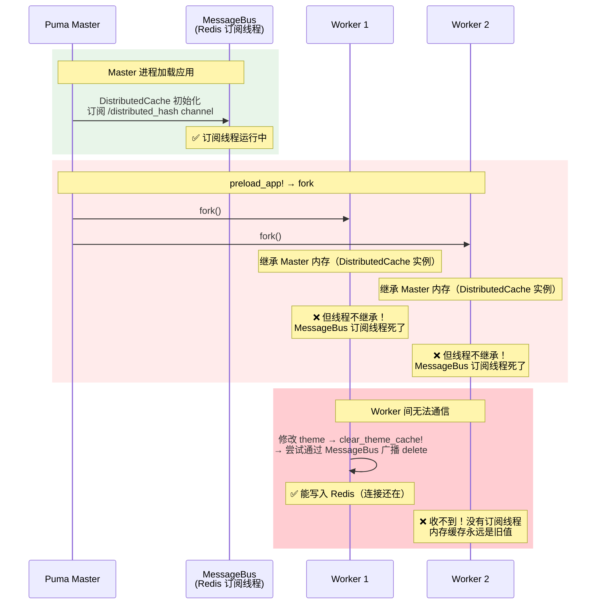
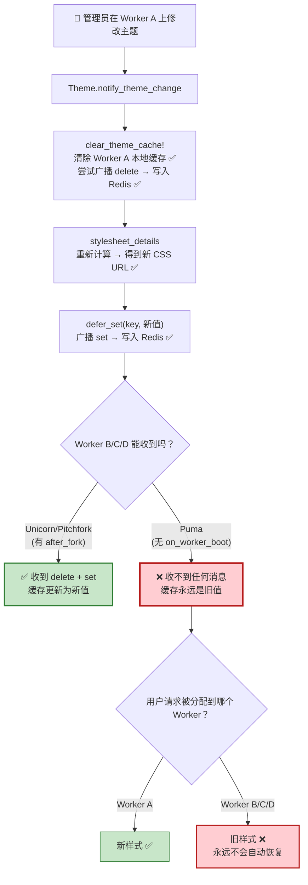
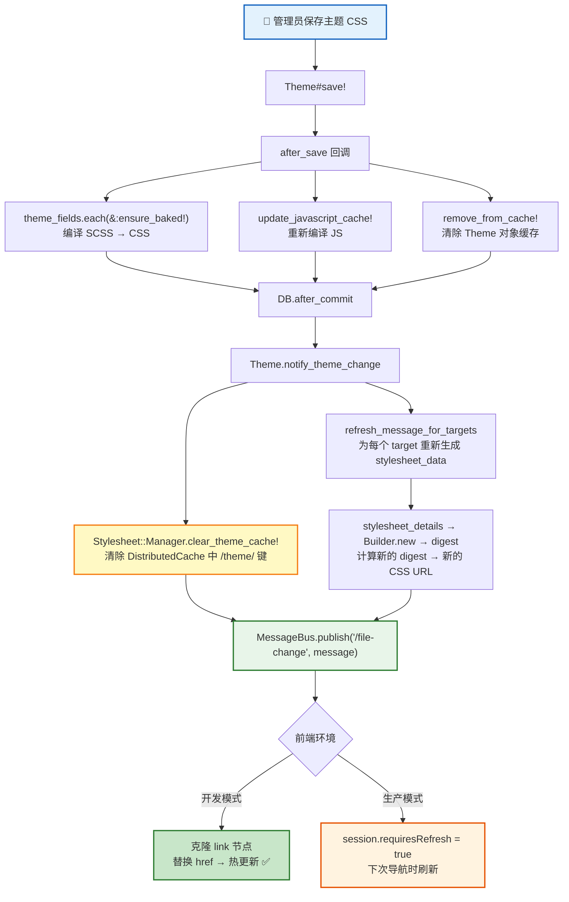
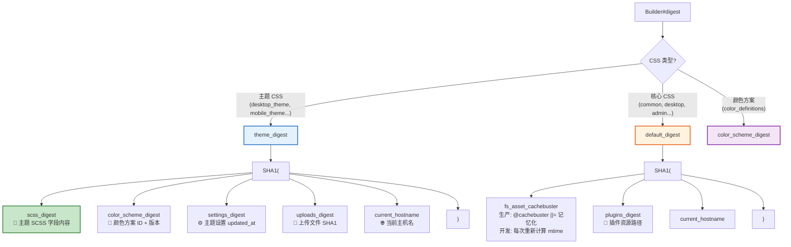
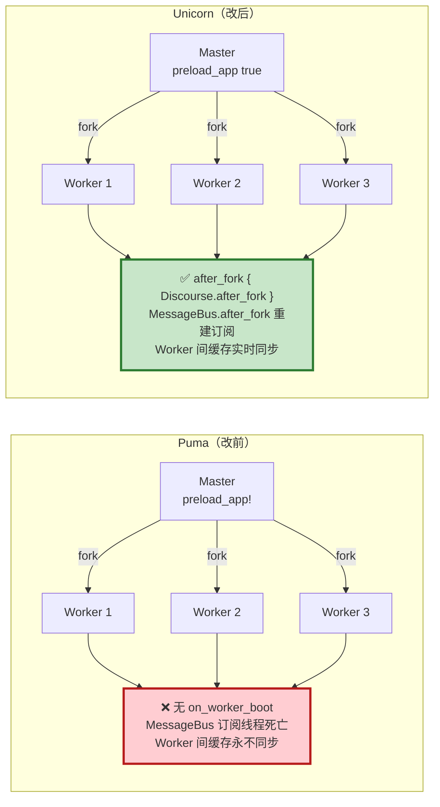

# 🎨 生产环境主题 CSS 缓存不一致问题修复报告

## 📋 问题概述

| 问题编号 | 问题描述 | 严重程度 |
|:--------:|----------|:--------:|
| **#1** | 生产环境修改主题 CSS 后，刷新页面**随机**看到新旧两种样式 | 🔴 高 |
| **#2** | 问题持续 30 分钟以上仍不收敛，并非短暂的同步延迟 | 🔴 高 |
| **#3** | 同一数据库下，开发环境秒生效，生产环境始终随机 | 🟡 中 |

---

## 🏗️ Discourse 样式表加载架构

### 三层缓存体系

Discourse 的 CSS 服务链路包含**三层缓存**，任何一层出现不一致都会导致用户看到旧样式：



### CSS URL 的构成

每个 CSS 文件的 URL 中嵌入了 **40 位 SHA1 digest**，样式变更后 digest 变化 → URL 变化 → 浏览器视为新资源：

```
/stylesheets/desktop_theme_42_a1b2c3d4e5f6789012345678901234567890abcd.css?__ws=your-host
              ─────────────── ────────────────────────────────────────────
              qualified_target                  digest (SHA1)
```

---

## 🔍 根因分析

### 根因：Puma `preload_app!` fork 后缺少 `after_fork` 回调

**Discourse 官方生产环境使用 Unicorn 或 Pitchfork**，不是 Puma。这两个服务器都正确配置了 fork 后的初始化回调：

```ruby
# config/unicorn.conf.rb — 第195-198行
after_fork do |server, worker|
  DiscourseEvent.trigger(:web_fork_started)
  Discourse.after_unicorn_worker_fork
  Discourse.after_fork    # ← 关键！重建 MessageBus 连接
end

# config/pitchfork.conf.rb — 第60-63行
after_worker_fork do |server, worker|
  DiscourseEvent.trigger(:web_fork_started)
  Discourse.after_fork    # ← 关键！重建 MessageBus 连接
  SignalTrapLogger.instance.after_fork
end
```

而 `config/puma.rb` **完全没有对应的 `on_worker_boot` 回调**：

```ruby
# config/puma.rb — 完整内容
if ENV["RAILS_ENV"] == "production"
  num_workers = ENV["NUM_WEBS"].to_i > 0 ? ENV["NUM_WEBS"].to_i : 4
  workers "#{num_workers}"
  threads 8, 32
  bind ...
  preload_app!
  # ❌ 没有 on_worker_boot { Discourse.after_fork }
end
```

### `Discourse.after_fork` 做了什么

```ruby
# lib/discourse.rb — 第960-968行
def self.after_fork
  MessageBus.after_fork        # 🔑 重建 Redis 连接 + 重新订阅 /distributed_hash channel
  SiteSetting.after_fork
  Discourse.redis.reconnect    # 重建 Redis 连接
  Rails.cache.reconnect
  Discourse.cache.reconnect
  Logster.store.redis.reconnect
  Sidekiq.redis_pool.reload(&:close)
  # ...
end
```

**最关键的是 `MessageBus.after_fork`**。DistributedCache 通过 MessageBus 的 `/distributed_hash` channel 在 Worker 间同步缓存。没有这个调用，fork 出来的 Worker 无法收到其他 Worker 的缓存变更消息。

### fork 后为什么 MessageBus 会失效



**Unix `fork()` 的核心特性：子进程继承父进程的内存，但不继承线程。** Puma 的 `preload_app!` 在 Master 进程中加载整个 Rails 应用（包括 DistributedCache 和它的 MessageBus 订阅），然后 fork 出 Worker。fork 后：

- Worker 有 DistributedCache 实例 ✅
- Worker 有 Redis 连接（文件描述符被继承） ✅（但需要 reconnect）
- Worker 有 MessageBus 订阅线程 ❌ **线程死了**

没有 `on_worker_boot { Discourse.after_fork }` 来重建这些连接和线程，**每个 Worker 的 DistributedCache 都成了"聋子"**——能写入但收不到其他 Worker 的消息。

### 这如何导致 CSS 随机



### 为什么问题持续 30+ 分钟不收敛

因为这**不是延迟问题，而是永久性的**。Worker B/C/D 的 MessageBus 订阅线程是死的，它们**永远不会**收到缓存更新消息。旧缓存只有在以下情况才会清除：

- Pod 重启（Worker 重新创建）
- 某些操作触发了全量 `cache.clear`（如修改颜色方案时的 `with_scheme: true`）

### 问题 #3: 为什么开发环境不受影响？

| 对比项 | 开发环境 | 生产环境（Puma） |
|--------|---------|-----------------|
| **服务器** | `rails server`（单进程） | Puma + `preload_app!` + fork |
| **Worker 数** | 1 | 4（默认 `NUM_WEBS=4`）|
| **fork** | 无 | 有，且**缺少 `after_fork`** |
| **MessageBus** | 单进程内直接通信 | Worker 间通过 Redis ❌（订阅线程死了）|
| **CSS 浏览器缓存** | `immutable_for(1.second)` | `immutable_for(1.year)` |

---

## 🔄 主题修改的完整生命周期



---

## 📊 Digest 计算机制

CSS 文件名中的 digest 决定了浏览器是否使用缓存。不同类型的 CSS 有不同的 digest 计算方式：



---

## 🌐 浏览器缓存策略差异

`StylesheetsController#show_resource` 对同一个 CSS 文件在不同环境返回截然不同的缓存头：

```ruby
# app/controllers/stylesheets_controller.rb — 第81-87行
if Rails.env.development?
  response.headers["Last-Modified"] = Time.zone.now.httpdate
  immutable_for(1.second)        # ← 开发: 1秒后过期
else
  response.headers["Last-Modified"] = stylesheet_time.httpdate
  immutable_for(1.year)          # ← 生产: 1年不过期 + immutable 标记
end
```

| 特性 | 开发环境 | 生产环境 |
|------|---------|---------|
| **Cache-Control** | `max-age=1, public, immutable` | `max-age=31536000, public, immutable` |
| **Last-Modified** | 当前时间（每次不同） | DB 中的 created_at |
| **缓存失效方式** | 1 秒后自动过期 | **仅通过 URL 中 digest 变化** |
| **浏览器行为** | 几乎每次都重新请求 | 同 URL 一年内不再请求 |

---

## ✅ 修复方案

### 采用方案：改用 Unicorn（Discourse 官方生产服务器）

Discourse 官方生产环境使用 Unicorn（或 Pitchfork），而非 Puma。`config/puma.rb` 是一个不完整的配置，缺少 fork 后的关键初始化回调。**改用 Unicorn 是对齐官方的正确做法。**

#### 改动 1：Dockerfile

```dockerfile
# 改前（Puma）
CMD ["/bin/bash", "-c", "\
    ... && \
    bundle exec puma -C config/puma.rb"]

# 改后（Unicorn）
CMD ["/bin/bash", "-c", "\
    ... && \
    bundle exec unicorn -c config/unicorn.conf.rb"]
```

同时删除 Puma 专用的 `sed` 路径修复（Unicorn 通过 `discourse_path` 自动检测路径）。

#### 改动 2：K8s ConfigMap

```yaml
# 新增/修改以下环境变量
UNICORN_WORKERS: "4"        # Worker 数量（根据内存调整，每 Worker 约 300-500MB）
UNICORN_BIND_ALL: "true"    # 监听 0.0.0.0（K8s 必须）
UNICORN_PORT: "3000"        # 与 EXPOSE 和健康检查一致
UNICORN_TIMEOUT: "180"      # 已有，保持不变
```

### 为什么 Unicorn 不会有这个问题



`config/unicorn.conf.rb` 第 195-198 行：

```ruby
after_fork do |server, worker|
  DiscourseEvent.trigger(:web_fork_started)
  Discourse.after_unicorn_worker_fork
  Discourse.after_fork    # → MessageBus.after_fork → 重建 Redis 连接 + 重新订阅
end
```

每个 Worker fork 后立即：
1. **`MessageBus.after_fork`** — 重建 Redis 连接，重新订阅 `/distributed_hash` channel
2. **`Discourse.redis.reconnect`** — 重建 Redis 连接
3. **`Rails.cache.reconnect`** — 重建缓存连接

这样所有 Worker 都能正常收发 DistributedCache 的同步消息。

### 备选方案对比

| 方案 | 改动范围 | 效果 | 副作用 |
|------|---------|------|--------|
| **改用 Unicorn ✅ 已采用** | Dockerfile + ConfigMap | 对齐官方，多 Worker 下缓存正确同步 | 无（官方推荐配置）|
| 给 Puma 补 `on_worker_boot` | 修改 `config/puma.rb` | 修复 fork 后初始化 | 修改了 Discourse 源码，升级需维护 |
| Puma `NUM_WEBS=1` | ConfigMap 加一行 | 单 Worker 绕开问题 | 并发能力大幅降低 |
| 重启 Pod | `kubectl rollout restart` | 临时生效，下次修改仍复现 | 治标不治本 |

---

## 📊 修复前后对比

```mermaid
flowchart TB
    subgraph 修复前["修复前（Puma，无 after_fork）"]
        direction TB
        B1["管理员修改主题 CSS"] --> B2["Worker A: clear + 重新计算 ✅"]
        B2 --> B3["通过 MessageBus 广播"]
        B3 --> B4["Worker B/C/D: ❌ 订阅线程死了<br/>收不到消息，缓存永远是旧值"]
        B4 --> B5{"用户请求被 Puma 分配到？"}
        B5 -->|Worker A| B6["新样式 ✅"]
        B5 -->|Worker B/C/D| B7["旧样式 ❌（永久）"]
    end
    
    subgraph 修复后["修复后（Unicorn，有 after_fork）"]
        direction TB
        A1["管理员修改主题 CSS"] --> A2["Worker A: clear + 重新计算 ✅"]
        A2 --> A3["通过 MessageBus 广播"]
        A3 --> A4["Worker B/C/D: ✅ 订阅线程活跃<br/>收到消息，缓存更新为新值"]
        A4 --> A5{"用户请求被 Unicorn 分配到？"}
        A5 --> A6["任意 Worker → 新样式 ✅"]
    end
    
    style B4 fill:#ffcdd2,stroke:#b71c1c,stroke-width:3px
    style B7 fill:#ffcdd2,stroke:#b71c1c
    style A4 fill:#c8e6c9,stroke:#2e7d32,stroke-width:3px
    style A6 fill:#c8e6c9,stroke:#2e7d32
```



---

## 🧪 验证清单

| # | 测试场景 | 预期结果 | 验证方式 |
|:-:|----------|----------|----------|
| 1 | 修改主题 CSS 后刷新页面 | 立即且稳定显示新样式 | 连续刷新 10 次，样式一致 |
| 2 | 修改主题 CSS 后不同浏览器访问 | 都显示新样式 | 用 Chrome + Firefox 分别访问 |
| 3 | 修改颜色方案后刷新 | 新颜色立即生效 | 观察页面配色变化 |
| 4 | 安装新主题后切换 | 新主题样式正确加载 | 在管理后台切换默认主题 |
| 5 | 高并发下修改主题 | 不出现新旧交替 | 用 ab/wrk 模拟并发请求 |
| 6 | Pod 重启后样式正常 | CSS 从数据库恢复 | `kubectl rollout restart` |

---

## 📁 涉及的关键文件

```
config/
├── unicorn.conf.rb              # ✅ Discourse 官方生产配置（含 after_fork）
├── pitchfork.conf.rb            # ✅ Discourse 新一代生产配置（含 after_worker_fork）
└── puma.rb                      # ❌ 不完整，缺少 on_worker_boot

lib/
├── discourse.rb                 # Discourse.after_fork → MessageBus.after_fork
├── distributed_cache.rb         # DistributedCache，通过 MessageBus 同步
├── stylesheet/
│   ├── manager.rb               # 样式表管理器核心
│   │   ├── self.cache           # DistributedCache 实例（第1层缓存）
│   │   ├── clear_theme_cache!   # 清除主题相关缓存
│   │   └── stylesheet_details   # 核心方法：生成 CSS URL 并缓存
│   └── manager/
│       └── builder.rb           # CSS 编译构建器 + digest 计算

app/
├── models/theme.rb              # 主题保存 → notify_theme_change
├── models/stylesheet_cache.rb   # 第3层缓存（数据库持久化）
└── controllers/stylesheets_controller.rb  # CSS HTTP 服务 + 浏览器缓存头
```

---

## 🗺️ 架构知识沉淀

### 关键认知

1. **Discourse 官方生产使用 Unicorn/Pitchfork，不是 Puma。** `config/puma.rb` 是一个简化配置，缺少 fork 后的关键初始化（`Discourse.after_fork`）。如果要用 Puma 多 Worker 模式，必须添加 `on_worker_boot` 回调。

2. **`fork()` 不继承线程。** 这是 Unix 的基本特性。`preload_app!` / `preload_app true` 让 Master 进程加载应用后 fork 出 Worker，Worker 继承内存但不继承线程。MessageBus 的 Redis 订阅线程在 fork 后死亡，必须通过 `after_fork` 重建。

3. **DistributedCache 依赖 MessageBus 进行 Worker 间同步。** 没有 MessageBus 订阅，每个 Worker 的内存缓存是完全隔离的"孤岛"，缓存变更永远无法传播。

4. **浏览器缓存依赖 URL 变化。** 生产环境 CSS 文件设置了 `immutable_for(1.year)`，只有 digest 变化导致 URL 变化时浏览器才会获取新文件。如果某个 Worker 返回了旧 digest 的 URL，浏览器会长期使用旧 CSS。

5. **三层缓存的一致性顺序是 DB > 文件 > 内存。** 数据库是最终 source of truth，文件系统是加速层，内存缓存是热点缓存。本次问题出在内存层的跨 Worker 同步。

### 扩容建议

```
推荐架构（对齐 Discourse 官方）：
  Web 服务器: Unicorn
  每个 Pod: UNICORN_WORKERS=N（根据内存，每 Worker 约 300-500MB）
  水平扩展: K8s replicas=M（按流量需求）

  Pod 1 (Unicorn Master + 3 Workers, after_fork ✅)
  Pod 2 (Unicorn Master + 3 Workers, after_fork ✅)
  ↑ 各 Pod 内 Worker 通过 MessageBus/Redis 同步缓存
  ↑ 各 Pod 间也通过同一个 Redis 同步缓存
```

---

## 📝 总结

| 问题 | 根因 | 解决方案 | 修复日期 |
|------|------|----------|----------|
| 生产主题 CSS 随机新旧交替 | 使用 Puma 作为生产服务器，`config/puma.rb` 缺少 `on_worker_boot { Discourse.after_fork }` 回调。fork 后 Worker 的 MessageBus 订阅线程死亡，DistributedCache 无法跨 Worker 同步，导致部分 Worker 永远返回旧 CSS URL | 改用 Discourse 官方推荐的 Unicorn 服务器，其 `config/unicorn.conf.rb` 已正确配置 `after_fork` 回调 | 2026-02-07 |
| 开发环境不受影响 | 开发模式 `rails server` 单进程运行，不 fork，不存在 Worker 间同步问题 | — | — |
