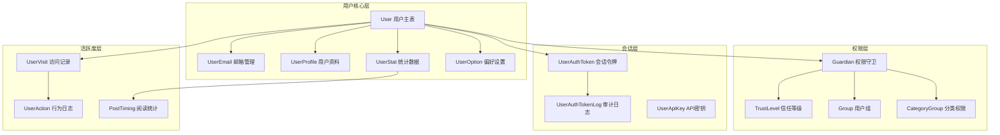
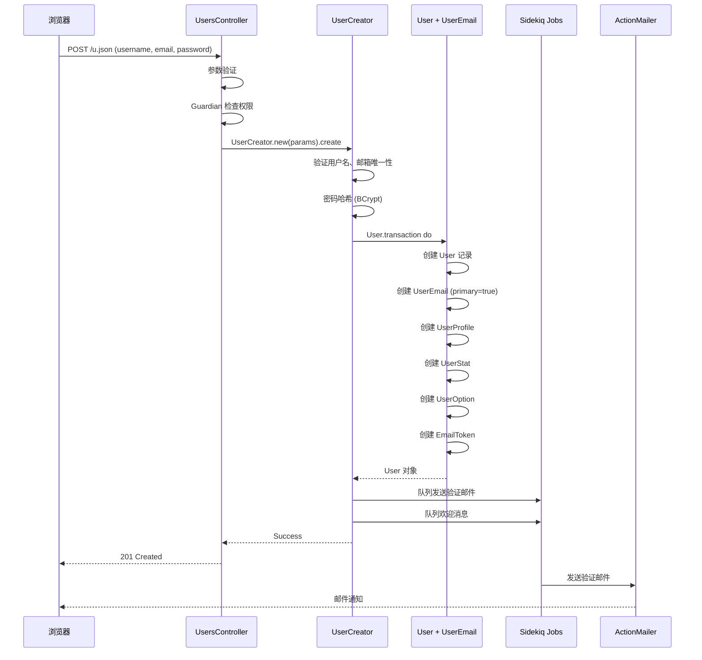
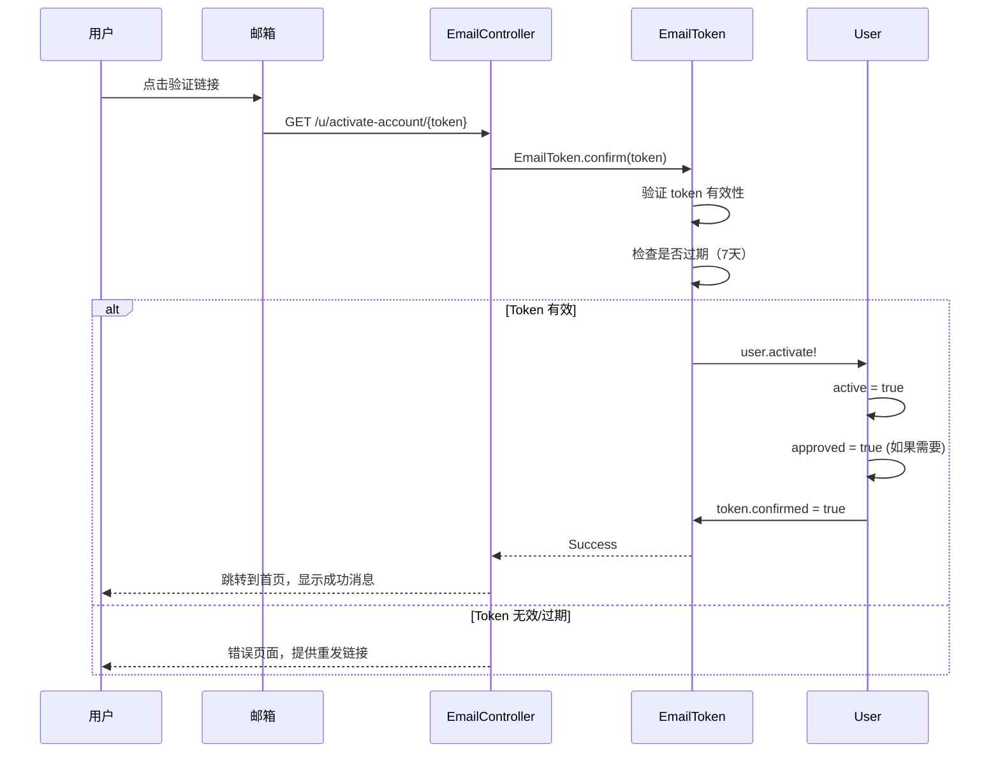
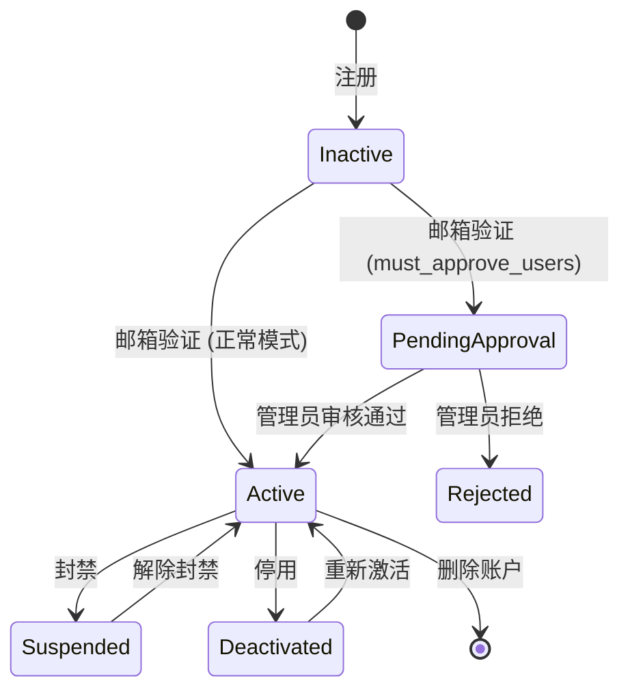
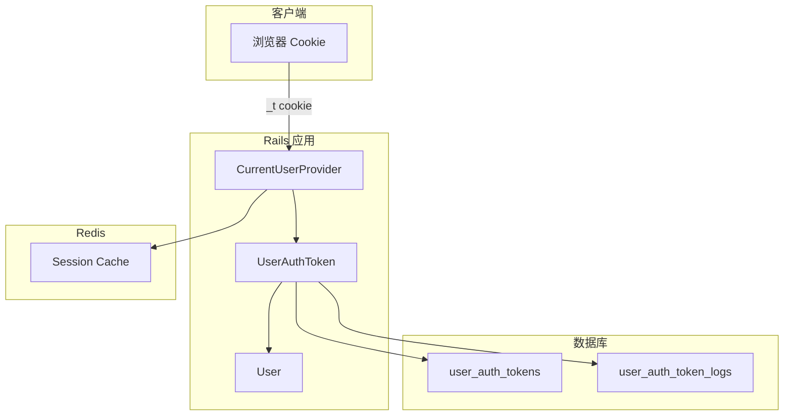
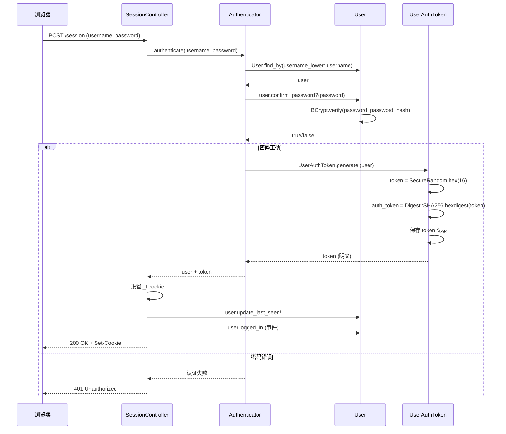
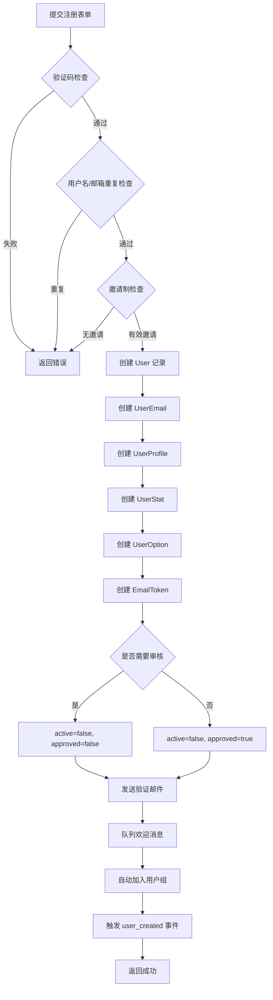
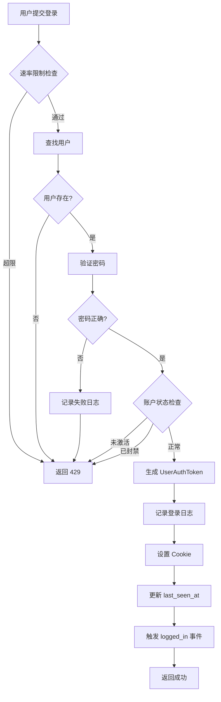
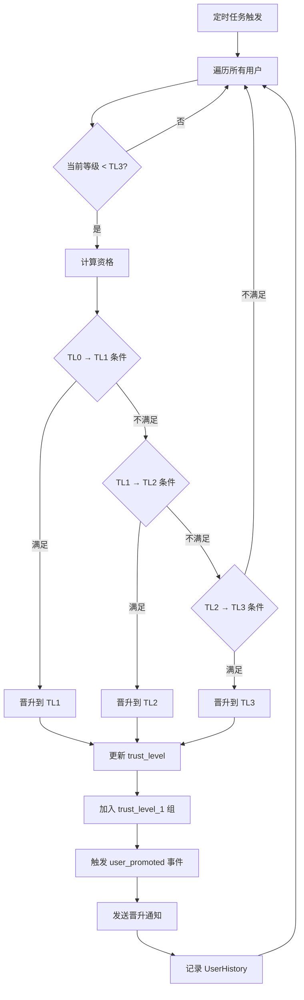
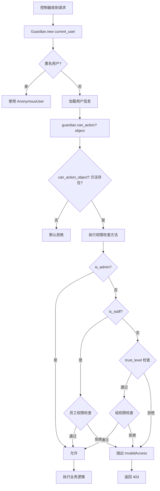

# Discourse 用户系统完全指南

> **目标读者**: 需要深入理解 Discourse 用户系统的研发人员
> 
> **文档范围**: 用户系统的核心业务流程、数据库表设计、权限体系、插件扩展
>
> **最后更新**: 2026-02-01

---

## 📑 目录

- [1. 系统概览](#1-系统概览)
- [2. 核心数据表](#2-核心数据表)
- [3. 用户生命周期](#3-用户生命周期)
- [4. 信任等级系统](#4-信任等级系统)
- [5. 权限体系 (Guardian)](#5-权限体系-guardian)
- [6. 用户组系统](#6-用户组系统)
- [7. 认证与会话](#7-认证与会话)
- [8. 用户统计与活跃度](#8-用户统计与活跃度)
- [9. 核心业务流程](#9-核心业务流程)
- [10. 插件扩展点](#10-插件扩展点)
- [11. 性能优化](#11-性能优化)
- [12. 最佳实践](#12-最佳实践)

---

## 1. 系统概览

### 1.1 架构设计



### 1.2 核心特性

| 特性 | 说明 | 关键表 |
|------|------|--------|
| **多邮箱支持** | 一个用户可绑定多个邮箱，一个主邮箱 | `user_emails` |
| **信任等级** | 0-4 级自动晋升系统 | `users.trust_level` |
| **细粒度权限** | 基于角色、组、信任等级的权限控制 | `Guardian` + `groups` |
| **会话管理** | 支持多设备登录，完整审计日志 | `user_auth_tokens` |
| **统计系统** | 实时统计用户活跃度和贡献 | `user_stats` |
| **自定义字段** | 插件可扩展用户属性 | `user_custom_fields` |
| **临时用户** | 邮件回复自动创建临时账户 | `users.staged = true` |
| **匿名模式** | TL1+ 用户可创建匿名身份 | `anonymous_users` |

---

## 2. 核心数据表

### 2.1 users - 用户主表

**记录数量级**: 百万级

**核心字段**:

```ruby
# app/models/user.rb (Schema 部分)
```

| 字段 | 类型 | 说明 | 索引 |
|------|------|------|------|
| `id` | bigint | 主键 | PK |
| `username` | string(60) | 用户名（唯一） | UK |
| `username_lower` | string(60) | 小写用户名（用于查询） | UK |
| `name` | string | 显示名称 | - |
| `email` | - | **已废弃**，迁移到 `user_emails` | - |
| `active` | boolean | 账户是否激活 | - |
| `admin` | boolean | 是否管理员 | index |
| `moderator` | boolean | 是否版主 | index |
| `trust_level` | integer | 信任等级 (0-4) | - |
| `approved` | boolean | 是否通过审核 | - |
| `approved_by_id` | integer | 审核人 ID | - |
| `staged` | boolean | 是否临时用户（邮件创建） | - |
| `suspended_till` | datetime | 封禁到期时间 | - |
| `silenced_till` | datetime | 禁言到期时间 | - |
| `last_seen_at` | datetime | 最后活跃时间 | index |
| `last_posted_at` | datetime | 最后发帖时间 | index |
| `previous_visit_at` | datetime | 上次访问时间 | - |
| `ip_address` | inet | 当前 IP 地址 | index |
| `registration_ip_address` | inet | 注册 IP | - |
| `uploaded_avatar_id` | integer | 自定义头像 ID | FK |
| `primary_group_id` | integer | 主用户组 ID | FK |
| `locale` | string(10) | 语言偏好 | - |
| `secure_identifier` | string | 安全标识符（用于 API） | UK |

**关键关联**:

```ruby
# 一对一关联
has_one :user_option        # 用户偏好设置
has_one :user_avatar        # 头像管理
has_one :user_profile       # 用户资料
has_one :user_stat          # 统计数据
has_one :primary_email      # 主邮箱

# 一对多关联
has_many :user_emails              # 多邮箱
has_many :user_auth_tokens         # 登录会话
has_many :posts                    # 发布的帖子
has_many :topics                   # 创建的话题
has_many :notifications            # 通知
has_many :user_badges              # 获得的徽章
has_many :bookmarks                # 书签
has_many :user_visits              # 访问记录
has_many :user_custom_fields       # 自定义字段

# 多对多关联
has_many :groups, through: :group_users  # 所属用户组
```

### 2.2 user_emails - 邮箱管理

**记录数量级**: 百万级

**设计理念**: 支持用户绑定多个邮箱，便于账号迁移和找回

| 字段 | 类型 | 说明 |
|------|------|------|
| `id` | bigint | 主键 |
| `user_id` | bigint | 用户 ID (FK) |
| `email` | string | 邮箱地址 (UK) |
| `primary` | boolean | 是否主邮箱 |
| `confirmed` | boolean | 是否已验证 |
| `created_at` | datetime | 创建时间 |
| `updated_at` | datetime | 更新时间 |

**业务规则**:
- 每个用户只能有一个 `primary = true` 的邮箱
- 邮箱地址全站唯一（不区分大小写）
- 更改主邮箱需通过 `email_change_requests` 表走验证流程
- 未验证的邮箱不能用于登录

### 2.3 user_profiles - 用户资料

**记录数量级**: 百万级

| 字段 | 类型 | 说明 |
|------|------|------|
| `user_id` | bigint | 用户 ID (PK, FK) |
| `bio_raw` | text | 个人简介（Markdown） |
| `bio_cooked` | text | 渲染后的 HTML |
| `website` | string | 个人网站 |
| `location` | string | 所在地 |
| `views` | integer | 资料页浏览数 |
| `profile_background_upload_id` | integer | 背景图 |
| `card_background_upload_id` | integer | 卡片背景图 |
| `dismissed_banner_key` | integer | 已关闭的横幅 |

### 2.4 user_stats - 统计数据

**记录数量级**: 百万级

**设计理念**: 冗余计数，避免实时查询性能问题

| 字段 | 类型 | 说明 | 计算方式 |
|------|------|------|---------|
| `user_id` | bigint | 用户 ID (PK, FK) | - |
| `topics_entered` | integer | 进入的话题数 | 从 `topic_views` 统计 |
| `time_read` | integer | 阅读时长（秒） | 累加访问时长 |
| `days_visited` | integer | 访问天数 | 从 `user_visits` 统计 |
| `posts_read_count` | integer | 阅读帖子数 | 从 `post_timings` 统计 |
| `likes_given` | integer | 点赞数 | 发出的点赞 |
| `likes_received` | integer | 被赞数 | 收到的点赞 |
| `post_count` | integer | 发帖数 | 帖子总数 |
| `topic_count` | integer | 创建话题数 | 话题总数 |
| `bounce_score` | float | 邮件退信分数 | 邮件系统计算 |
| `flags_agreed` | integer | 举报被采纳次数 | - |
| `flags_disagreed` | integer | 举报被驳回次数 | - |
| `distinct_badge_count` | integer | 不同徽章数 | - |
| `first_post_created_at` | datetime | 第一次发帖时间 | - |
| `first_unread_at` | datetime | 第一个未读帖子时间 | - |
| `pending_posts_count` | integer | 待审核帖子数 | - |

**更新机制**:
- 大部分字段通过后台任务异步更新（`Jobs::UpdateUserStats`）
- 部分字段通过数据库触发器或回调实时更新
- 定期执行 `UserStat.ensure_consistency!` 修正数据

### 2.5 user_options - 用户偏好设置

**记录数量级**: 百万级

**核心配置**:

| 分类 | 字段 | 类型 | 默认值 | 说明 |
|------|------|------|--------|------|
| **邮件通知** | `email_level` | enum | `only_when_away` | 邮件通知级别 |
| | `email_messages_level` | enum | `always` | 私信邮件通知 |
| | `email_digests` | boolean | `true` | 是否接收摘要邮件 |
| | `mailing_list_mode` | boolean | `false` | 邮件列表模式 |
| **界面** | `theme_ids` | array | `[]` | 主题 ID 列表 |
| | `text_size_key` | enum | `normal` | 文字大小 |
| | `interface_color_mode` | enum | `auto` | 颜色模式（自动/明亮/暗黑） |
| | `homepage_id` | integer | `1` | 首页（latest/categories/unread...） |
| **行为** | `auto_track_topics_after_msecs` | integer | `240000` | 自动跟踪话题（毫秒） |
| | `new_topic_duration_minutes` | integer | `2880` | 新话题定义（分钟） |
| | `external_links_in_new_tab` | boolean | `false` | 新标签页打开外链 |
| | `dynamic_favicon` | boolean | `false` | 动态 favicon（显示未读数） |
| **隐私** | `hide_profile` | boolean | `false` | 隐藏个人资料 |
| | `hide_presence` | boolean | `false` | 隐藏在线状态 |
| | `allow_private_messages` | boolean | `true` | 允许接收私信 |

**枚举值定义**:

```ruby
# app/models/user_option.rb
email_level_types = {
  always: 0,           # 总是发送邮件
  only_when_away: 1,   # 仅离线时发送（默认）
  never: 2             # 从不发送
}

like_notification_frequency_type = {
  always: 0,              # 每次点赞都通知
  first_time_and_daily: 1,# 首次和每日汇总
  first_time: 2,          # 仅首次
  never: 3                # 从不
}

HOMEPAGES = {
  1 => "latest",    # 最新
  2 => "categories",# 分类
  3 => "unread",    # 未读
  4 => "new",       # 新话题
  5 => "top",       # 热门
  6 => "bookmarks", # 书签
  7 => "unseen",    # 未见过
  8 => "hot"        # 热度
}
```

### 2.6 user_custom_fields - 自定义字段

**记录数量级**: 百万级

**设计理念**: 插件无需修改核心表即可扩展用户属性

| 字段 | 类型 | 说明 |
|------|------|------|
| `id` | bigint | 主键 |
| `user_id` | bigint | 用户 ID (FK) |
| `name` | string | 字段名 |
| `value` | text | 字段值 |
| `created_at` | datetime | 创建时间 |
| `updated_at` | datetime | 更新时间 |

**常见用途**:
- 插件存储扩展数据（如 `discourse_chat_enabled`）
- 用户自定义字段（`user_field_1`, `user_field_2` 等）
- SSO 提供商 ID（`oauth2_user_id_github`）
- 临时标记（`from_staged`）

**性能优化**:
- 通过 `HasCustomFields` mixin 提供缓存机制
- 避免频繁数据库查询

---

## 3. 用户生命周期

### 3.1 用户注册流程



**关键代码路径**:
1. **控制器**: `app/controllers/users_controller.rb#create`
2. **业务逻辑**: `lib/user_creator.rb`
3. **模型回调**: `app/models/user.rb` (after_create hooks)
4. **后台任务**: `app/jobs/regular/critical_user_email.rb`

**关键步骤详解**:

#### Step 1: 参数验证
```ruby
# app/controllers/users_controller.rb
def create
  params.require(:email)
  params.require(:username)
  params.require(:password) unless SiteSetting.enable_sso
  
  # 检查注册是否开启
  raise Discourse::InvalidAccess if !SiteSetting.allow_new_registrations
  
  # 邀请制检查
  if SiteSetting.invite_only?
    invite = Invite.find_by(email: params[:email], invited_by_id: params[:inviter_id])
    raise Discourse::InvalidAccess if invite.blank? || invite.expired?
  end
end
```

#### Step 2: 创建用户（UserCreator）
```ruby
# lib/user_creator.rb
class UserCreator
  def create
    User.transaction do
      @user = User.new(user_params)
      @user.password = params[:password]
      @user.trust_level = TrustLevel.calculate(@user)
      
      # 设置激活状态
      if SiteSetting.must_approve_users?
        @user.active = false
        @user.approved = false
      else
        @user.active = true
      end
      
      @user.save!
      
      # 自动加入组（基于邮箱域名）
      @user.set_automatic_groups
      
      # 触发事件
      DiscourseEvent.trigger(:user_created, @user)
    end
    
    @user
  end
end
```

#### Step 3: 发送验证邮件
```ruby
# app/jobs/regular/critical_user_email.rb
def execute(args)
  user = User.find_by(id: args[:user_id])
  email_token = user.email_tokens.create!(email: user.email, scope: EmailToken.scopes[:signup])
  
  UserNotifications.signup_email(
    user_id: user.id,
    email_token: email_token.token
  ).deliver_now
end
```

### 3.2 邮箱验证流程



**EmailToken 表结构**:

| 字段 | 类型 | 说明 |
|------|------|------|
| `id` | bigint | 主键 |
| `user_id` | bigint | 用户 ID |
| `email` | string | 邮箱地址 |
| `token` | string(32) | 验证 token (UUID) |
| `confirmed` | boolean | 是否已确认 |
| `expired` | boolean | 是否已过期 |
| `scope` | integer | 用途（注册/密码重置/邮箱变更） |
| `created_at` | datetime | 创建时间 |

**Token 作用域**:
```ruby
EmailToken.scopes = {
  signup: 1,         # 注册验证
  password_reset: 2, # 密码重置
  email_login: 3,    # 邮件登录
}
```

### 3.3 账户激活与审核

**激活状态机**:



**相关字段**:
- `active`: 账户是否激活（邮箱验证后为 true）
- `approved`: 是否通过审核（需要 `must_approve_users` 开启）
- `approved_by_id`: 审核人 ID
- `suspended_till`: 封禁到期时间
- `silenced_till`: 禁言到期时间

**管理员审核流程**:
```ruby
# app/controllers/admin/users_controller.rb
def approve
  user = User.find(params[:id])
  guardian.ensure_can_approve!(user)
  
  user.approve(current_user)
  user.send_welcome_message = true
  user.save!
  
  # 创建审核记录
  StaffActionLogger.new(current_user).log_user_approve(user)
  
  render json: success_json
end
```

### 3.4 账户删除

**删除模式**:
1. **标记删除**: 保留数据，设置 `deleted_at`（未使用）
2. **匿名化**: 保留帖子，用户信息匿名化
3. **完全删除**: 删除用户及关联数据（慎用）

**UserDestroyer 流程**:
```ruby
# lib/user_destroyer.rb
class UserDestroyer
  def destroy(user, opts = {})
    raise Discourse::InvalidAccess if user.admin? && User.where(admin: true).count <= 1
    
    User.transaction do
      # 1. 删除私信
      user.topics_allowed.where(archetype: 'private_message').destroy_all
      
      # 2. 删除帖子（可选）
      if opts[:delete_posts]
        user.posts.each { |p| PostDestroyer.new(admin, p).destroy }
      end
      
      # 3. 移除用户组
      user.group_users.destroy_all
      
      # 4. 删除会话
      user.user_auth_tokens.destroy_all
      
      # 5. 删除关联记录
      user.user_emails.destroy_all
      user.user_stats.destroy
      user.user_profile.destroy
      
      # 6. 删除用户记录
      user.destroy!
      
      # 7. 记录日志
      StaffActionLogger.new(admin).log_user_deletion(user, opts)
    end
  end
end
```

---

## 4. 信任等级系统

### 4.1 信任等级定义

```ruby
# lib/trust_level.rb
TrustLevel.levels = {
  newuser: 0,  # 新用户
  basic: 1,    # 基础用户
  member: 2,   # 成员
  regular: 3,  # 常客
  leader: 4    # 领袖
}
```

**等级对应权限**:

| 等级 | 名称 | 关键权限 | 限制 |
|------|------|---------|------|
| **TL0** | 新用户 | - 查看公开内容<br>- 回复帖子（有限制） | - 不能创建话题<br>- 每日点赞限制 50 次<br>- 每个话题最多回复 3 次<br>- 帖子需要审核 |
| **TL1** | 基础用户 | - 创建话题<br>- 上传图片<br>- 发送私信 | - 每日创建话题限制<br>- 仍有速率限制 |
| **TL2** | 成员 | - 邀请用户<br>- 可见所有帖子操作<br>- 编辑 wiki | - 无特殊限制 |
| **TL3** | 常客 | - 重新分类话题<br>- 重命名话题<br>- 关注链接（nofollow 移除）<br>- 标记为精华 | - 需持续活跃 |
| **TL4** | 领袖 | - 编辑所有帖子<br>- 置顶话题<br>- 近似版主权限 | - 手动授予 |

### 4.2 自动晋升机制

**TL0 → TL1 条件**:
```ruby
SiteSetting.tl1_requires_topics_entered = 5        # 进入 5 个话题
SiteSetting.tl1_requires_read_posts = 30          # 阅读 30 篇帖子
SiteSetting.tl1_requires_time_spent_mins = 10     # 10 分钟阅读时长
```

**TL1 → TL2 条件**:
```ruby
SiteSetting.tl2_requires_days_visited = 15         # 15 天内访问 15 天
SiteSetting.tl2_requires_topics_entered = 20       # 进入 20 个话题
SiteSetting.tl2_requires_read_posts = 100          # 阅读 100 篇帖子
SiteSetting.tl2_requires_time_spent_mins = 60      # 60 分钟阅读
SiteSetting.tl2_requires_likes_received = 1        # 至少收到 1 个赞
SiteSetting.tl2_requires_likes_given = 1           # 至少给出 1 个赞
SiteSetting.tl2_requires_topic_reply_count = 3     # 回复 3 个不同话题
```

**TL2 → TL3 条件**:
```ruby
# lib/trust_level_3_requirements.rb
class TrustLevel3Requirements
  TIME_PERIOD = 100.days
  
  def requirements_met?
    days_visited >= min_days_visited &&
    topics_replied_to >= min_topics_replied_to &&
    topics_viewed >= min_topics_viewed &&
    posts_read >= min_posts_read &&
    likes_given >= min_likes_given &&
    likes_received >= min_likes_received &&
    likes_received_unique_days >= min_likes_received_unique_days &&
    num_flagged_posts <= max_flagged_posts &&
    num_flagged_by_users <= max_flagged_by_users &&
    num_likes_on_flagged_posts <= max_likes_on_flagged_posts
  end
  
  # 默认条件
  min_days_visited = 50                    # 100 天内访问 50 天
  min_topics_replied_to = 10               # 回复 10 个不同话题
  min_topics_viewed = 25                   # 查看 25% 的话题
  min_posts_read = 25                      # 阅读 25% 的帖子
  min_likes_given = 30                     # 给出 30 个赞
  min_likes_received = 20                  # 收到 20 个赞
  min_likes_received_unique_days = 7       # 7 个不同的天收到赞
  max_flagged_posts = 5                    # 被举报不超过 5 次
  max_flagged_by_users = 5                 # 被举报人数不超过 5 人
end
```

**TL3 → TL4**: 手动授予，无自动晋升

### 4.3 信任等级计算

```ruby
# lib/trust_level.rb
def self.calculate(user, use_previous_trust_level: false)
  # 1. 手动锁定等级（最高优先级）
  return user.manual_locked_trust_level if user.manual_locked_trust_level.present?
  
  # 2. 用户组授予等级
  granted_trust_level = user.group_granted_trust_level || 0
  
  # 3. 历史等级（用于降级保护）
  previous_trust_level = use_previous_trust_level ? find_previous_trust_level(user) : 0
  
  # 4. 邀请用户默认等级
  invitee_trust_level = user.invited_user&.redeemed_at ? SiteSetting.default_invitee_trust_level : 0
  
  # 5. 系统默认等级
  default_trust_level = SiteSetting.default_trust_level
  
  # 取最大值
  [granted_trust_level, previous_trust_level, invitee_trust_level, default_trust_level].max
end
```

**定期检查任务**:
```ruby
# app/jobs/scheduled/tl3_promotions.rb
module Jobs
  class Tl3Promotions < ::Jobs::Scheduled
    every 1.day
    
    def execute(args)
      Promotion.recalculate_all  # 重新计算所有用户的 TL3 资格
    end
  end
end
```

---

## 5. 权限体系 (Guardian)

### 5.1 Guardian 设计理念

**核心思想**: 集中式权限控制，类似 Spring Security 的 `@PreAuthorize`

```ruby
# lib/guardian.rb
class Guardian
  def initialize(user = nil, request = nil)
    @user = user.presence || Guardian::AnonymousUser.new
    @request = request
  end
  
  # 统一的权限检查入口
  def can_see?(obj)
    see_method = method_name_for(:see, obj)
    see_method && public_send(see_method, obj)
  end
  
  def can_edit?(obj)
    can_do?(:edit, obj)
  end
  
  def can_delete?(obj)
    can_do?(:delete, obj)
  end
end
```

### 5.2 权限检查方法命名约定

**模式**: `can_{action}_{model_name}?`

**示例**:
```ruby
# 用户相关
can_edit_user?(user)
can_delete_user?(user)
can_impersonate?(user)
can_view_action_logs?(user)

# 话题相关
can_see_topic?(topic)
can_create_topic?(topic)
can_edit_topic?(topic)
can_moderate_topic?(topic)

# 帖子相关
can_see_post?(post)
can_edit_post?(post)
can_delete_post?(post)
```

### 5.3 用户权限检查实现

```ruby
# lib/guardian/user_guardian.rb
module UserGuardian
  # 查看用户资料
  def can_see_user?(target_user)
    return false if target_user.blank?
    return true if is_me?(target_user)
    return true if !SiteSetting.hide_user_profiles_from_public
    
    authenticated?
  end
  
  # 编辑用户
  def can_edit_user?(user)
    return false if user.blank?
    return true if is_me?(user)        # 编辑自己
    return true if is_staff?           # 员工可编辑所有人
    false
  end
  
  # 删除用户
  def can_delete_user?(user)
    return false unless is_staff?
    return false if user.blank?
    return false if user.admin?        # 不能删除管理员
    return false if user.post_count > MAX_STAFF_DELETE_POST_COUNT  # 发帖超过 5 篇
    true
  end
  
  # 管理用户（提权/降权）
  def can_grant_admin?(user)
    is_admin? && !user.admin? && user.id > 0
  end
  
  def can_revoke_admin?(admin)
    is_admin? && admin.admin? && admin != @user  # 不能撤销自己
  end
  
  # 封禁用户
  def can_suspend?(user)
    return false unless is_staff?
    return false if user == @user       # 不能封禁自己
    return false if user.staff?         # 不能封禁员工
    true
  end
  
  # 禁言用户
  def can_silence?(user)
    can_suspend?(user)
  end
end
```

### 5.4 角色与权限矩阵

| 操作 | 匿名 | TL0 | TL1 | TL2 | TL3 | TL4 | 版主 | 管理员 |
|------|------|-----|-----|-----|-----|-----|------|--------|
| 查看公开话题 | ✅ | ✅ | ✅ | ✅ | ✅ | ✅ | ✅ | ✅ |
| 回复话题 | ❌ | ✅ | ✅ | ✅ | ✅ | ✅ | ✅ | ✅ |
| 创建话题 | ❌ | ❌ | ✅ | ✅ | ✅ | ✅ | ✅ | ✅ |
| 上传图片 | ❌ | ❌ | ✅ | ✅ | ✅ | ✅ | ✅ | ✅ |
| 编辑自己的帖子 | ❌ | ✅ | ✅ | ✅ | ✅ | ✅ | ✅ | ✅ |
| 编辑他人帖子 | ❌ | ❌ | ❌ | ❌ | ❌ | ✅ | ✅ | ✅ |
| 删除自己的帖子 | ❌ | ❌ | ✅ | ✅ | ✅ | ✅ | ✅ | ✅ |
| 删除他人帖子 | ❌ | ❌ | ❌ | ❌ | ❌ | ❌ | ✅ | ✅ |
| 重新分类话题 | ❌ | ❌ | ❌ | ❌ | ✅ | ✅ | ✅ | ✅ |
| 置顶话题 | ❌ | ❌ | ❌ | ❌ | ❌ | ✅ | ✅ | ✅ |
| 关闭话题 | ❌ | ❌ | ❌ | ❌ | ❌ | ❌ | ✅ | ✅ |
| 举报处理 | ❌ | ❌ | ❌ | ❌ | ❌ | ❌ | ✅ | ✅ |
| 用户管理 | ❌ | ❌ | ❌ | ❌ | ❌ | ❌ | ✅ | ✅ |
| 站点设置 | ❌ | ❌ | ❌ | ❌ | ❌ | ❌ | ❌ | ✅ |

### 5.5 控制器中的权限检查

```ruby
# app/controllers/users_controller.rb
class UsersController < ApplicationController
  before_action :ensure_logged_in, except: [:show, :index]
  
  def update
    user = fetch_user_from_params
    guardian.ensure_can_edit!(user)  # 抛出 Discourse::InvalidAccess
    
    # 更新用户信息
    user.update!(user_params)
    
    render json: success_json
  end
  
  def destroy
    user = fetch_user_from_params
    guardian.ensure_can_delete!(user)
    
    UserDestroyer.new(current_user).destroy(user)
    render json: success_json
  end
end
```

**ensure_can_* 方法**:
```ruby
# lib/guardian/ensure_magic.rb
module EnsureMagic
  def ensure_can_see!(obj)
    raise Discourse::InvalidAccess unless can_see?(obj)
  end
  
  def ensure_can_edit!(obj)
    raise Discourse::InvalidAccess unless can_edit?(obj)
  end
  
  def ensure_can_delete!(obj)
    raise Discourse::InvalidAccess unless can_delete?(obj)
  end
end
```

---

## 6. 用户组系统

### 6.1 系统内置组

```ruby
# app/models/group.rb
Group::AUTO_GROUPS = {
  everyone: 0,          # 所有用户
  admins: 1,            # 管理员
  moderators: 2,        # 版主
  staff: 3,             # 员工（管理员+版主）
  trust_level_0: 10,    # TL0 用户
  trust_level_1: 11,    # TL1 用户
  trust_level_2: 12,    # TL2 用户
  trust_level_3: 13,    # TL3 用户
  trust_level_4: 14,    # TL4 用户
}
```

**自动组特性**:
- 不可删除
- 不可修改名称
- 成员自动维护（基于用户角色和信任等级）

### 6.2 自定义组

**核心表**: `groups`, `group_users`

| 字段 | 类型 | 说明 |
|------|------|------|
| `id` | bigint | 组 ID |
| `name` | string | 组名（唯一） |
| `automatic` | boolean | 是否自动组 |
| `visibility_level` | integer | 可见级别 |
| `members_visibility_level` | integer | 成员可见级别 |
| `messageable_level` | integer | 私信权限 |
| `mentionable_level` | integer | @提及权限 |
| `title` | string | 组头衔（用户可选显示） |
| `primary_group` | boolean | 是否可作为主用户组 |
| `grant_trust_level` | integer | 授予的信任等级 |
| `flair_icon` | string | 徽章图标（FontAwesome） |
| `flair_upload_id` | integer | 徽章图片 |

**可见级别**:
```ruby
Group.visibility_levels = {
  public: 0,          # 所有人可见
  logged_on_users: 1, # 登录用户可见
  members: 2,         # 仅成员可见
  staff: 3,           # 仅员工可见
  owners: 4,          # 仅组主可见
}
```

### 6.3 组权限应用

#### 分类权限
```ruby
# category_groups 表
# 定义组对分类的访问权限
CategoryGroup.permission_types = {
  full: 1,        # 完全访问（创建/回复/查看）
  create_post: 2, # 创建帖子（回复/查看）
  readonly: 3,    # 只读（仅查看）
}
```

#### 私信权限
```ruby
# groups.messageable_level
Group.messageable_levels = {
  nobody: 0,      # 不可私信
  only_admins: 1, # 仅管理员可私信此组
  mods_and_admins: 2, # 版主和管理员
  members_mods_and_admins: 3, # 成员、版主、管理员
  everyone: 4,    # 所有人
}
```

#### @提及权限
```ruby
# groups.mentionable_level
Group.mentionable_levels = {
  nobody: 0,
  only_admins: 1,
  mods_and_admins: 2,
  members_mods_and_admins: 3,
  everyone: 99,
}
```

### 6.4 组成员管理

```ruby
# app/models/group_user.rb
class GroupUser < ActiveRecord::Base
  belongs_to :group
  belongs_to :user
  
  # 成员角色
  # owner: 组主（可管理组设置和成员）
  # member: 普通成员
end
```

**加入组流程**:
```ruby
# app/services/group_membership_service.rb
def add_user_to_group(user, group)
  # 检查权限
  raise Discourse::InvalidAccess unless can_manage_group?(group)
  
  # 检查是否已是成员
  return if group.users.include?(user)
  
  # 创建成员关系
  GroupUser.create!(
    group_id: group.id,
    user_id: user.id,
    notification_level: NotificationLevels.all[:watching]
  )
  
  # 如果组授予信任等级，更新用户
  if group.grant_trust_level.present?
    user.change_trust_level!(group.grant_trust_level)
  end
  
  # 记录日志
  GroupActionLogger.new(current_user, group).log_add_user_to_group(user)
  
  # 触发事件
  DiscourseEvent.trigger(:user_added_to_group, user, group)
end
```

---

## 7. 认证与会话

### 7.1 会话管理架构



### 7.2 UserAuthToken 表

**记录数量级**: 千万级

| 字段 | 类型 | 说明 |
|------|------|------|
| `id` | bigint | 主键 |
| `user_id` | bigint | 用户 ID (FK) |
| `auth_token` | string(32) | 会话 token (哈希后) |
| `prev_auth_token` | string(32) | 上一个 token |
| `user_agent` | text | 浏览器 User-Agent |
| `client_ip` | inet | 客户端 IP |
| `seen` | boolean | 是否已使用 |
| `rotated_at` | datetime | token 轮换时间 |
| `created_at` | datetime | 创建时间 |
| `updated_at` | datetime | 更新时间 |

**Token 生命周期**:
- 默认有效期: 60 天（可配置 `maximum_session_age`）
- Token 轮换: 每 10 分钟轮换一次（`auth_token_rotation_age`）
- 多设备登录: 每个设备独立 token

### 7.3 登录流程



**关键代码**:

```ruby
# app/controllers/session_controller.rb
def create
  params.require(:login)
  params.require(:password)
  
  # 速率限制
  RateLimiter.new(nil, "login-#{request.ip}", 10, 1.minute).performed!
  
  # 认证
  login = params[:login].strip
  login = login[1..-1] if login[0] == "@"
  
  user = User.find_by_username_or_email(login)
  
  if user.present? && user.confirm_password?(params[:password])
    # 检查账户状态
    if user.suspended?
      return render json: { error: user.suspended_message }, status: 403
    end
    
    # 生成 token
    token = UserAuthToken.generate!(
      user_id: user.id,
      user_agent: request.user_agent,
      client_ip: request.ip.to_s
    )
    
    # 设置 cookie
    cookies[:_t] = {
      value: token.unhashed_auth_token,
      httponly: true,
      expires: 60.days,
      secure: SiteSetting.force_https,
      same_site: :lax
    }
    
    # 更新用户状态
    user.update_last_seen!
    user.logged_in
    
    render json: { success: "OK" }
  else
    render json: { error: I18n.t("login.incorrect_username_email_or_password") }, status: 401
  end
end
```

### 7.4 Token 轮换机制

**目的**: 防止 token 被盗用后长期有效

```ruby
# lib/auth/default_current_user_provider.rb
class Auth::DefaultCurrentUserProvider
  TOKEN_ROTATION_AGE = 10.minutes
  
  def refresh_session(user, token_record)
    # 检查是否需要轮换
    return if token_record.rotated_at && token_record.rotated_at > TOKEN_ROTATION_AGE.ago
    
    # 生成新 token
    new_token = SecureRandom.hex(16)
    new_auth_token = UserAuthToken.hash_token(new_token)
    
    # 保留旧 token 用于兼容
    token_record.update!(
      prev_auth_token: token_record.auth_token,
      auth_token: new_auth_token,
      rotated_at: Time.zone.now
    )
    
    # 更新 cookie
    set_cookie("_t", new_token, expires: 60.days)
    
    new_token
  end
end
```

### 7.5 登出流程

```ruby
# app/controllers/session_controller.rb
def destroy
  # 查找 token
  token = UserAuthToken.lookup(cookies[:_t])
  
  if token.present?
    # 记录登出日志
    UserAuthTokenLog.create!(
      action: "logout",
      user_id: token.user_id,
      user_agent: request.user_agent,
      client_ip: request.ip.to_s,
      auth_token_id: token.id
    )
    
    # 删除 token
    token.destroy!
    
    # 清除 cookie
    cookies.delete(:_t)
    
    # 通知用户（MessageBus）
    MessageBus.publish("/logout/#{token.user_id}", token.user_id, user_ids: [token.user_id])
  end
  
  render json: success_json
end
```

### 7.6 API 密钥认证

**UserApiKey 表**:

| 字段 | 类型 | 说明 |
|------|------|------|
| `id` | bigint | 主键 |
| `user_id` | bigint | 用户 ID |
| `client_id` | string | 客户端 ID |
| `application_name` | string | 应用名称 |
| `key` | string(32) | API Key (哈希后) |
| `scopes` | text[] | 权限范围（read/write/message） |
| `revoked_at` | datetime | 撤销时间 |
| `last_used_at` | datetime | 最后使用时间 |

**API 请求认证**:
```ruby
# lib/auth/default_current_user_provider.rb
def current_user_from_api_key(env)
  api_key = env[API_KEY_ENV]
  return nil unless api_key
  
  # 查找 API Key
  user_api_key = UserApiKey.find_by_key(api_key)
  return nil if user_api_key.nil? || user_api_key.revoked?
  
  # 检查权限范围
  required_scope = env["REQUEST_METHOD"] == "GET" ? "read" : "write"
  return nil unless user_api_key.scopes.include?(required_scope)
  
  # 更新使用时间
  user_api_key.update_column(:last_used_at, Time.zone.now)
  
  user_api_key.user
end
```

---

## 8. 用户统计与活跃度

### 8.1 UserVisit - 访问记录表

**记录数量级**: 亿级

**设计理念**: 按天记录用户访问，用于统计活跃度

| 字段 | 类型 | 说明 |
|------|------|------|
| `id` | bigint | 主键 |
| `user_id` | bigint | 用户 ID (FK) |
| `visited_at` | date | 访问日期 |
| `posts_read` | integer | 当天阅读帖子数 |
| `mobile` | boolean | 是否移动设备 |
| `time_read` | integer | 阅读时长（秒） |

**唯一索引**: `(user_id, visited_at)`

**访问记录逻辑**:
```ruby
# app/models/user.rb
def update_last_seen!(now = Time.zone.now, force: false)
  # 速率限制（默认 60 秒内只更新一次）
  return if !force && !User.should_update_last_seen?(self.id, now)
  
  # 更新 last_seen_at
  update_column(:last_seen_at, now)
  update_column(:first_seen_at, now) unless self.first_seen_at
  
  # 创建/更新访问记录
  update_visit_record!(now.to_date)
  
  # 更新 previous_visit_at
  update_previous_visit(now)
  
  # 触发事件
  DiscourseEvent.trigger(:user_seen, self)
end

def update_visit_record!(date)
  visit = user_visits.find_by(visited_at: date)
  
  if visit
    visit.increment!(:posts_read, 0)  # 触发更新
  else
    user_visits.create!(visited_at: date, posts_read: 0, mobile: false)
    user_stat.increment!(:days_visited)
  end
end
```

### 8.2 UserAction - 用户行为表

**记录数量级**: 亿级

**设计理念**: 记录所有用户行为，用于生成活动流

| 字段 | 类型 | 说明 |
|------|------|------|
| `id` | bigint | 主键 |
| `action_type` | integer | 行为类型 |
| `user_id` | bigint | 执行者 ID |
| `target_topic_id` | bigint | 目标话题 |
| `target_post_id` | bigint | 目标帖子 |
| `target_user_id` | bigint | 目标用户 |
| `acting_user_id` | bigint | 行为发起者 |
| `created_at` | datetime | 创建时间 |

**行为类型**:
```ruby
UserAction.types = {
  new_topic: 1,              # 创建话题
  reply: 2,                  # 回复
  response: 4,               # 收到回复
  like: 5,                   # 点赞
  was_liked: 6,              # 被点赞
  bookmark: 7,               # 书签（已废弃）
  new_private_message: 9,    # 发起私信
  got_private_message: 10,   # 收到私信
  reply_to_private_message: 11, # 回复私信
  mention: 12,               # @提及
  quote: 13,                 # 引用
  solved: 15,                # 标记已解决（插件）
  assigned: 16,              # 被分配（插件）
}
```

**查询示例**:
```ruby
# 用户的最近活动
UserAction
  .where(user_id: user.id)
  .where(action_type: [1, 2, 5])  # 发帖、回复、点赞
  .order(created_at: :desc)
  .limit(20)
```

### 8.3 PostTiming - 阅读统计表

**记录数量级**: 十亿级

**设计理念**: 记录用户阅读每个帖子的时长

| 字段 | 类型 | 说明 |
|------|------|------|
| `topic_id` | bigint | 话题 ID (FK) |
| `post_number` | integer | 帖子楼层号 |
| `user_id` | bigint | 用户 ID (FK) |
| `msecs` | integer | 阅读时长（毫秒） |

**唯一索引**: `(topic_id, post_number, user_id)`

**阅读记录逻辑**:
```ruby
# app/models/post_timing.rb
def self.process_timings(user, topic_id, topic_time, timings, opts = {})
  # timings 格式: { post_number => msecs }
  # 例如: { 1 => 5000, 2 => 3000 }
  
  timings.each do |post_number, msecs|
    PostTiming.upsert(
      {
        topic_id: topic_id,
        post_number: post_number,
        user_id: user.id,
        msecs: msecs
      },
      unique_by: [:topic_id, :post_number, :user_id],
      on_duplicate: 'msecs = post_timings.msecs + EXCLUDED.msecs'
    )
  end
  
  # 更新用户统计
  user.update_posts_read!(timings.count)
end
```

---

## 9. 核心业务流程

### 9.1 用户注册完整流程



### 9.2 登录流程详解



### 9.3 信任等级晋升流程



### 9.4 权限检查流程



---

## 10. 插件扩展点

### 10.1 用户相关事件

**DiscourseEvent 触发点**:

```ruby
# 用户生命周期事件
DiscourseEvent.trigger(:user_created, user)           # 用户创建
DiscourseEvent.trigger(:user_confirmed_email, user)   # 邮箱验证
DiscourseEvent.trigger(:user_approved, user)          # 审核通过
DiscourseEvent.trigger(:user_updated, user)           # 用户信息更新
DiscourseEvent.trigger(:user_destroyed, user)         # 用户删除

# 认证事件
DiscourseEvent.trigger(:user_logged_in, user)         # 登录
DiscourseEvent.trigger(:user_first_logged_in, user)   # 首次登录
DiscourseEvent.trigger(:user_logged_out, user)        # 登出

# 信任等级事件
DiscourseEvent.trigger(:user_promoted, user: user, old_trust_level: old, new_trust_level: new)

# 用户行为事件
DiscourseEvent.trigger(:user_seen, user)              # 用户活跃
DiscourseEvent.trigger(:user_unstaged, user)          # 临时用户转正
```

**插件监听示例**:
```ruby
# plugins/my-plugin/plugin.rb
after_initialize do
  DiscourseEvent.on(:user_created) do |user|
    # 给新用户发送欢迎私信
    SystemMessage.create_from_system_user(
      user,
      :welcome_user,
      username: user.username
    )
  end
  
  DiscourseEvent.on(:user_promoted) do |data|
    user = data[:user]
    new_level = data[:new_trust_level]
    
    if new_level == 2
      # TL2 用户自动加入特殊组
      Group.find_by(name: "members").add(user)
    end
  end
end
```

### 10.2 自定义字段扩展

```ruby
# plugins/my-plugin/plugin.rb
register_editable_user_custom_field :my_custom_field

# 前端可编辑
DiscoursePluginRegistry.self_editable_user_custom_fields << "my_custom_field"

# 员工可编辑
DiscoursePluginRegistry.staff_editable_user_custom_fields << "admin_notes"

# 公开可见
DiscoursePluginRegistry.public_user_custom_fields << "public_profile_field"

# 序列化到 API
add_to_serializer(:user, :my_custom_field) do
  object.custom_fields["my_custom_field"]
end
```

### 10.3 权限扩展

```ruby
# 添加自定义权限检查
add_to_class(:guardian, :can_use_special_feature?) do
  return false unless user
  user.in_any_groups?(SiteSetting.special_feature_allowed_groups_map)
end

# 使用
class MyController < ApplicationController
  def special_action
    guardian.ensure_can_use_special_feature!
    # ...
  end
end
```

### 10.4 用户信息扩展

```ruby
# 添加用户方法
add_to_class(:user, :special_score) do
  custom_fields["special_score"].to_i
end

# 添加序列化字段
add_to_serializer(:user, :special_score) do
  object.special_score
end

# 添加用户统计
add_to_class(:user_stat, :special_count) do
  # 从 Schema 定义的字段
  self[:special_count] || 0
end
```

---

## 11. 性能优化

### 11.1 查询优化

**N+1 查询预防**:
```ruby
# 错误示例
users.each do |user|
  puts user.posts.count  # N+1 查询
end

# 正确示例
users.includes(:posts).each do |user|
  puts user.posts.size  # 已预加载
end
```

**批量查询**:
```ruby
# 使用 find_each 避免一次性加载所有记录
User.where(active: true).find_each(batch_size: 1000) do |user|
  user.update_stats!
end

# 批量更新
User.where(trust_level: 0).update_all(trust_level: 1)
```

### 11.2 缓存策略

**Redis 缓存**:
```ruby
# 用户最后活跃时间缓存
def update_last_seen!(now = Time.zone.now, force: false)
  redis_key = "user-last-seen:#{id}"
  
  # 速率限制（60 秒内只更新一次）
  return unless force || Discourse.redis.setnx(redis_key, "1")
  
  Discourse.redis.expire(redis_key, 60)
  update_column(:last_seen_at, now)
end
```

**实例缓存**:
```ruby
class User < ActiveRecord::Base
  def unread_notifications
    @unread_notifications ||= calculate_unread_notifications
  end
  
  def reload
    @unread_notifications = nil  # 清除缓存
    super
  end
end
```

### 11.3 数据库索引

**关键索引**:
```ruby
# users 表索引
add_index :users, :username_lower, unique: true
add_index :users, :last_seen_at
add_index :users, :last_posted_at
add_index :users, :ip_address
add_index :users, :secure_identifier, unique: true
add_index :users, [:id], where: "admin = true"
add_index :users, [:id], where: "moderator = true"

# user_visits 表索引
add_index :user_visits, [:user_id, :visited_at], unique: true
add_index :user_visits, :visited_at

# user_auth_tokens 表索引
add_index :user_auth_tokens, :auth_token, unique: true
add_index :user_auth_tokens, [:user_id, :rotated_at]
```

---

## 12. 最佳实践

### 12.1 开发规范

**用户查找**:
```ruby
# ❌ 错误
User.find_by(username: params[:username])

# ✅ 正确（自动处理大小写）
User.find_by_username(params[:username])

# ✅ 正确（支持邮箱和用户名）
User.find_by_username_or_email(params[:login])
```

**权限检查**:
```ruby
# ❌ 错误（跳过权限检查）
def update
  user = User.find(params[:id])
  user.update!(user_params)
end

# ✅ 正确
def update
  user = User.find(params[:id])
  guardian.ensure_can_edit!(user)
  user.update!(user_params)
end
```

**统计更新**:
```ruby
# ❌ 错误（实时统计，性能差）
user.posts.count

# ✅ 正确（使用缓存字段）
user.user_stat.post_count

# 后台任务定期同步
Jobs::UpdateUserStats.new.execute(user_id: user.id)
```

### 12.2 安全注意事项

**密码处理**:
```ruby
# ✅ 使用 BCrypt 哈希
user.password = params[:password]  # 自动哈希
user.save!

# ❌ 不要直接访问 password_hash
user.user_password.password_hash
```

**敏感信息**:
```ruby
# 不要在日志中输出敏感信息
Rails.logger.info "User logged in: #{user.username}"  # ✅
Rails.logger.info "Password: #{params[:password]}"    # ❌

# 序列化时过滤敏感字段
class UserSerializer < ApplicationSerializer
  attributes :id, :username, :name
  # password_hash, email 等敏感字段不暴露
end
```

### 12.3 测试建议

**工厂定义**:
```ruby
# spec/fabricators/user_fabricator.rb
Fabricator(:user) do
  username { sequence(:username) { |i| "user#{i}" } }
  email { sequence(:email) { |i| "user#{i}@example.com" } }
  password "password123"
  trust_level TrustLevel[1]
  active true
end

# 使用
user = Fabricate(:user)
admin = Fabricate(:user, admin: true)
```

**权限测试**:
```ruby
# spec/lib/guardian_spec.rb
describe Guardian do
  describe "#can_edit_user?" do
    it "allows users to edit themselves" do
      user = Fabricate(:user)
      expect(Guardian.new(user).can_edit_user?(user)).to eq(true)
    end
    
    it "does not allow users to edit others" do
      user = Fabricate(:user)
      other = Fabricate(:user)
      expect(Guardian.new(user).can_edit_user?(other)).to eq(false)
    end
    
    it "allows staff to edit all users" do
      admin = Fabricate(:admin)
      user = Fabricate(:user)
      expect(Guardian.new(admin).can_edit_user?(user)).to eq(true)
    end
  end
end
```

---

## 13. 总结

### 核心设计理念

| 设计模式 | 应用 | 优势 |
|----------|------|------|
| **单表继承** | User 模型 | 简化查询，避免关联 |
| **多表扩展** | UserEmail, UserProfile | 灵活扩展，避免主表膨胀 |
| **计数器缓存** | UserStat | 避免实时统计，提升性能 |
| **软删除** | deleted_at | 数据可恢复，审计完整 |
| **自定义字段** | user_custom_fields | 插件扩展无需修改核心表 |
| **事件驱动** | DiscourseEvent | 插件松耦合集成 |
| **Guardian 模式** | 权限控制 | 集中式权限管理，易于维护 |
| **信任等级** | 自动晋升 | 激励用户，自动授权 |

### 关键表总结

| 表名 | 记录数 | 用途 | 更新频率 |
|------|--------|------|---------|
| `users` | 百万级 | 用户主表 | 中频 |
| `user_emails` | 百万级 | 邮箱管理 | 低频 |
| `user_stats` | 百万级 | 统计数据 | 高频（异步） |
| `user_options` | 百万级 | 偏好设置 | 低频 |
| `user_auth_tokens` | 千万级 | 会话管理 | 高频 |
| `user_visits` | 亿级 | 访问记录 | 每日一次 |
| `user_actions` | 亿级 | 行为日志 | 高频 |
| `post_timings` | 十亿级 | 阅读统计 | 极高频 |

### 学习路径建议

1. **第一阶段**: 理解 User 模型和关联表
2. **第二阶段**: 掌握 Guardian 权限体系
3. **第三阶段**: 熟悉信任等级系统
4. **第四阶段**: 研究认证与会话机制
5. **第五阶段**: 深入统计与性能优化

---

## 附录: 相关文件索引

### 核心模型
- `app/models/user.rb` - 用户主模型
- `app/models/user_stat.rb` - 统计模型
- `app/models/user_option.rb` - 偏好设置
- `app/models/user_email.rb` - 邮箱管理

### 权限系统
- `lib/guardian.rb` - 权限守卫
- `lib/guardian/user_guardian.rb` - 用户权限
- `lib/trust_level.rb` - 信任等级

### 业务逻辑
- `lib/user_creator.rb` - 用户创建
- `lib/user_destroyer.rb` - 用户删除
- `lib/username_changer.rb` - 用户名修改
- `lib/promotion.rb` - 信任等级晋升

### 控制器
- `app/controllers/users_controller.rb` - 用户管理
- `app/controllers/session_controller.rb` - 会话管理
- `app/controllers/admin/users_controller.rb` - 管理员用户管理

### 后台任务
- `app/jobs/regular/critical_user_email.rb` - 发送验证邮件
- `app/jobs/scheduled/tl3_promotions.rb` - TL3 晋升检查
- `app/jobs/regular/update_user_stats.rb` - 更新用户统计

---

**文档维护**: 如有疑问或发现错误，请提交 Issue 或 PR。
