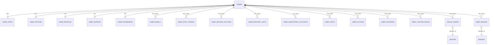

# Discourse 用户系统详细拆解

> 基于实际数据库表结构的完整用户系统解析

---

## 目录

- [1. 核心表结构](#1-核心表结构)
- [2. 认证与安全](#2-认证与安全)
- [3. 行为追踪](#3-行为追踪)
- [4. 扩展与关联](#4-扩展与关联)
- [5. 业务逻辑](#5-业务逻辑)

---

## 1. 核心表结构

### 1.1 users - 用户主表

**字段说明**（共37个字段）:

```sql
-- 基础信息
id                          INTEGER PK
username                    VARCHAR(60) NOT NULL UNIQUE     -- 显示用户名
username_lower              VARCHAR(60) NOT NULL UNIQUE     -- 查询用（小写）
name                        VARCHAR(255) NULL               -- 真实姓名
created_at, updated_at      TIMESTAMP

-- 状态字段
active                      BOOLEAN DEFAULT false           -- 账户激活
last_seen_at                TIMESTAMP                       -- 最后在线
last_posted_at              TIMESTAMP                       -- 最后发帖
previous_visit_at           TIMESTAMP                       -- 上次访问

-- 角色权限
admin                       BOOLEAN DEFAULT false
moderator                   BOOLEAN DEFAULT false
trust_level                 INTEGER NOT NULL                -- 0-4 信任等级
approved                    BOOLEAN DEFAULT false           -- 审核通过
approved_by_id              INTEGER                         -- 审核人

-- 惩罚状态
suspended_at                TIMESTAMP                       -- 封禁开始
suspended_till              TIMESTAMP                       -- 封禁结束
silenced_till               TIMESTAMP                       -- 禁言结束

-- 关联外键
uploaded_avatar_id          INTEGER                         -- 自定义头像
primary_group_id            INTEGER                         -- 主用户组
flair_group_id              INTEGER                         -- 徽记组

-- 特殊标记
staged                      BOOLEAN DEFAULT false           -- 邮件创建的临时用户
```

**关键索引**:
```sql
CREATE UNIQUE INDEX index_users_on_username_lower ON users(username_lower);
CREATE INDEX index_users_on_last_seen_at ON users(last_seen_at);
CREATE INDEX idx_users_admin ON users(id) WHERE admin = true;
```

**业务规则**:
- 用户名: 3-20字符，字母/数字/下划线/连字符
- `username_lower` 用于不区分大小写查询
- `staged: true` 表示通过邮件回复自动创建的临时用户
- 信任等级: TL0(新用户) → TL1(基础) → TL2(成员) → TL3(常客) → TL4(领袖)

---

### 1.2 user_emails - 邮箱管理

```sql
CREATE TABLE user_emails (
  id                  INTEGER PK,
  user_id             INTEGER NOT NULL,
  email               VARCHAR(513) NOT NULL,
  primary             BOOLEAN DEFAULT false,      -- 是否主邮箱
  confirmed           BOOLEAN NULL                -- 是否已验证
);

-- 唯一索引
CREATE UNIQUE INDEX ON user_emails(user_id, email);
```

**业务规则**:
- **多邮箱支持**: 一个用户可绑定多个邮箱
- **主邮箱**: 只能有一个 `primary = true`，用于登录和通知
- **验证流程**: 新邮箱 `confirmed = false` → 发送验证邮件 → 点击链接 → `confirmed = true`

---

### 1.3 user_stats - 统计数据

```sql
CREATE TABLE user_stats (
  user_id             INTEGER PK,                 -- 一对一关系
  
  -- 核心统计
  posts_count         INTEGER DEFAULT 0,          -- 发帖数（回复）
  topic_count         INTEGER DEFAULT 0,          -- 创建话题数
  likes_given         INTEGER DEFAULT 0,          -- 给出的赞
  likes_received      INTEGER DEFAULT 0,          -- 收到的赞
  
  -- 活跃度
  topics_entered      INTEGER DEFAULT 0,          -- 进入过的话题数
  posts_read_count    INTEGER DEFAULT 0,          -- 阅读的帖子数
  time_read           INTEGER DEFAULT 0,          -- 阅读时长（秒）
  days_visited        INTEGER DEFAULT 0,          -- 访问天数
  
  -- 通知
  notification_count  INTEGER DEFAULT 0,          -- 未读通知数
  first_unread_pm_at  TIMESTAMP NOT NULL          -- 首次未读私信时间
);
```

**用途**:
- 用户排行榜（按 `posts_count`, `likes_received` 排序）
- 信任等级自动晋升条件判断
- 显示用户活跃度数据

---

### 1.4 user_options - 用户偏好

```sql
CREATE TABLE user_options (
  user_id                     INTEGER PK,
  
  -- 邮件设置
  email_digests               BOOLEAN DEFAULT true,   -- 摘要邮件
  email_level                 INTEGER DEFAULT 1,      -- 邮件频率 0always/1away/2never
  mailing_list_mode           BOOLEAN DEFAULT false,  -- 邮件列表模式
  
  -- 界面设置
  theme_ids                   INTEGER[] DEFAULT '{}', -- 主题ID数组
  text_size                   VARCHAR DEFAULT 'normal', -- 文字大小
  timezone                    VARCHAR NULL,            -- 时区
  
  -- 通知设置
  like_notification_frequency INTEGER DEFAULT 1,      -- 点赞通知频率
  
  -- 隐私设置
  hide_profile_and_presence   BOOLEAN DEFAULT false   -- 隐藏在线状态
);
```

---

### 1.5 user_profiles - 用户资料

```sql
CREATE TABLE user_profiles (
  user_id                     INTEGER PK,
  
  -- 个人简介
  bio_raw                     TEXT NULL,              -- Markdown 原文
  bio_cooked                  TEXT NULL,              -- 渲染后 HTML
  bio_excerpt                 TEXT NULL,              -- 纯文本摘要
  
  -- 社交链接
  website                     TEXT NULL,
  location                    VARCHAR(255) NULL,
  
  -- 背景图
  profile_background_upload_id INTEGER NULL,
  card_background_upload_id    INTEGER NULL
);
```

---

### 1.6 user_avatars - 头像系统

```sql
CREATE TABLE user_avatars (
  id                          INTEGER PK,
  user_id                     INTEGER NOT NULL UNIQUE,
  custom_upload_id            INTEGER NULL,           -- 自定义头像
  gravatar_upload_id          INTEGER NULL            -- Gravatar缓存
);
```

**头像优先级**:
1. `custom_upload_id` - 用户上传（最高）
2. `gravatar_upload_id` - Gravatar
3. Letter Avatar - 字母头像（兜底）

**多尺寸**: 20/25/32/45/60/90/120/240px（通过 `optimized_images` 表）

---

## 2. 认证与安全

### 2.1 user_passwords - 密码管理

```sql
CREATE TABLE user_passwords (
  id                  INTEGER PK,
  user_id             INTEGER NOT NULL UNIQUE,
  password_hash       VARCHAR(255) NOT NULL,  -- bcrypt hash
  password_salt       VARCHAR(255) NOT NULL,
  password_algorithm  VARCHAR(64) NOT NULL,   -- 'pbkdf2_sha256'
  password_expired_at TIMESTAMP NULL
);
```

**加密算法**:
```ruby
# PBKDF2-SHA256, 64000 iterations
salt = SecureRandom.hex(32)
hash = Pbkdf2.hash_password(password, salt, iterations: 64000)
password_hash = "#{hash}$#{salt}$64000"
```

---

### 2.2 user_auth_tokens - 会话令牌

```sql
CREATE TABLE user_auth_tokens (
  id                          INTEGER PK,
  user_id                     INTEGER NOT NULL,
  
  -- 令牌（单向hash存储）
  auth_token                  VARCHAR(100) NOT NULL UNIQUE,
  prev_auth_token             VARCHAR(100) NOT NULL UNIQUE,  -- 轮换用
  auth_token_seen             BOOLEAN DEFAULT false,
  
  -- 设备信息
  user_agent                  VARCHAR(400) NULL,
  client_ip                   INET NULL,
  
  -- 时间戳
  rotated_at                  TIMESTAMP NOT NULL,
  seen_at                     TIMESTAMP NULL,
  
  -- OAuth/模拟
  authenticated_with_oauth    BOOLEAN DEFAULT false,
  impersonated_user_id        INTEGER NULL              -- 管理员模拟
);
```

**令牌轮换机制**:
```ruby
# 每次使用后轮换（提高安全性）
token.update!(
  prev_auth_token: token.auth_token,  # 保存旧令牌
  auth_token: new_hashed_token,
  rotated_at: Time.now
)
# prev_auth_token 处理并发请求（短时间都有效）
```

**多设备支持**: 一个用户可有多条记录，每个设备一个令牌

---

### 2.3 user_second_factors - 双因素认证

```sql
CREATE TABLE user_second_factors (
  id          INTEGER PK,
  user_id     INTEGER NOT NULL,
  method      INTEGER NOT NULL,         -- 1:TOTP, 2:BackupCodes
  data        VARCHAR(1000) NOT NULL,   -- 加密存储的secret/codes
  enabled     BOOLEAN DEFAULT false,
  name        VARCHAR(300) NULL,        -- 设备名称
  last_used   TIMESTAMP NULL
);
```

**TOTP流程**:
1. 生成 secret: `ROTP::Base32.random`
2. 生成二维码让用户扫描
3. 用户输入验证码确认
4. 加密存储 secret

**备用码**: 10个一次性恢复码（JSON数组加密存储）

---

### 2.4 user_security_keys - 安全密钥 (WebAuthn)

```sql
CREATE TABLE user_security_keys (
  id              INTEGER PK,
  user_id         INTEGER NOT NULL,
  credential_id   TEXT NOT NULL UNIQUE,     -- Base64编码
  public_key      TEXT NOT NULL,            -- Base64编码
  factor_type     INTEGER DEFAULT 0,        -- 0:双因素, 1:无密码
  enabled         BOOLEAN DEFAULT true,
  name            VARCHAR(200) NOT NULL,    -- 设备名
  last_used       TIMESTAMP NULL
);
```

支持: YubiKey, Google Titan, Touch ID, Windows Hello

---

### 2.5 user_associated_accounts - 第三方登录

```sql
CREATE TABLE user_associated_accounts (
  id              INTEGER PK,
  provider_name   VARCHAR NOT NULL,     -- google, github, facebook
  provider_uid    VARCHAR NOT NULL,     -- 第三方用户ID
  user_id         INTEGER NULL,
  
  -- JSONB 字段
  info            JSONB DEFAULT '{}',   -- 用户信息
  credentials     JSONB DEFAULT '{}',   -- access_token等
  extra           JSONB DEFAULT '{}',   -- 额外数据
  
  last_used       TIMESTAMP NOT NULL
);

-- 唯一索引
CREATE UNIQUE INDEX ON user_associated_accounts(provider_name, provider_uid);
```

**JSONB 示例**:
```json
// info
{
  "email": "user@example.com",
  "name": "John Doe",
  "image": "https://..."
}

// credentials
{
  "token": "ya29.a0AfH6SMC...",
  "expires_at": 1643059200
}
```

---

## 3. 行为追踪

### 3.1 user_visits - 访问记录

```sql
CREATE TABLE user_visits (
  id          INTEGER PK,
  user_id     INTEGER NOT NULL,
  visited_at  DATE NOT NULL,          -- 访问日期
  posts_read  INTEGER DEFAULT 0,      -- 当日阅读数
  mobile      BOOLEAN DEFAULT false,
  time_read   INTEGER DEFAULT 0       -- 当日时长（秒）
);

-- 唯一索引（每天一条记录）
CREATE UNIQUE INDEX ON user_visits(user_id, visited_at);
```

**用途**:
- 计算连续访问天数
- 统计 `user_stats.days_visited`
- 保留365天数据

---

### 3.2 user_actions - 行为流

```sql
CREATE TABLE user_actions (
  id              INTEGER PK,
  action_type     INTEGER NOT NULL,   -- 行为类型
  user_id         INTEGER NOT NULL,   -- 行为归属用户
  target_topic_id INTEGER NULL,
  target_post_id  INTEGER NULL,
  target_user_id  INTEGER NULL,
  acting_user_id  INTEGER NULL,       -- 执行者
  created_at      TIMESTAMP NOT NULL
);

-- 唯一约束（防止重复）
CREATE UNIQUE INDEX ON user_actions(
  action_type, user_id, target_topic_id, target_post_id, acting_user_id
);
```

**行为类型**:
```ruby
1:like, 2:was_liked, 4:new_topic, 5:reply, 6:response,
7:mention, 9:quote, 11:edit, 12:new_pm, 13:got_pm
```

**双向记录**: 点赞时记录两条（点赞者和被赞者）

---

### 3.3 user_histories - 操作历史（审计）

```sql
CREATE TABLE user_histories (
  id              INTEGER PK,
  action          INTEGER NOT NULL,   -- 操作类型
  acting_user_id  INTEGER NULL,       -- 操作者（管理员）
  target_user_id  INTEGER NULL,       -- 目标用户
  
  details         TEXT NULL,
  previous_value  TEXT NULL,          -- 修改前
  new_value       TEXT NULL,          -- 修改后
  
  topic_id        INTEGER NULL,
  post_id         INTEGER NULL,
  ip_address      VARCHAR NULL,
  admin_only      BOOLEAN DEFAULT false
);
```

**记录的操作**:
```ruby
1:change_trust_level, 2:change_username, 5:delete_user,
6:suspend_user, 8:grant_badge, 16:grant_admin, 21:silence_user
```

---

## 4. 扩展与关联

### 4.1 user_custom_fields - 自定义字段

```sql
CREATE TABLE user_custom_fields (
  id          INTEGER PK,
  user_id     INTEGER NOT NULL,
  name        VARCHAR NOT NULL,
  value       TEXT NULL
);

CREATE UNIQUE INDEX ON user_custom_fields(user_id, name);
```

**常用字段**: `external_id`, `company`, `position`, `pronouns`

---

### 4.2 group_users - 用户组关系

```sql
CREATE TABLE group_users (
  id                  INTEGER PK,
  group_id            INTEGER NOT NULL,
  user_id             INTEGER NOT NULL,
  owner               BOOLEAN DEFAULT false,      -- 组拥有者
  notification_level  INTEGER DEFAULT 2,          -- 通知级别
  first_unread_pm_at  TIMESTAMP NOT NULL
);

CREATE UNIQUE INDEX ON group_users(group_id, user_id);
```

---

### 4.3 user_badges - 徽章系统

```sql
CREATE TABLE user_badges (
  id              INTEGER PK,
  badge_id        INTEGER NOT NULL,
  user_id         INTEGER NOT NULL,
  granted_at      TIMESTAMP NOT NULL,
  granted_by_id   INTEGER NOT NULL,
  post_id         INTEGER NULL,           -- 关联帖子
  seq             INTEGER DEFAULT 0,      -- 多次获得同一徽章
  featured_rank   INTEGER NULL,           -- 精选排名（1-3）
  is_favorite     BOOLEAN NULL
);

-- 同一徽章+同一帖子只能授予一次
CREATE UNIQUE INDEX ON user_badges(badge_id, user_id, post_id) WHERE post_id IS NOT NULL;
```

---

## 5. 业务逻辑

### 5.1 信任等级系统

#### 定义
```ruby
TL0 = 新用户 (newuser)
TL1 = 基础用户 (basic)
TL2 = 成员 (member)
TL3 = 常客 (regular)
TL4 = 领袖 (leader)  # 仅管理员手动授予
```

#### 自动晋升条件

**TL0 → TL1**:
- 进入 5 个话题
- 阅读 30 篇帖子
- 阅读 10 分钟

**TL1 → TL2**:
- 15天内访问15天
- 阅读 20% 的帖子
- 阅读 1 小时
- 收到 1 个赞

**TL2 → TL3**:
- 50天内访问50天
- 阅读 25% 的帖子
- 回复 10 个不同话题
- 创建 3 个话题
- 收到 20 个赞
- 给出 30 个赞

#### 权限差异

| 功能 | TL0 | TL1 | TL2 | TL3 | TL4 |
|------|-----|-----|-----|-----|-----|
| 上传图片 | ✗ | ✓ | ✓ | ✓ | ✓ |
| 添加链接 | ✗ | ✓ | ✓ | ✓ | ✓ |
| 编辑Wiki | ✗ | ✗ | ✓ | ✓ | ✓ |
| 重新分类 | ✗ | ✗ | ✗ | ✓ | ✓ |
| 关闭话题 | ✗ | ✗ | ✗ | ✗ | ✓ |

---

### 5.2 用户注册流程

```ruby
# 核心流程
User.transaction do
  # 1. 创建 users 记录
  user = User.create!(
    username: username,
    active: false,
    trust_level: 0
  )
  
  # 2. 创建 user_emails
  user.user_emails.create!(
    email: email,
    primary: true,
    confirmed: false
  )
  
  # 3. 创建 user_passwords
  user.create_user_password!(
    password_hash: hash,
    password_algorithm: 'pbkdf2_sha256'
  )
  
  # 4. 自动创建关联记录
  # - user_stats
  # - user_options
  # - user_profile
  # - user_avatar
  
  # 5. 生成邮箱验证 token
  email_token = user.email_tokens.create!(token: random_token)
  
  # 6. 发送验证邮件
  send_activation_email(email_token)
end
```

---

### 5.3 用户登录流程

```ruby
# 1. 验证密码
user = User.find_by_username_or_email(login)
return unless user.confirm_password?(password)

# 2. 检查双因素认证
if user.totp_enabled?
  return require_2fa_token
end

# 3. 创建会话令牌
token = UserAuthToken.generate!(
  user_id: user.id,
  user_agent: request.user_agent,
  client_ip: request.remote_ip
)

# 4. 设置 Cookie
cookies[:_t] = {
  value: token.unhashed_auth_token,
  httponly: true,
  secure: true,
  expires: 60.days
}

# 5. 更新最后活跃时间
user.update_last_seen!
```

---

### 5.4 权限检查 (Guardian)

```ruby
class Guardian
  # 查看用户资料
  def can_see_profile?(target_user)
    return true if is_admin?
    return true unless target_user.hide_profile?
    user == target_user
  end
  
  # 编辑用户
  def can_edit_user?(target_user)
    return true if is_admin?
    user == target_user
  end
  
  # 封禁用户
  def can_suspend?(target_user)
    return false unless is_staff?
    return false if target_user.admin?
    true
  end
  
  # 模拟登录
  def can_impersonate?(target_user)
    return false unless is_admin?
    return false if target_user.admin?
    true
  end
end
```

---

## 6. 表关系总览



---

## 7. 性能优化要点

1. **计数器缓存**: `user_stats` 表避免实时 COUNT 查询
2. **索引策略**: 
   - `username_lower` 唯一索引（不区分大小写查询）
   - `last_seen_at` 索引（活跃用户查询）
   - 复合索引 `(user_id, visited_at)` 在 `user_visits`
3. **分区表**: `user_visits` 可按月分区
4. **Redis 缓存**: 
   - `user-last-seen:{user_id}` 缓存在线状态
   - 会话数据缓存
5. **异步任务**: 
   - 头像生成
   - 徽章授予
   - 统计数据更新

---

## 8. 安全设计

1. **密码**: PBKDF2-SHA256, 64000 iterations
2. **令牌轮换**: 每次使用后更换 token
3. **双因素认证**: TOTP + 备用码 + WebAuthn
4. **审计日志**: `user_histories` 记录所有管理操作
5. **IP 追踪**: 注册IP和登录IP记录
6. **权限检查**: Guardian 类统一权限逻辑

---

## 9. 常见操作SQL

```sql
-- 查找用户（不区分大小写）
SELECT * FROM users WHERE username_lower = LOWER('UserName');

-- 用户统计
SELECT 
  u.username,
  us.posts_count,
  us.likes_received,
  us.days_visited
FROM users u
JOIN user_stats us ON u.id = us.user_id
WHERE u.active = true
ORDER BY us.likes_received DESC
LIMIT 10;

-- 用户最近行为
SELECT 
  ua.action_type,
  ua.created_at,
  t.title,
  p.raw
FROM user_actions ua
LEFT JOIN topics t ON ua.target_topic_id = t.id
LEFT JOIN posts p ON ua.target_post_id = p.id
WHERE ua.user_id = 123
ORDER BY ua.created_at DESC
LIMIT 20;

-- 用户会话
SELECT 
  user_agent,
  client_ip,
  seen_at
FROM user_auth_tokens
WHERE user_id = 123
  AND rotated_at > NOW() - INTERVAL '30 days'
ORDER BY seen_at DESC;
```

---

**文档完成！** 🎉

此文档涵盖了 Discourse 用户系统的核心表结构、业务逻辑和实现细节，可作为开发和维护的参考手册。
