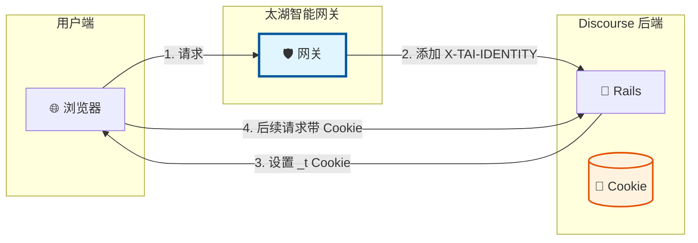
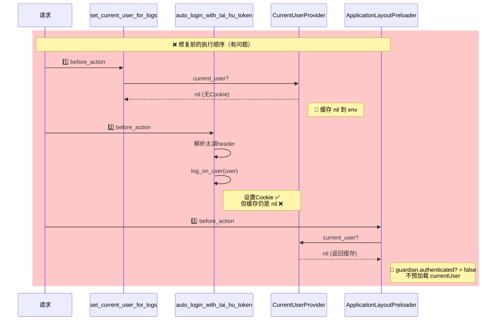
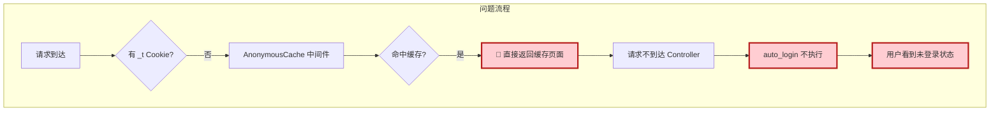
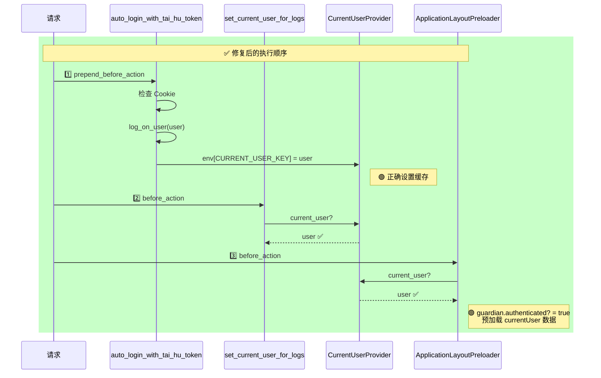
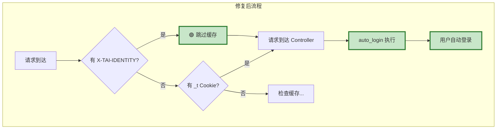
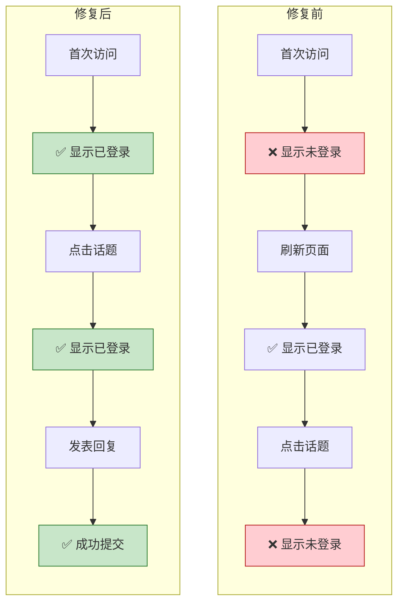

让我先完整查看一下修改后的插件代码，确保理解全貌：
现在我来创建一份完整的修复总结文档：

---

# 🔐 太湖认证插件登录问题修复报告

## 📋 问题概述

| 问题编号 | 问题描述 | 严重程度 |
|:--------:|----------|:--------:|
| **#1** | 首次访问页面，登录态不生效，需刷新才能看到 | 🔴 高 |
| **#2** | 清理 Cookie 后刷新页面，无法自动重新登录 | 🔴 高 |
| **#3** | 在同一页面点击话题/分类/回复，显示未登录状态 | 🔴 高 |

---

## 🏗️ 系统架构



---

## 🔍 根因分析

### 问题 #1 & #3: `current_user` 缓存机制



**根本原因**: 
> `set_current_user_for_logs` 在太湖认证 `before_action` **之前**执行，调用了 `current_user`，导致 `nil` 被缓存。后续即使登录成功，缓存也不会更新。

### 问题 #2: AnonymousCache 中间件



**根本原因**:
> 当用户清理 Cookie 后，请求被 `AnonymousCache` 中间件拦截，直接返回缓存的匿名页面，请求根本不会到达 Controller，太湖自动登录逻辑无法执行。

### 问题 #3: SPA 单页应用特性

```mermaid
flowchart LR
    subgraph 首次HTML请求
        A1[服务端渲染] --> A2[preloadedData]
        A2 --> A3["currentUser: null ❌"]
    end
    
    subgraph Ember.js 初始化
        B1[读取 preloadedData] --> B2[注册 currentUser service]
        B2 --> B3["service = null 🔴"]
    end
    
    subgraph 页面内导航 XHR
        C1[点击话题/分类] --> C2[发送 AJAX 请求]
        C2 --> C3[Cookie 有效 ✅]
        C3 --> C4[后端认证成功 ✅]
        C4 --> C5["但前端 currentUser 仍是 null ❌"]
    end
    
    A3 --> B1
    B3 --> C1
    
    style A3 fill:#ffcdd2,stroke:#b71c1c,stroke-width:2px
    style B3 fill:#ffcdd2,stroke:#b71c1c,stroke-width:2px
    style C5 fill:#ffcdd2,stroke:#b71c1c,stroke-width:2px
```



**根本原因**:
> SPA 的 `currentUser` service 只在首次页面加载时从 `preloadedData` 初始化。如果首次请求返回的 `currentUser` 是 `null`，后续的 XHR 请求即使 Cookie 有效，前端也不会自动更新 `currentUser`。

---

## ✅ 修复方案

### 修复 #1: 使用 `prepend_before_action`

```ruby
# ❌ 修复前
before_action :auto_login_with_tai_hu_token,
              before: :redirect_to_login_if_required

# ✅ 修复后
prepend_before_action :auto_login_with_tai_hu_token,
                      if: -> { SiteSetting.tai_hu_auth_enabled }
```



### 修复 #2: 扩展 AnonymousCache

```ruby
module TaiHuAnonymousCacheExtension
  def cacheable?
    # 🔑 关键：有太湖 header 时，跳过匿名缓存
    return false if @env["HTTP_X_TAI_IDENTITY"].present?
    super
  end
end

Middleware::AnonymousCache::Helper.prepend(TaiHuAnonymousCacheExtension)
```



### 修复 #3: 为已有会话也设置 env 缓存

```ruby
def auto_login_with_tai_hu_token
  existing_user = check_existing_session_without_caching
  
  if existing_user.present?
    # 🔑 关键修复：即使已有会话，也要设置 env 缓存
    # 这样后续的 current_user 调用会返回正确的用户
    request.env[Auth::DefaultCurrentUserProvider::CURRENT_USER_KEY] = existing_user
    return
  end
  
  # ... 其他逻辑
end
```

---

## 📊 修复前后对比



---

## 🧪 测试清单

| # | 测试场景 | 预期结果 | 验证方式 |
|:-:|----------|----------|----------|
| 1 | 首次访问首页 | 立即显示登录态 | 观察右上角用户头像 |
| 2 | 点击话题链接 | 保持登录态，可回复 | 尝试发表回复 |
| 3 | 点击分类链接 | 保持登录态 | 观察页面状态 |
| 4 | 清理 Cookie 后刷新 | 自动重新登录 | 删除 `_t` Cookie 后刷新 |
| 5 | 访问 /login 页面 | 自动跳转首页 | 直接访问登录页 |
| 6 | 发表新话题 | 成功创建 | 点击新建话题按钮 |

---

## 📁 修改的文件

```
plugins/discourse-tai-hu-auth/
└── plugin.rb  ← 核心修复
    ├── prepend_before_action（修复执行顺序）
    ├── TaiHuAnonymousCacheExtension（修复缓存问题）
    └── check_existing_session_without_caching（避免触发缓存）
```

---

## 🎯 关键代码变更

### 变更 1: `before_action` → `prepend_before_action`

```diff
- before_action :auto_login_with_tai_hu_token,
-               if: -> { SiteSetting.tai_hu_auth_enabled },
-               before: :redirect_to_login_if_required
+ prepend_before_action :auto_login_with_tai_hu_token,
+                       if: -> { SiteSetting.tai_hu_auth_enabled }
```

### 变更 2: 已有会话时也设置缓存

```diff
  if existing_user.present?
+   # 关键：设置 env 缓存
+   request.env[Auth::DefaultCurrentUserProvider::CURRENT_USER_KEY] = existing_user
    if request.path == "/login"
      redirect_to "/"
    end
    return
  end
```

---

## 📝 总结

| 问题 | 根因 | 解决方案 |
|------|------|----------|
| 首次登录不生效 | `before_action` 执行顺序导致 `current_user` 缓存为 `nil` | 使用 `prepend_before_action` 确保最先执行 |
| 清理 Cookie 后无法重登录 | `AnonymousCache` 中间件拦截请求 | 扩展 `cacheable?` 方法，有太湖 header 时跳过缓存 |
| SPA 内导航没有登录态 | 已有会话时未设置 `env` 缓存 | 为所有带太湖 header 的请求设置正确的用户缓存 |